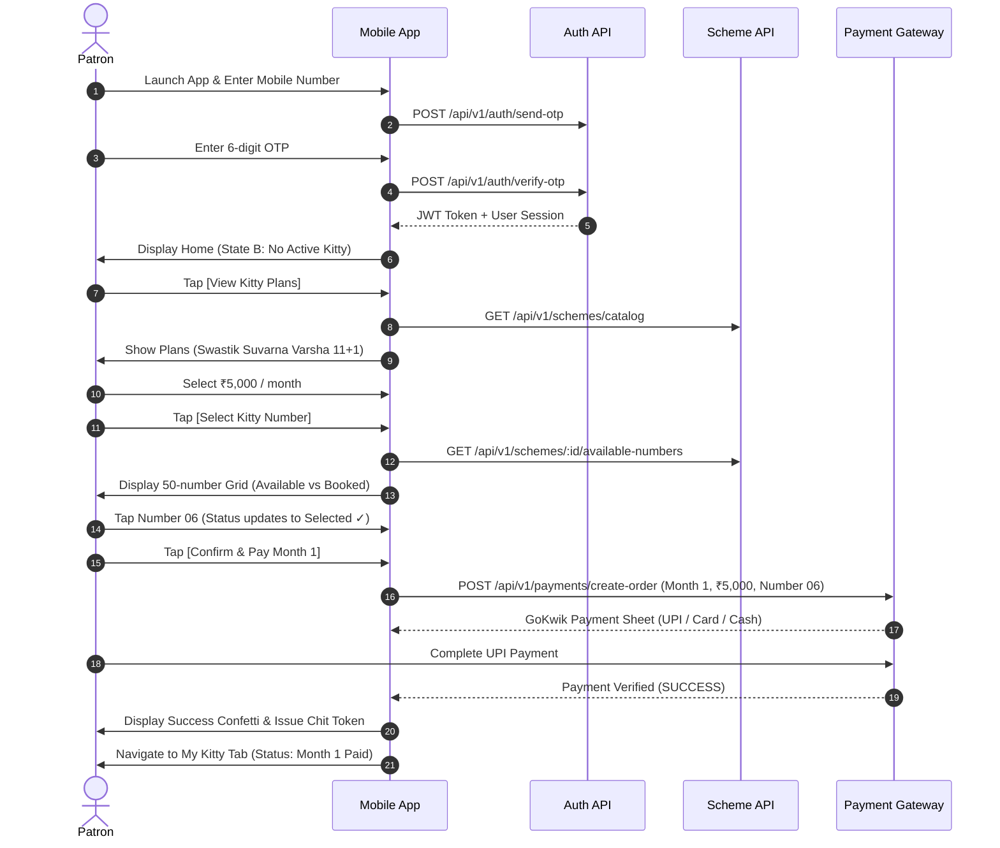
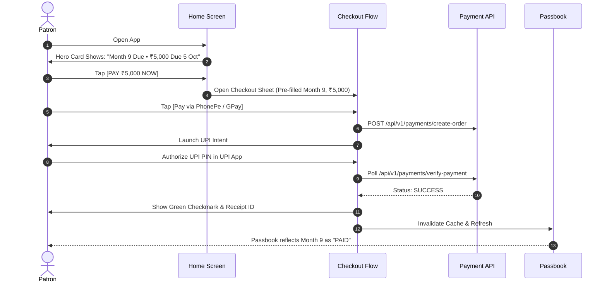

# Kitty User Flows V2 (End-to-End User Journeys)

**Project**: Swastik Jewellers Kitty App  
**Document Status**: Official User Journey & Interaction Flow Specification (V2)  
**Effective Date**: 2026-09-29  
**Replaces**: `02_PRODUCT_FLOW.md`  

---

## Flow 1: New User Onboarding & Starting First Kitty



---

## Flow 2: Existing User — 1-Tap Monthly Installment Payment



* **Tap Count Guarantee**: Exactly **2 taps** from app opening.

---

## Flow 3: Multi-Month Advance Payment

A patron receives festival bonus or agricultural harvest proceeds and wishes to deposit 2 or 3 upcoming months simultaneously.

```
[My Kitty Screen]
       │
       ▼
Tap [Pay Multiple Months]
       │
       ▼
┌────────────────────────────────────────────────────────┐
│ SELECT INSTALLMENTS TO PAY                             │
│ Plan: Swastik Suvarna Varsha (No. 42)                  │
├────────────────────────────────────────────────────────┤
│ [✓] Month 9 (Due 5 Oct)                   ₹5,000       │
│ [✓] Month 10 (Due 5 Nov)                  ₹5,000       │
│ [ ] Month 11 (Due 5 Dec)                  ₹5,000       │
├────────────────────────────────────────────────────────┤
│ TOTAL SELECTED: 2 Months                  ₹10,000      │
│ Note: Depositing in advance earns full 12th-month bonus│
│                                                        │
│ [ PROCEED TO PAY ₹10,000 ]                             │
└──────────────────────────┬─────────────────────────────┘
                           │
                           ▼
Payment via GoKwik Gateway (Order for ₹10,000)
                           │
                           ▼
Backend records Month 9 & Month 10 as PAID in passbook
```

---

## Flow 4: Full Remaining Kitty Amount Payment

A patron wishes to pay all remaining balance (e.g. Months 9, 10, 11 = ₹15,000) in one single transaction.

```
[My Kitty Screen]
       │
       ▼
Tap [Pay Full Remaining Amount]
       │
       ▼
┌────────────────────────────────────────────────────────┐
│ PAY COMPLETE KITTY BALANCE                             │
├────────────────────────────────────────────────────────┤
│ Total Months in Plan:            12 Months             │
│ Months Paid So Far:              8 Months (₹40,000)    │
│ Remaining Months (9, 10, 11):    3 Months              │
│ Payable Balance:                 ₹15,000               │
│                                                        │
│ Swastik 100% Jeweller Bonus:     + ₹5,000 (Month 12)   │
│ Total Maturity Gold Value:       ₹60,000               │
├────────────────────────────────────────────────────────┤
│ [BUSINESS DECISION REQUIRED: REDEMPTION TIMING]        │
│ Does jewellery redemption unlock immediately upon      │
│ full payment, OR must patron wait until Month 12 date? │
├────────────────────────────────────────────────────────┤
│ [ CONFIRM & PAY ₹15,000 ]                              │
└────────────────────────────────────────────────────────┘
```

---

## Flow 5: Kitty Number Selection & Allocation Flow

```
[Start Kitty Flow] ──> Select Plan (e.g. ₹5,000/mo)
                               │
                               ▼
┌────────────────────────────────────────────────────────┐
│ CHOOSE YOUR KITTY NUMBER                               │
│ Group: Swastik Suvarna Oct-2026 (50 Total Numbers)     │
│ Legend: ○ Available (34)  ● Booked (16)  ✓ Selected    │
├────────────────────────────────────────────────────────┤
│ Search: [ 🔍 Type your lucky number...               ] │
├────────────────────────────────────────────────────────┤
│  [ 01 ○ ]   [ 02 ● ]   [ 03 ○ ]   [ 04 ○ ]   [ 05 ● ]  │
│  [ 06 ✓ ]   [ 07 ○ ]   [ 08 ○ ]   [ 09 ● ]   [ 10 ○ ]  │
│  [ 11 ○ ]   [ 12 ○ ]   [ 13 ● ]   [ 14 ○ ]   [ 15 ○ ]  │
│  [ 16 ● ]   [ 17 ○ ]   [ 18 ○ ]   [ 19 ○ ]   [ 20 ● ]  │
├────────────────────────────────────────────────────────┤
│ SELECTED: Kitty Number 06                              │
│ Temporary Hold: 15 minutes to complete first payment   │
│                                                        │
│ [ CONFIRM NUMBER & PAY ₹5,000 ]                        │
└────────────────────────────────────────────────────────┘
```

---

## Flow 6: Future Number Reservation Flow (Concept Under Review)

A patron already has an active Kitty but wants to lock their favorite number (e.g. No. 07) for the next festive group opening in Diwali.

```
[Kitty Plans Screen] ──> Tap [Reserve a Number for Next Group]
                                   │
                                   ▼
┌────────────────────────────────────────────────────────┐
│ RESERVE FUTURE KITTY NUMBER                            │
│ Next Group Starting: Diwali Festive 2026               │
├────────────────────────────────────────────────────────┤
│ Select Upcoming Number: [ No. 07 ]                     │
│ Reservation Token Deposit: ₹100                        │
├────────────────────────────────────────────────────────┤
│ [UNRESOLVED BUSINESS DECISIONS REQUIRED]:              │
│ 1. Is the ₹100 deposit refundable if group is dropped? │
│ 2. Is ₹100 deducted from Month 1 payment (pay ₹4,900)? │
│ 3. How many days before group launch is number held?   │
│ 4. What happens if user fails to pay Month 1 in time?  │
├────────────────────────────────────────────────────────┤
│ [ PAY ₹100 TOKEN DEPOSIT ]                             │
└────────────────────────────────────────────────────────┘
```

---

## Flow 7: Live Gold Rates Check (1-Tap Bottom Dock)

1. Patron taps **Live Rates** (Tab 1 in Bottom Bar).
2. App fetches latest bullion rates from `GET /api/v1/market/rates`.
3. Screen displays large, clean cards:
   - **24K Gold**: ₹15,268 / g (99.9% Pure Investment Gold)
   - **22K Gold**: ₹13,995 / g (91.6% Hallmark Jewellery Gold)
   - **18K Gold**: ₹11,451 / g (75.0% Diamond Setting Gold)
   - **14K Gold**: ₹8,932 / g (58.5% Everyday Wear Gold)
   - **999 Silver**: ₹89.50 / g (₹895 / 10g)
4. Displays official timestamp: *"Market rate as of 10:30 AM today"*.
5. Quick button: **[ Calculate Gold Value ]** switches directly to Calculator tab.

---

## Flow 8: Gold Valuation Calculation (Tab 4)

1. Patron taps **Calculator** (Tab 4 in Bottom Bar).
2. Chooses mode: **By Weight** (Enter grams) or **By Budget** (Enter rupees).
3. Selects Karat: `24K` | `22K` | `18K`.
4. Result card instantly computes:
   - `5.000 g of 22K Gold = ₹69,975` (at current live rate).
5. Primary button below result: **[ Start Kitty with this Budget ]** transfers the calculated monthly budget directly into the Start Kitty flow.

---

## Flow 9: Showroom Jewellery Browsing (In-App WebView)

1. Patron taps **Jewellery** (Tab 5 in Bottom Bar).
2. Screen loads official Swastik Jewellers website (`https://swastikjewel.in/collections`) inside high-performance in-app WebView.
3. Top luxury bar displays Swastik crest, reload button, and WhatsApp Concierge icon.
4. Patron browses live bridal sets, bangles, and solitaires.
5. Android hardware back-button navigates web history; once at root page, switches back to Home tab.

---

## Flow 10: Doorstep Cash Collection ("Pick Cash")

For patrons who prefer paying monthly installments in physical cash:
1. On Checkout Screen, patron selects payment method: **PICK CASH (Doorstep Pickup)**.
2. Slide-up sheet prompts for: Address, City, Landmark, Pincode, and preferred time slot (10 AM–1 PM or 2 PM–6 PM).
3. Patron taps **[ Request Cash Pickup ]**.
4. System generates secure 4-digit verification OTP.
5. Swastik showroom counter executive arrives at doorstep, collects cash, verifies OTP, and confirms transaction.
6. Patron's digital passbook updates to **PAID** instantly.
