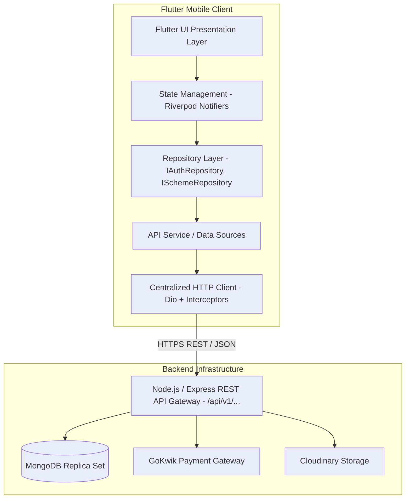
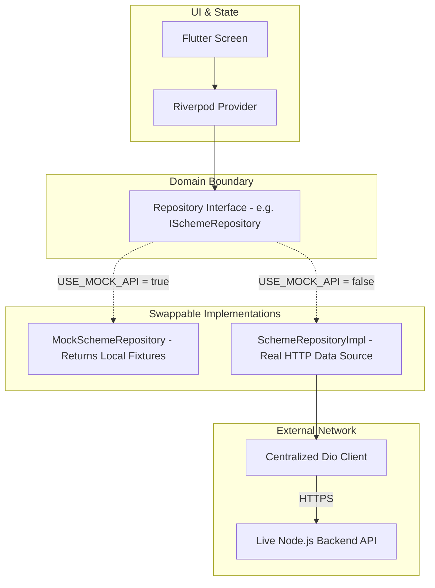

# Frontend ↔ Backend Integration & Connectivity Guide

## 1. Architectural Connectivity Pipeline

The Kitty App frontend connects to the backend strictly via standard **RESTful HTTPS endpoints**. The frontend possesses **zero direct database access** and maintains an absolute separation from MongoDB or server-side services.



---

## 2. Mock vs. Live Network Architecture

To ensure the frontend is completely decoupled and never blocked while the backend is being built, all data access flows through abstract domain interfaces:



* **Offline Development Mode:** With `USE_MOCK_API=true`, the app reads deterministic static fixtures, accurately simulating delays, loading spinners, and error cases.
* **Live Integration Mode:** With `USE_MOCK_API=false`, the exact same UI widgets and state notifiers communicate with live backend endpoints.

---

## 3. Centralized Network Layer Contract

Individual screens, widgets, or ViewModels must **never** instantiate an HTTP client or execute raw network calls. All outbound traffic passes through the centralized client:

```
Screen / View
    ↓ (User Event)
StateNotifier / ViewModel
    ↓ (Method Invocation)
Repository (e.g. SchemeRepositoryImpl)
    ↓ (Call Remote Data Source)
ApiRemoteDataSource
    ↓ (Request Dispatch)
HttpClient (Dio Singleton)
    ├─► Request: Injects 'Authorization: Bearer <token>' & Headers
    ├─► Telemetry: Console Logging (Debug only)
    ├─► Timeout Handling: 15,000ms limit
    └─► Response Interceptor: Catches 401 Unauthorized, maps status codes
```

### 3.1 Base Configuration Specifications
* **Connect Timeout:** 15,000 milliseconds (15s).
* **Receive Timeout:** 15,000 milliseconds (15s).
* **Content-Type:** `application/json; charset=utf-8` (or `multipart/form-data` for file uploads).
* **Accept:** `application/json`.

---

## 4. Environment Configuration Strategy

The API base URL is **never** hardcoded in feature code. It is driven by build-time compilation flags:

```dart
// lib/core/config/app_environment.dart
enum EnvironmentType { dev, staging, prod }

class AppEnvironment {
  static const EnvironmentType current = EnvironmentType.values[
    int.fromEnvironment('ENV', defaultValue: 0)
  ];

  static String get apiBaseUrl {
    switch (current) {
      case EnvironmentType.dev:
        return const String.fromEnvironment(
          'API_BASE_URL',
          defaultValue: 'http://10.0.2.2:5000/api/v1', // Android Emulator localhost
        );
      case EnvironmentType.staging:
        return 'https://staging-api.swastikjewels.com/api/v1';
      case EnvironmentType.prod:
        return 'https://api.swastikjewels.com/api/v1';
    }
  }

  static const bool useMockApi = bool.fromEnvironment('USE_MOCK_API', defaultValue: true);
}
```

### Build Commands:
* **Run with Mock Backend:**
  ```bash
  flutter run --dart-define=USE_MOCK_API=true
  ```
* **Run with Local Dev Backend (Android Emulator):**
  ```bash
  flutter run --dart-define=ENV=0 --dart-define=USE_MOCK_API=false --dart-define=API_BASE_URL=http://10.0.2.2:5000/api/v1
  ```
* **Build Staging Bundle:**
  ```bash
  flutter build apk --dart-define=ENV=1 --dart-define=USE_MOCK_API=false
  ```
* **Build Production Bundle:**
  ```bash
  flutter build apk --release --dart-define=ENV=2 --dart-define=USE_MOCK_API=false
  ```

---

## 5. Local Development & Network Addressing

When running the frontend against a locally running Node.js / Express backend:

| Target Platform / Host | Reachable Host Address for Local Backend | Note |
| :--- | :--- | :--- |
| **Android Studio Emulator** | `http://10.0.2.2:5000/api/v1` | `10.0.2.2` routes to the host development PC. `localhost` refers to the emulator itself! |
| **iOS Simulator** | `http://localhost:5000/api/v1` | iOS Simulator shares the host Mac's network interface directly. |
| **Physical Android/iOS Device**| `http://192.168.X.X:5000/api/v1` | Must use host PC's local LAN Wi-Fi IP address. Device and PC must be on the same Wi-Fi. |
| **Web Browser / Preview** | `http://localhost:5000/api/v1` | Requires CORS to be configured on the Express server. |

### 5.1 Cross-Origin Resource Sharing (CORS) Notice
> [!IMPORTANT]
> **CORS is purely a server-side web browser security mechanism.**
> If testing web builds, the backend developer must configure Express `cors` middleware:
> ```javascript
> const cors = require('cors');
> app.use(cors({ origin: ['http://localhost:3000', 'http://localhost:8080'], credentials: true }));
> ```
> The frontend will **never** employ insecure client-side proxy workarounds.

---

## 6. API Versioning Strategy

* **Standard Prefix:** All backend API endpoints must be prefixed with a major version identifier:
  ```http
  /api/v1/...
  ```
  - `/api/v1/auth/send-otp`
  - `/api/v1/memberships/my-dashboard`
  - `/api/v1/payments/initiate`
* **Versioning Policy:**
  - Non-breaking changes (adding optional fields to response objects) occur within `/v1`.
  - Breaking structural changes (renaming required fields, changing authentication formats) require a new version route (`/v2`).

---

## 7. Backward Compatibility & Resilience Rules

To prevent frontend crashes when the backend updates:

1. **Ignore Unknown Fields:** The frontend JSON deserializers (`fromJson`) must ignore unrecognized response fields without throwing errors.
2. **Safe Null Handling:** Any response field that is not strictly required must have a null-safe fallback (e.g. `json['receiptUrl'] as String? ?? ''`).
3. **Unknown Enum Values:** If the backend introduces a new status (e.g. `'UNDER_REVIEW'`), the frontend must gracefully fallback to an `unknown` status type rather than throwing an unhandled exception.
4. **Deprecation Notice:** The backend developer must provide at least one sprint advance notice before deprecating or removing any field from the contract.
