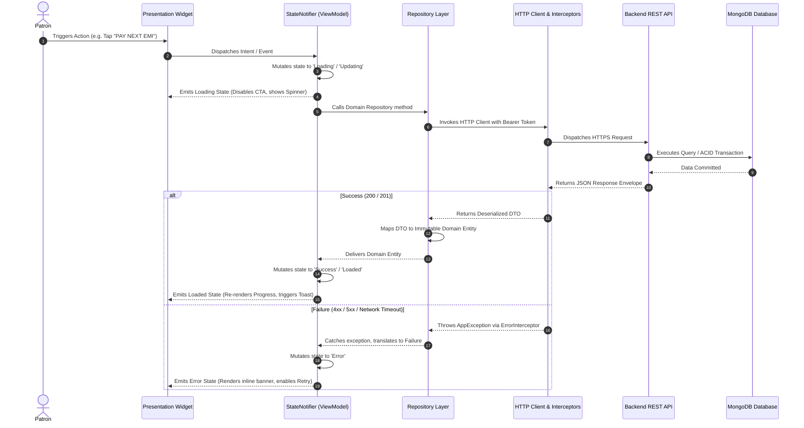
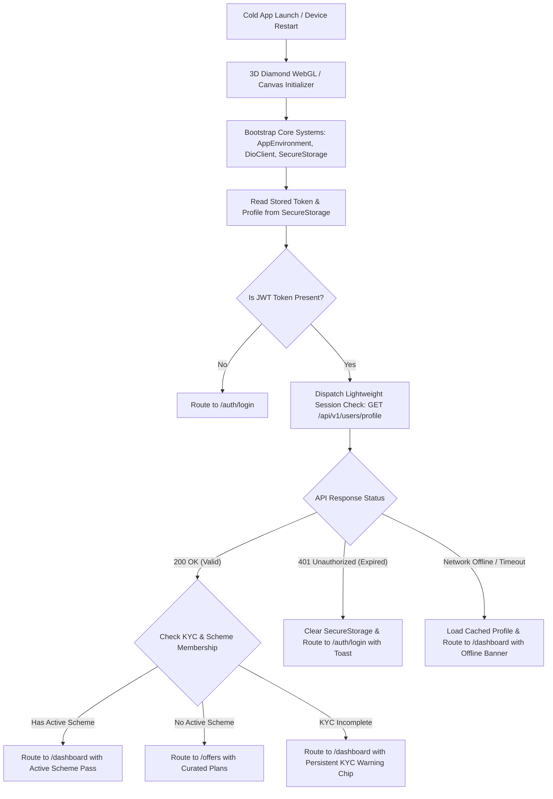
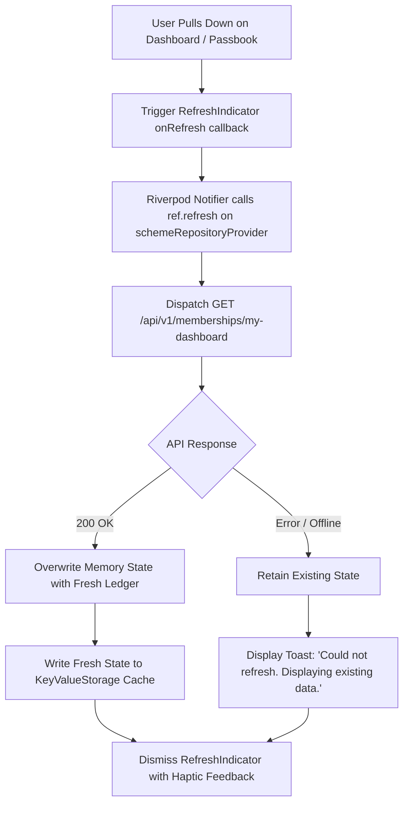
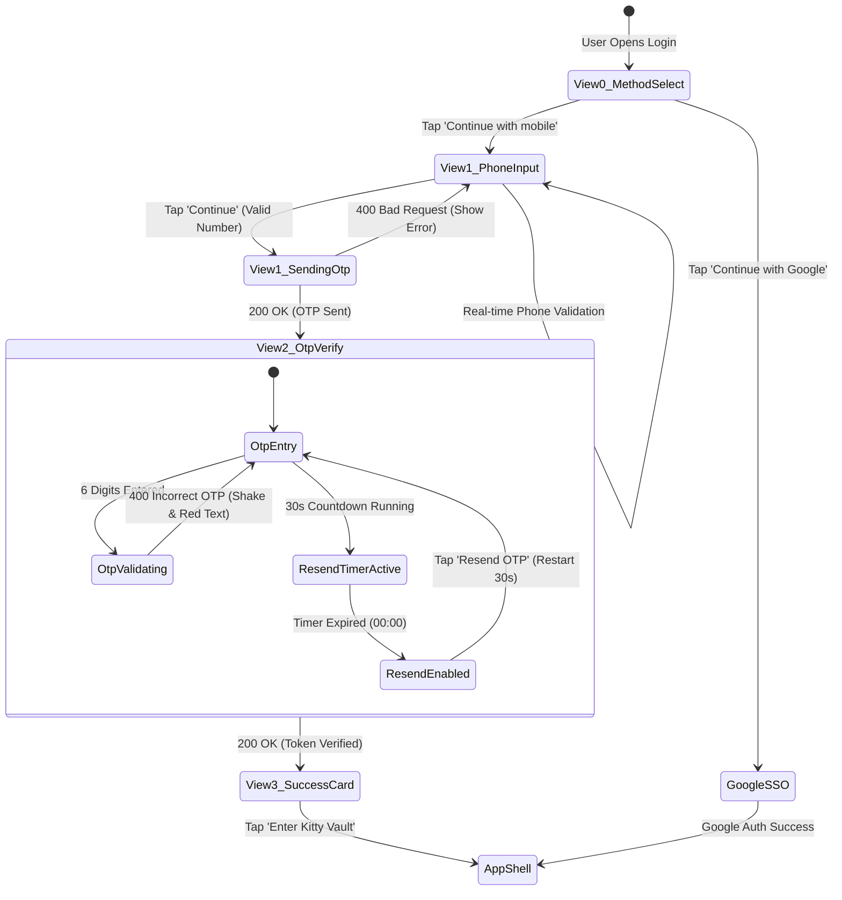
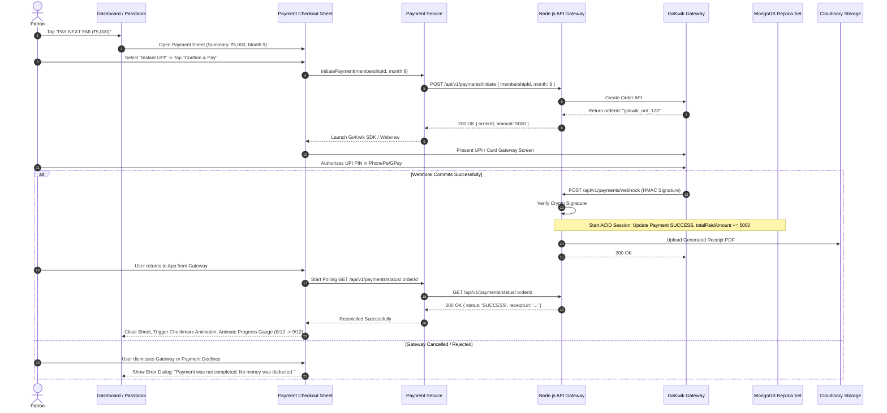
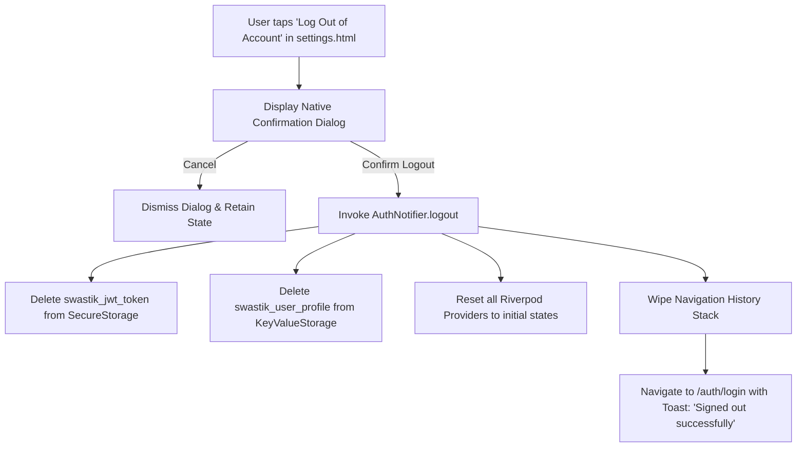

# Complete System Flow & State Lifecycle Documentation

## 1. Complete End-to-End Execution Flow

Every user action in the Kitty App transitions through a strictly managed 12-stage unidirectional lifecycle:

---

## 2. Application Startup & Cold Restart Flow

### Warm Resume vs. Cold Start:
* **Cold Start (Process Killed):** Reads environment, boots Riverpod container, reads KeyStore/Keychain tokens, performs startup check.
* **Warm Resume (App in Background):** App resumes instantly without splash; background service polls `GET /api/v1/rates/gold` to refresh the gold benchmark rate if more than 5 minutes elapsed.

---

## 3. Detailed Edge-Case State Matrix

The UI handles all 9 critical frontend lifecycle states cleanly:

| State | Trigger / Scenario | Visual Presentation | User Action & Recovery Path |
| :--- | :--- | :--- | :--- |
| **Initial / Idle** | Screen first mounted prior to user interaction. | Clean form inputs, default action buttons enabled. | User enters input or selects tab. |
| **Loading** | Active network request in flight. | Shimmer skeleton placeholders matching exact card geometry; CTA shows spinner; inputs disabled. | Interactive elements locked to prevent double-submissions. |
| **Loaded / Success** | Valid 200/201 response received. | Smooth transition to populated cards; green success badge; toast confirmation. | User proceeds with next feature step. |
| **Empty State** | Valid 200 response with zero records (e.g. no active kitty joined). | Reusable `EmptyStateCard` featuring jewelry box illustration, friendly copy, and primary action button. | Tap CTA: "Explore Curated Kitty Plans" $\rightarrow$ routes to `/offers`. |
| **Validation Error** | Client-side format check fails (invalid phone, wrong Aadhaar length, unselected checkbox). | Red border around input field; inline error text below box; primary CTA disabled. | User corrects input; error clears in real-time as valid pattern matches. |
| **API Error (400/422/500)**| Backend responds with error code (e.g. scheme capacity full, invalid OTP). | Red-tinted alert card (`#FEF2F2`) with specific message extracted from backend error envelope. | "Try Again" or dismiss trigger. Form remains editable without losing entered text. |
| **Network Offline** | Device loses internet connection (detected via `Connectivity` stream). | Subtle top warning bar: *"You are offline. Showing cached passbook data."* | Read-only access to cached passbook; write actions disabled. Banner auto-dismisses on reconnection. |
| **Timeout (15s)** | Server fails to respond within 15,000ms. | Friendly dialog: *"Request timed out. The server took too long to respond."* | Prominent "Retry Now" button re-dispatches the exact failed request. |
| **Session Expired (401)**| Token expired or revoked. | Screen blurs; toast: *"Your session has expired. Please sign in again."* | Auto-redirects to `/auth/login`; navigation stack wiped clean. |

---

## 4. Data Refresh & Pull-to-Refresh Flow

---

## 5. Authentication Flow & State Machine

---

## 6. End-to-End Payment & Webhook Reconciliation Flow

---

## 7. Logout & Session Termination Flow

