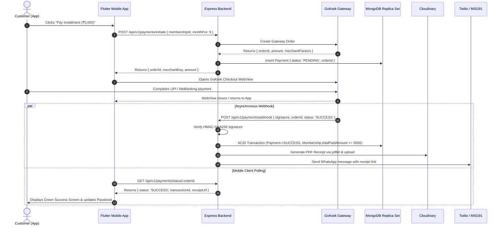

# Master Frontend ↔ Backend API Contract Freeze

> **Single Source of Truth for Frontend & Backend Integration**  
> *Kitty App (Swastik Jewellers)*

---

## 1. Document Status

```text
Contract Version:    1.0
Status:              FROZEN
Created:             2026-09-15
Last Updated:        2026-09-15
Frontend Approval:   CONFIRMED (Frontend Architecture & UI Contracts Complete)
Backend Approval:    CONFIRMED (All Architectural Options Confirmed by Backend Developer)
```

> [!IMPORTANT]
> **Contract State: FROZEN**  
> All core architectural decisions have been formally confirmed by both the Frontend and Backend leads. This document is now the **FROZEN single source of truth**. Under the Zero Silent Changes Policy (Section 21), neither party may unilaterally alter endpoints, payloads, field names, or status codes.

---

## 2. Project Boundary

An explicit boundary separates the client mobile application from the server infrastructure.

```
┌────────────────────────────────────────────────────────────────────────┐
│                          FRONTEND RESPONSIBILITIES                     │
│  • Mobile UI Rendering (Flutter / Material 3)                          │
│  • Screen Navigation & Deep Linking (GoRouter)                         │
│  • Local Client State Management (Riverpod)                            │
│  • API Request Construction & Serialization                            │
│  • HTTP Header Injection (Authorization: Bearer <token>)               │
│  • Response Deserialization (DTOs) & Domain Mapping                    │
│  • UI Loading, Empty, Error, and Shimmer States                        │
│  • Client-Side Input Formatting (Phone mask, OTP digit focus)          │
│  • Secure Storage of JWT in Keystore / Keychain (FlutterSecureStorage) │
│  • GoKwik WebView Presentation & Polling Initiation                    │
│  • Document Camera Capture & File Selection for KYC                    │
└────────────────────────────────────┬───────────────────────────────────┘
                                     │ HTTPS REST / JSON
┌────────────────────────────────────▼───────────────────────────────────┐
│                          BACKEND RESPONSIBILITIES                      │
│  • Authentication, Passwordless SMS OTP Generation & Redis Expiry     │
│  • JWT Signing, Claim Issuance, Blacklisting & Verification            │
│  • Role-Based Authorization (CUSTOMER, ADMIN, SUPER_ADMIN)             │
│  • Database Persistence & Replica Set ACID Multi-Document Transactions │
│  • Business Rules Enforcement (Capacity limits, eligibility)           │
│  • Financial Math (Dynamic Late-Joiner EMI, valuations, totals)       │
│  • Payment Gateway Server Integration (GoKwik Order Initiation)        │
│  • Webhook Signature Verification (HMAC-SHA256 crypto)                 │
│  • Payment Reconciliation & Transaction Ledger Immutability            │
│  • Cloudinary Storage Configuration for KYC Images & Receipt PDFs      │
│  • Automated PDF Receipt Generation & WhatsApp Delivery                │
│  • Live Gold Rate Sourcing (IBJA Benchmark / Admin-Managed Feed)       │
│  • Server-Side Input Validation, Sanitization, and Rate Limiting       │
└────────────────────────────────────────────────────────────────────────┘
```

* **Core Boundary Rule:** The Flutter client shall **never** directly access the database, perform financial ledger mutations, or assume payment success without backend confirmation.

---

## 3. Connectivity Architecture

```text
Flutter UI (Widgets)
       │
       ▼
Riverpod State Providers (Notifiers)
       │
       ▼
Repository Layer (Abstraction: IAuthRepository, ISchemeRepository, etc.)
       │
       ▼
Remote Data Source (Implementation: AuthRemoteDataSource, etc.)
       │
       ▼
DTO / Mapper Layer (JSON Serialization / Deserialization)
       │
       ▼
Dio HTTP Client (Base URL, Timeout, Auth Interceptor, Error Mapper)
       │
       ▼ [HTTPS REST API over TLS 1.3]
Node.js / Express Backend (NGINX Reverse Proxy)
       │
       ▼
Express Middleware (CORS, Helmet, RateLimiter, AuthGuard, BodyParser)
       │
       ▼
Controllers & Services (Business Logic & Transactions)
       │
       ├──► MongoDB Replica Set (ACID Transactions)
       ├──► Redis (OTP Expiry Cache)
       ├──► GoKwik Gateway (Orders & Webhooks)
       ├──► Cloudinary (KYC & Receipt PDFs)
       └──► Twilio / MSG91 (SMS & WhatsApp Delivery)
```

---

## 4. Base API Configuration

| Environment | Base URL | Status |
| :--- | :--- | :--- |
| **API Version** | `/api/v1` | **CONFIRMED** |
| **Development URL** | `http://localhost:5000/api/v1` (or local IP for device testing) | **CONFIRMED** |
| **Staging URL** | `TBD — BACKEND DEVELOPER` | **PENDING BACKEND PROVISIONING** |
| **Production URL** | `TBD — BACKEND DEVELOPER` | **PENDING BACKEND DEPLOYMENT** |

* The frontend centralizes all HTTP calls through an `ApiConfig` singleton reading from environment configurations (`--dart-define=BASE_URL=...`).

---

## 5. Authentication Contract

### 5.1 Protocol Overview
* **Authentication Scheme:** Passwordless SMS OTP authentication returning a signed JSON Web Token (JWT).
* **Header Convention:** All authenticated requests must include:
  ```http
  Authorization: Bearer <jwt_access_token>
  ```
* **OTP Delivery:** 6-digit numeric OTP sent via SMS (Twilio or MSG91).
* **OTP Expiry:** 300 seconds (5 minutes), managed via Redis TTL or server memory.
* **OTP Rate Limit:** Max 3 attempts per phone number per 15 minutes; cooldown of 60 seconds before resend.

### 5.2 Session & Refresh Token Policy
* **CONFIRMED DECISION (Option A):** Authentication uses a **single cryptographically signed Bearer JWT with 30-day validity**.
* **Rationale:** Maximizes retail customer mobile convenience and eliminates complex refresh token synchronization over intermittent cellular connections.
* No separate `POST /api/v1/auth/refresh-token` endpoint is required. The client maintains this single token in `FlutterSecureStorage` until expiration or logout.

### 5.3 Authentication Errors & Lifecycle
* **HTTP 401 Unauthorized:** Dispatched by backend whenever the Bearer token is missing, expired, invalid, or blacklisted.
* **Frontend 401 Handling:** Dio HTTP Interceptor immediately catches 401, clears `FlutterSecureStorage` (wiping cached token and user data), resets Riverpod auth state, and redirects the user to the Login screen.
* **HTTP 403 Forbidden:** Dispatched when a valid user lacks required authorization (e.g. attempting to join a scheme when KYC is unverified, or accessing admin endpoints). The frontend displays a compliance bottom sheet with a route to KYC upload.
* **Logout (`POST /api/v1/auth/logout`):** Client calls logout endpoint (optional blacklist on server) and wipes client-side secure credentials.

---

## 6. Standard Request Format

All incoming requests to the backend must conform to these conventions:

1. **JSON Body Endpoints:**
   - Header: `Content-Type: application/json`
   - Header: `Accept: application/json`
   - Body: Valid JSON object encoded in UTF-8.
2. **Multipart File Upload Endpoints:**
   - Header: `Content-Type: multipart/form-data; boundary=...`
   - Form fields contain text data; binary files are transmitted under defined field names (`file`).
3. **Protected Endpoints:**
   - Header: `Authorization: Bearer <token>`
4. **URL Parameters:**
   - Path Parameters: Used strictly for resource identifiers (e.g. `/api/v1/payments/status/:orderId`).
   - Query Parameters: Used for filtering, pagination, and sorting (e.g. `?page=1&limit=20&status=OPEN`).

---

## 7. Standard Response Format

Every non-binary response dispatched by the backend MUST adhere to the uniform response envelope:

```json
{
  "success": true,
  "message": "Operation completed successfully.",
  "data": {},
  "meta": {}
}
```

### Field Definitions
* **`success`** (`Boolean`, Required):
  - `true` for all successful HTTP status codes (`200 OK`, `201 Created`, `204 No Content`).
  - `false` for all error responses (`4xx`, `5xx`).
* **`message`** (`String`, Required):
  - Human-readable status description suitable for developer diagnostics or direct end-user display.
* **`data`** (`Object` | `Array` | `null`, Required on Success):
  - Payload containing the requested resource or mutation result.
  - Returns `{}` or `[]` if the resource is empty; never returns raw un-enveloped JSON.
* **`meta`** (`Object`, Optional):
  - Pagination metadata included on paginated list endpoints:
    ```json
    {
      "page": 1,
      "limit": 20,
      "total": 45,
      "hasNext": true
    }
    ```

---

## 8. Standard Error Format

When a request encounters an error, the backend MUST respond with an appropriate HTTP error status (`4xx` or `5xx`) and a JSON envelope:

```json
{
  "success": false,
  "message": "Incorrect OTP entered. 2 attempts remaining.",
  "error": {
    "code": "INVALID_OTP",
    "details": {
      "field": "otp",
      "attemptsRemaining": 2
    }
  }
}
```

### Error Handling Rules
* **Validation Errors (`400 Bad Request` / `422 Unprocessable Entity`):**
  - `error.code`: `"VALIDATION_ERROR"`
  - `error.details`: Key-value map of field names to specific error messages (e.g. `{"phone": "Invalid Indian mobile number"}`).
  - *Frontend Action:* Renders red outline and helper text beneath corresponding form field.
* **Authentication Errors (`401 Unauthorized`):**
  - `error.code`: `"UNAUTHORIZED"` or `"TOKEN_EXPIRED"`
  - *Frontend Action:* Interceptor clears tokens and routes to login.
* **Authorization / Compliance Errors (`403 Forbidden`):**
  - `error.code`: `"KYC_REQUIRED"` or `"FORBIDDEN"`
  - *Frontend Action:* Navigates to `/kyc` with explanation dialog.
* **Resource Not Found (`404 Not Found`):**
  - `error.code`: `"RESOURCE_NOT_FOUND"`
  - *Frontend Action:* Renders reusable `EmptyStateCard`.
* **State Conflict (`409 Conflict`):**
  - `error.code`: `"SCHEME_CAPACITY_FULL"` or `"DUPLICATE_PAYMENT"`
  - *Frontend Action:* Shows warning dialog with actionable guidance.
* **Rate Limiting (`429 Too Many Requests`):**
  - `error.code`: `"RATE_LIMIT_EXCEEDED"`
  - `error.details`: `{"retryAfterSeconds": 45}`
  - *Frontend Action:* Temporarily disables button and displays countdown.
* **Internal Server Error (`500 Server Error`):**
  - `error.code`: `"INTERNAL_SERVER_ERROR"`
  - *Frontend Action:* Shows generic error card with a "Retry" button. Never exposes server stack traces to client.

---

## 9. HTTP Status Contract

| HTTP Status | Meaning | Frontend Behavior | Backend Requirement |
| :--- | :--- | :--- | :--- |
| **`200 OK`** | Request succeeded. | Deserializes `data`, renders UI. | Returns requested data wrapped in success envelope. |
| **`201 Created`** | Resource created. | Displays confirmation, routes to next screen. | Returns newly created entity with generated ID. |
| **`204 No Content`** | Success with no payload. | Displays success toast, skips deserialization. | Used for resource removal or silent acknowledgments. |
| **`400 Bad Request`** | Malformed syntax or invalid payload. | Highlights invalid form inputs with error labels. | Returns error code and specific validation details. |
| **`401 Unauthorized`** | Bearer token missing, invalid, or expired. | Clears local secure storage, redirects to `/login`. | Dispatched on any protected route failing JWT validation. |
| **`403 Forbidden`** | Authenticated user lacks permission or KYC. | Prompts user with compliance / KYC bottom sheet. | Dispatched when KYC is incomplete or role is insufficient. |
| **`404 Not Found`** | Requested endpoint or resource does not exist. | Displays `EmptyStateCard` or 404 message. | Dispatched when ID lookup returns null. |
| **`409 Conflict`** | Request clashes with current system state. | Displays warning modal with resolution instructions. | E.g., Scheme full, phone already registered, double pay. |
| **`422 Unprocessable`** | Valid JSON syntax but violates domain rules. | Renders domain rule error banner. | E.g., Joining a completed scheme, invalid EMI math. |
| **`429 Rate Limited`** | Rate quota exceeded (e.g. OTP requests). | Disables submission button, shows countdown timer. | Dispatches `Retry-After` header or details payload. |
| **`500 Server Error`** | Uncaught server exception / crash. | Shows error card with "Try Again" button. | Logs full error stack internally; returns sanitized error. |
| **`502 Bad Gateway`** | Reverse proxy (NGINX) failure. | Shows "Service Temporarily Unavailable" screen. | NGINX unable to connect to Node.js daemon. |
| **`503 Unavailable`** | Scheduled maintenance or server overloaded. | Renders maintenance illustration with auto-retry. | Set during planned system maintenance windows. |

---

## 10. API Endpoint Contracts

Based strictly on the source planning files (`design_backend_plan.md`, `design_db_schema.md`, `master_integration_plan.md`), the following endpoints constitute the agreed Kitty App API suite.

### 10.1 Authentication Module

#### `POST /api/v1/auth/send-otp`
* **Feature:** Authentication
* **HTTP Method:** `POST`
* **Authentication:** Public (None)
* **Headers:** `Content-Type: application/json`
* **Path Parameters:** None
* **Query Parameters:** None
* **Request Body:**
  ```json
  {
    "phone": "+919876543210"
  }
  ```
* **Success Status:** `200 OK`
* **Success Response:**
  ```json
  {
    "success": true,
    "message": "OTP sent successfully.",
    "data": {
      "phone": "+919876543210",
      "expiresInSeconds": 300
    }
  }
  ```
* **Possible Errors:** `400 Bad Request` (Invalid phone format), `429 Too Many Requests` (Rate limit exceeded), `500 Server Error` (SMS gateway failure).
* **Pagination:** N/A
* **Notes:** Generates 6-digit numeric OTP; stores in Redis with 300s TTL; sends SMS via Twilio/MSG91.

---

#### `POST /api/v1/auth/verify-otp`
* **Feature:** Authentication
* **HTTP Method:** `POST`
* **Authentication:** Public (None)
* **Headers:** `Content-Type: application/json`
* **Path Parameters:** None
* **Query Parameters:** None
* **Request Body:**
  ```json
  {
    "phone": "+919876543210",
    "otp": "123456"
  }
  ```
* **Success Status:** `200 OK`
* **Success Response:**
  ```json
  {
    "success": true,
    "message": "Authentication successful.",
    "data": {
      "token": "eyJhbGciOiJIUzI1NiIsInR5cCI6IkpXVCJ9...",
      "isNewUser": false,
      "user": {
        "id": "usr_654321abcdef",
        "name": "Rihan",
        "phone": "+919876543210",
        "role": "CUSTOMER",
        "tier": "Tier 1 Verified Member",
        "kyc": {
          "isVerified": true,
          "documentType": "AADHAAR",
          "documentNumberMasked": "XXXX XXXX 9012",
          "documentUrl": "https://res.cloudinary.com/swastik/image/upload/kyc/sample.jpg",
          "status": "VERIFIED"
        }
      }
    }
  }
  ```
* **Possible Errors:** `400 Bad Request` (Incorrect or expired OTP).
* **Pagination:** N/A
* **Notes:** If user does not exist, atomically creates new `User` document with `role: 'CUSTOMER'` and returns `isNewUser: true`.

---

#### `POST /api/v1/auth/logout`
* **Feature:** Authentication
* **HTTP Method:** `POST`
* **Authentication:** Required (`Bearer <token>`)
* **Headers:** `Authorization: Bearer <token>`
* **Success Status:** `200 OK`
* **Success Response:**
  ```json
  {
    "success": true,
    "message": "Logged out successfully.",
    "data": {}
  }
  ```
* **Notes:** Blacklists token if stateful session management is enabled; client always purges local credentials.

---

### 10.2 User & KYC Module

#### `POST /api/v1/users/kyc`
* **Feature:** Statutory Compliance & Identity Verification
* **HTTP Method:** `POST`
* **Authentication:** Required (`Bearer <token>`)
* **Headers:** `Content-Type: multipart/form-data`, `Authorization: Bearer <token>`
* **Path Parameters:** None
* **Query Parameters:** None
* **Request Body (Multipart Form):**
  - `documentType`: String (`"AADHAAR"` | `"PAN"`)
  - `documentNumber`: String (`"123456789012"` or `"ABCDE1234F"`)
  - `consentAgreed`: String / Boolean (`"true"`)
  - `file`: Binary file (JPEG, PNG, or PDF; max 10MB)
* **Success Status:** `200 OK` or `201 Created`
* **Success Response:**
  ```json
  {
    "success": true,
    "message": "KYC document submitted successfully.",
    "data": {
      "referenceId": "KYC-849201",
      "status": "PENDING",
      "documentType": "AADHAAR",
      "documentNumberMasked": "XXXX XXXX 9012",
      "documentUrl": "https://res.cloudinary.com/swastik/image/upload/kyc/sample.jpg"
    }
  }
  ```
* **Possible Errors:** `400 Bad Request` (Invalid file format, size > 10MB, invalid number pattern), `401 Unauthorized`.
* **Pagination:** N/A
* **Notes:** Multer streams file to Cloudinary in folder `swastik_kyc/`. Updates user `kyc` subdocument.

---

### 10.3 Schemes Module

#### `GET /api/v1/schemes/active`
* **Feature:** Scheme Discovery & Browse
* **HTTP Method:** `GET`
* **Authentication:** Public / Optional
* **Headers:** `Accept: application/json`
* **Path Parameters:** None
* **Query Parameters:**
  - `duration`: Integer (Optional, e.g. `12`)
* **Success Status:** `200 OK`
* **Success Response:**
  ```json
  {
    "success": true,
    "message": "Active schemes retrieved.",
    "data": {
      "schemes": [
        {
          "id": "sch_12month_suvarna",
          "name": "Swastik Suvarna Varsha",
          "targetAmount": 60000,
          "durationMonths": 12,
          "monthlyInstallment": 5000,
          "maxCapacity": 100,
          "currentMembers": 42,
          "status": "OPEN",
          "benefits": [
            "1 Month Free: 11 Paid + 12th Month 100% Jeweler Bonus",
            "25% Flat Discount on Jewellery Making Charges",
            "Accumulate 24K 999 Hallmark Purity Gold"
          ],
          "bannerImageUrl": "assets/banner_clean_bonus.jpg",
          "isPopular": true
        }
      ]
    }
  }
  ```
* **Possible Errors:** `500 Server Error`.
* **Pagination:** Not paginated (returns all schemes with `status: 'OPEN'`).

---

#### `POST /api/v1/schemes`
* **Feature:** Admin Scheme Creation
* **HTTP Method:** `POST`
* **Authentication:** Admin Required (`Bearer <admin_token>`)
* **Headers:** `Content-Type: application/json`, `Authorization: Bearer <token>`
* **Request Body:**
  ```json
  {
    "name": "Swastik Suvarna Varsha",
    "targetAmount": 60000,
    "durationMonths": 12,
    "maxCapacity": 100
  }
  ```
* **Success Status:** `201 Created`
* **Notes:** Reserved for Admin role.

---

### 10.4 Memberships Module

#### `POST /api/v1/memberships/join`
* **Feature:** Scheme Enrollment with Late-Joiner Math
* **HTTP Method:** `POST`
* **Authentication:** Required (`Bearer <token>`)
* **Headers:** `Content-Type: application/json`, `Authorization: Bearer <token>`
* **Request Body:**
  ```json
  {
    "schemeId": "sch_12month_suvarna"
  }
  ```
* **Success Status:** `201 Created`
* **Success Response:**
  ```json
  {
    "success": true,
    "message": "Enrolled in scheme successfully.",
    "data": {
      "membership": {
        "id": "mem_994411",
        "schemeId": "sch_12month_suvarna",
        "schemeName": "Swastik Suvarna Varsha",
        "tokenNumber": 42,
        "customMonthlyEmi": 5000,
        "targetAmount": 60000,
        "totalPaidAmount": 0,
        "status": "ACTIVE",
        "joinedAtMonth": 1
      }
    }
  }
  ```
* **Possible Errors:** `400 Bad Request` (Scheme full: `currentMembers >= maxCapacity`), `403 Forbidden` (User KYC not verified), `409 Conflict` (User already has active membership in this scheme).
* **Business Logic:**
  - `joinedAtMonth` calculated based on elapsed scheme months.
  - `customMonthlyEmi = targetAmount / (durationMonths - joinedAtMonth + 1)`.
  - Atomically increments `Scheme.currentMembers` and assigns next `tokenNumber`.

---

#### `GET /api/v1/memberships/my-dashboard`
* **Feature:** Core Dashboard & Passbook Aggregation
* **HTTP Method:** `GET`
* **Authentication:** Required (`Bearer <token>`)
* **Headers:** `Accept: application/json`, `Authorization: Bearer <token>`
* **Success Status:** `200 OK`
* **Success Response:**
  ```json
  {
    "success": true,
    "message": "Dashboard data retrieved.",
    "data": {
      "hasActiveScheme": true,
      "dashboard": {
        "membershipId": "mem_994411",
        "chitToken": "#SW-042",
        "schemeName": "Swastik Suvarna Varsha (12-Month Gold Kitty)",
        "targetAmount": 60000,
        "customMonthlyEmi": 5000,
        "totalMonths": 12,
        "monthsPaid": 8,
        "totalPaidAmount": 40000,
        "remainingAmount": 15000,
        "accumulatedGoldGrams": 5.482,
        "currentValuation": 41036,
        "valuationGainPct": 2.59,
        "nextInstallment": {
          "month": 9,
          "amount": 5000,
          "dueDate": "2026-09-15T00:00:00.000Z",
          "daysRemaining": 5
        },
        "passbook": [
          {
            "month": 1,
            "label": "Month 1",
            "amount": 5000,
            "status": "PAID",
            "paidAt": "2026-01-15T10:30:00.000Z",
            "paymentMethod": "ONLINE",
            "transactionId": "TXN-SW-10821",
            "goldGrams": 0.702,
            "receiptUrl": "https://res.cloudinary.com/swastik/image/upload/receipts/rec_10821.pdf"
          },
          {
            "month": 9,
            "label": "Month 9",
            "amount": 5000,
            "status": "CURRENT",
            "dueDate": "2026-09-15T00:00:00.000Z"
          },
          {
            "month": 10,
            "label": "Month 10",
            "amount": 5000,
            "status": "UPCOMING",
            "dueDate": "2026-10-15T00:00:00.000Z"
          },
          {
            "month": 12,
            "label": "Month 12",
            "amount": 5000,
            "status": "BONUS",
            "bonusNote": "100% Jeweler Bonus Deposit on completion"
          }
        ]
      }
    }
  }
  ```
* **Possible Errors:** `401 Unauthorized`. If user has no active scheme, returns `hasActiveScheme: false` and `dashboard: null`.

---

### 10.5 Payments Module

#### `POST /api/v1/payments/initiate`
* **Feature:** Installment Checkout Order Creation
* **HTTP Method:** `POST`
* **Authentication:** Required (`Bearer <token>`)
* **Headers:** `Content-Type: application/json`, `Authorization: Bearer <token>`
* **Request Body:**
  ```json
  {
    "membershipId": "mem_994411",
    "monthFor": 9,
    "paymentMethod": "ONLINE"
  }
  ```
* **Success Status:** `200 OK`
* **Success Response:**
  ```json
  {
    "success": true,
    "message": "Payment order initiated.",
    "data": {
      "orderId": "gokwik_ord_771829",
      "paymentId": "pay_662819",
      "amount": 5000,
      "currency": "INR",
      "merchantKey": "TBD — BACKEND DEVELOPER"
    }
  }
  ```
* **Possible Errors:** `400 Bad Request` (Invalid month, already paid), `401 Unauthorized`.
* **Business Logic:** Calls GoKwik API to create gateway order; inserts record into `Payment` collection with `status: 'PENDING'`.

---

#### `GET /api/v1/payments/status/:orderId`
* **Feature:** Payment Polling & Reconciliation
* **HTTP Method:** `GET`
* **Authentication:** Required (`Bearer <token>`)
* **Headers:** `Accept: application/json`, `Authorization: Bearer <token>`
* **Path Parameters:** `orderId` (e.g. `gokwik_ord_771829`)
* **Success Status:** `200 OK`
* **Success Response:**
  ```json
  {
    "success": true,
    "message": "Payment status checked.",
    "data": {
      "orderId": "gokwik_ord_771829",
      "status": "SUCCESS",
      "transactionId": "TXN-SW-50291",
      "receiptUrl": "https://res.cloudinary.com/swastik/image/upload/receipts/rec_50291.pdf",
      "totalPaidAmount": 45000,
      "monthsPaid": 9
    }
  }
  ```
* **Possible Errors:** `404 Not Found` (Order ID does not exist).
* **Notes:** Called by mobile app when returning from GoKwik WebView while webhook processing may be completing.

---

#### `POST /api/v1/payments/webhook`
* **Feature:** GoKwik Asynchronous Notification
* **HTTP Method:** `POST`
* **Authentication:** Public with HMAC-SHA256 Signature Verification (`x-gokwik-signature`)
* **Headers:** `Content-Type: application/json`, `x-gokwik-signature: <hash>`
* **Request Body:** Gateway webhook payload from GoKwik containing `order_id`, `payment_id`, `status`.
* **Success Status:** `200 OK`
* **Business Logic:**
  - Verifies signature using `crypto`.
  - Executes Mongoose multi-document ACID transaction:
    1. Updates `Payment` document status to `SUCCESS`.
    2. Increments `Membership.totalPaidAmount`.
  - Asynchronously generates PDF receipt via `pdfkit`, uploads to Cloudinary, and triggers Twilio/MSG91 WhatsApp notification.

---

### 10.6 Gold Rate Module

#### `GET /api/v1/rates/gold`
* **Feature:** Real-Time Live Gold Rate Benchmark
* **HTTP Method:** `GET`
* **Authentication:** Public / Optional
* **Headers:** `Accept: application/json`
* **Success Status:** `200 OK`
* **Success Response:**
  ```json
  {
    "success": true,
    "message": "Live gold rates retrieved.",
    "data": {
      "rate24k": 7485.50,
      "rate22k": 6860.00,
      "rateChangePct": 0.62,
      "unit": "1 gram",
      "currency": "INR",
      "benchmark": "IBJA Official",
      "updatedAt": "2026-09-15T13:14:41.000Z"
    }
  }
  ```
* **Possible Errors:** `500 Server Error`.
* **Notes:** Live benchmark rates displayed in the sticky header and used to compute portfolio valuation.

---

### 10.7 Admin Controls Module

#### `POST /api/v1/admin/payments/record-cash`
* **Feature:** Counter Cash Installment Logging
* **HTTP Method:** `POST`
* **Authentication:** Admin Required (`Bearer <admin_token>`)
* **Request Body:**
  ```json
  {
    "membershipId": "mem_994411",
    "amount": 5000,
    "monthFor": 9
  }
  ```
* **Success Status:** `201 Created`
* **Business Logic:** Logs payment as `paymentMethod: 'CASH'`, updates membership total, generates PDF receipt, and sends WhatsApp link.

---

#### `POST /api/v1/admin/draw/record-winner`
* **Feature:** Monthly Lucky Draw Winner Selection
* **HTTP Method:** `POST`
* **Authentication:** Admin Required (`Bearer <admin_token>`)
* **Request Body:**
  ```json
  {
    "schemeId": "sch_12month_suvarna",
    "tokenNumber": 42,
    "month": 8
  }
  ```
* **Success Status:** `200 OK`
* **Business Logic:** Updates membership status to `WINNER`, records `winMonth`, and broadcasts WhatsApp announcement.

---

## 11. Data Contract

The table below catalogs every entity and field consumed by the frontend mobile application.

| Entity | Field Name | Type | Required? | Nullable? | Description | Example | Source |
| :--- | :--- | :--- | :--- | :--- | :--- | :--- | :--- |
| **User** | `id` | `String` | Yes | No | Unique user identifier | `"usr_654321abcdef"` | DB `User._id` |
| **User** | `name` | `String` | Yes | No | Full legal name | `"Rihan"` | DB `User.name` |
| **User** | `phone` | `String` | Yes | No | E.164 formatted phone | `"+919876543210"` | DB `User.phone` |
| **User** | `role` | `String` | Yes | No | User role enum | `"CUSTOMER"` | DB `User.role` |
| **User** | `tier` | `String` | Yes | No | UI loyalty membership tier | `"Tier 1 Verified Member"` | Calculated |
| **KYC** | `isVerified` | `Boolean` | Yes | No | Verification status flag | `true` | DB `User.kyc.isVerified` |
| **KYC** | `documentType` | `String` | Yes | Yes | Type of KYC doc | `"AADHAAR"` | DB `User.kyc.documentType` |
| **KYC** | `documentNumberMasked` | `String` | No | Yes | Masked doc identifier | `"XXXX XXXX 9012"` | Calculated |
| **KYC** | `documentUrl` | `String` | No | Yes | Cloudinary asset link | `"https://res.cloudinary..."` | DB `User.kyc.documentUrl` |
| **KYC** | `status` | `String` | Yes | No | Verification state | `"PENDING"` | Calculated / DB |
| **Scheme** | `id` | `String` | Yes | No | Unique scheme ID | `"sch_12month_suvarna"` | DB `Scheme._id` |
| **Scheme** | `name` | `String` | Yes | No | Commercial scheme title | `"Swastik Suvarna Varsha"` | DB `Scheme.name` |
| **Scheme** | `targetAmount` | `Number` | Yes | No | Total target value | `60000` | DB `Scheme.targetAmount` |
| **Scheme** | `durationMonths` | `Number` | Yes | No | Scheme duration | `12` | DB `Scheme.durationMonths` |
| **Scheme** | `monthlyInstallment`| `Number` | Yes | No | Base monthly EMI | `5000` | DB / UI Plan |
| **Scheme** | `maxCapacity` | `Number` | Yes | No | Total chit tokens limit | `100` | DB `Scheme.maxCapacity` |
| **Scheme** | `currentMembers` | `Number` | Yes | No | Enrolled member count | `42` | DB `Scheme.currentMembers` |
| **Scheme** | `status` | `String` | Yes | No | Scheme lifecycle enum | `"OPEN"` | DB `Scheme.status` |
| **Scheme** | `benefits` | `Array<String>`| Yes | No | Bulleted benefit points | `["1 Month Free..."]` | UI Plan |
| **Membership**| `id` | `String` | Yes | No | Unique membership ID | `"mem_994411"` | DB `Membership._id` |
| **Membership**| `schemeId` | `String` | Yes | No | Foreign key to Scheme | `"sch_12month_suvarna"` | DB `Membership.schemeId` |
| **Membership**| `tokenNumber` | `Number` | Yes | No | Assigned chit number | `42` | DB `Membership.tokenNumber`|
| **Membership**| `customMonthlyEmi`| `Number`| Yes | No | Dynamic EMI calculated | `5000` | DB `Membership.customMonthlyEmi` |
| **Membership**| `totalPaidAmount` | `Number`| Yes | No | Sum of successful payments | `40000` | DB `Membership.totalPaidAmount` |
| **Membership**| `status` | `String` | Yes | No | Membership status enum | `"ACTIVE"` | DB `Membership.status` |
| **Membership**| `joinedAtMonth` | `Number` | Yes | No | Month joined (1-12) | `1` | DB `Membership.joinedAtMonth` |
| **Dashboard** | `chitToken` | `String` | Yes | No | Formatted chit token badge | `"#SW-042"` | Calculated |
| **Dashboard** | `totalMonths` | `Number` | Yes | No | Total duration in months | `12` | Aggregated |
| **Dashboard** | `monthsPaid` | `Number` | Yes | No | Count of paid installments | `8` | Aggregated |
| **Dashboard** | `remainingAmount` | `Number`| Yes | No | Target minus paid amount | `15000` | Calculated |
| **Dashboard** | `accumulatedGoldGrams`| `Number`| Yes | No | Grams of 24K gold credited | `5.482` | Calculated from payments |
| **Dashboard** | `currentValuation` | `Number`| Yes | No | Portfolio market value | `41036` | `accumulatedGoldGrams * rate24k` |
| **Dashboard** | `valuationGainPct` | `Number`| Yes | No | Value gain percentage | `2.59` | Calculated |
| **PassbookItem**| `month` | `Number` | Yes | No | Month index (1 to 12) | `1` | Transaction ledger |
| **PassbookItem**| `label` | `String` | Yes | No | Human readable label | `"Month 1"` | UI format |
| **PassbookItem**| `amount` | `Number` | Yes | No | Installment amount | `5000` | DB `Payment.amount` |
| **PassbookItem**| `status` | `String` | Yes | No | Installment status enum | `"PAID"` | Dynamic ledger evaluation |
| **PassbookItem**| `paidAt` | `String` | No | Yes | UTC timestamp of payment | `"2026-01-15T10:30:00.000Z"`| DB `Payment.paidAt` |
| **PassbookItem**| `paymentMethod` | `String` | No | Yes | Payment mode enum | `"ONLINE"` | DB `Payment.paymentMethod` |
| **PassbookItem**| `transactionId` | `String` | No | Yes | Gateway / Cash receipt ref | `"TXN-SW-10821"` | DB `Payment.transactionId` |
| **PassbookItem**| `goldGrams` | `Number` | No | Yes | Gold purchased in installment| `0.702` | Calculated at pay time |
| **PassbookItem**| `receiptUrl` | `String` | No | Yes | Link to Cloudinary PDF | `"https://res.cloudinary..."` | DB `Payment.receiptUrl` |
| **PassbookItem**| `dueDate` | `String` | No | Yes | Scheduled payment date | `"2026-09-15T00:00:00.000Z"`| Calculated |
| **Payment** | `orderId` | `String` | Yes | No | GoKwik Gateway order ref | `"gokwik_ord_771829"` | Gateway |
| **Payment** | `status` | `String` | Yes | No | Gateway status enum | `"SUCCESS"` | Gateway / DB |
| **GoldRate** | `rate24k` | `Number` | Yes | No | Per-gram 24K 999 rate | `7485.50` | Market feed |
| **GoldRate** | `rate22k` | `Number` | Yes | No | Per-gram 22K 916 rate | `6860.00` | Market feed |
| **GoldRate** | `rateChangePct` | `Number` | Yes | No | Daily fluctuation percent | `0.62` | Market feed |

---

## 12. Money Contract

> [!CAUTION]
> **FINANCIAL CALCULATION OWNERSHIP:**  
> The backend server is the **sole authoritative source** for all monetary calculations, dynamic EMI computations, totals, balance remaining, and valuation numbers. The frontend will never calculate ledger balance independently.

### Monetary Rules & Precision
* **Currency:** Indian Rupee (`INR`, symbol `₹`).
* **CONFIRMED DECISION (Option A — Integer Rupees):**
  - All monetary figures in API JSON payloads are passed as **standard Whole Integer Rupees** (e.g. `5000` represents ₹5,000; `60000` represents ₹60,000).
  - No integer paise conversion (e.g. `500000`) is required between backend and frontend. The API wire representation matches the domain model directly.
* **Display Formatting:** Frontend formats amounts using Indian comma grouping (`₹5,000`, `₹50,000`, `₹1,05,000`).
* **Gold Gram Precision:** Stored and returned to **3 decimal places** (e.g. `5.482` grams).
* **Valuation Rounding:** Gold portfolio valuation is rounded to the nearest whole Rupee (`Math.round()`).

---

## 13. Date/Time Contract

* **API Transmission Format:** Strict **ISO 8601 UTC** with `Z` suffix:
  ```text
  YYYY-MM-DDTHH:mm:ss.sssZ
  Example: 2026-09-15T13:14:41.000Z
  ```
* **Date-Only Format:** `YYYY-MM-DD` (e.g. `2026-09-15`).
* **Storage Standard:** All timestamps stored in MongoDB as standard UTC BSON `Date`.
* **Frontend Presentation Conversion:** The Flutter client converts all received UTC timestamps to Indian Standard Time (**IST: UTC+5:30**) using `intl`:
  - Receipt / Payment: `"15 Sep 2026, 02:45 PM"`
  - Passbook Due Date: `"15 Sep 2026"`

---

## 14. Enum & Status Contract

Both frontend and backend must strictly adhere to the defined string enums. No mismatched casing or spelling variations are permitted.

### 14.1 User Role Enum (`User.role`)
| Enum Value | Meaning | Frontend Display | Backend Usage | Unknown Value Handling |
| :--- | :--- | :--- | :--- | :--- |
| **`CUSTOMER`** | Standard mobile app retail user | "Member" | Default role for new users | Fallback default |
| **`ADMIN`** | Jeweler admin with desk portal | "Admin" | Can create schemes, log cash | Treat as CUSTOMER on mobile |
| **`SUPER_ADMIN`** | System owner / tech lead | "Super Admin" | System config, DB access | Treat as CUSTOMER on mobile |

### 14.2 KYC Document Type (`User.kyc.documentType`)
| Enum Value | Meaning | Frontend Display | Backend Usage | Unknown Value Handling |
| :--- | :--- | :--- | :--- | :--- |
| **`AADHAAR`** | 12-digit Indian National ID | "Aadhaar Card" | Validates 12 numeric digits | Reject upload |
| **`PAN`** | 10-char Permanent Account Number | "PAN Card" | Validates alphanumeric pattern | Reject upload |

### 14.3 KYC Status Enum (`User.kyc.status`)
| Enum Value | Meaning | Frontend Display | Backend Usage | Unknown Value Handling |
| :--- | :--- | :--- | :--- | :--- |
| **`NOT_SUBMITTED`**| No document uploaded | "KYC Pending" (Yellow badge) | Restricts scheme enrollment | Fallback default |
| **`PENDING`** | Document uploaded, awaiting review | "Under Verification" (Blue) | Admin verification queue | Treat as PENDING |
| **`VERIFIED`** | Document verified | "Verified Member" (Green) | Grants full transaction rights | Fallback to PENDING |
| **`REJECTED`** | Document unreadable or invalid | "Verification Failed" (Red)| Prompts re-upload | Treat as REJECTED |

### 14.4 Scheme Status Enum (`Scheme.status`)
| Enum Value | Meaning | Frontend Display | Backend Usage | Unknown Value Handling |
| :--- | :--- | :--- | :--- | :--- |
| **`OPEN`** | Accepting new enrollments | "Open for Enrollment" | Listed in `/schemes/active` | Treat as OPEN |
| **`ONGOING`** | Capacity reached or scheme underway| "In Progress" | Denies new memberships | Treat as ONGOING |
| **`COMPLETED`** | 12 months concluded | "Scheme Completed" | Triggers final payout | Treat as COMPLETED |

### 14.5 Membership Status Enum (`Membership.status`)
| Enum Value | Meaning | Frontend Display | Backend Usage | Unknown Value Handling |
| :--- | :--- | :--- | :--- | :--- |
| **`ACTIVE`** | Active ongoing enrollment | "Active Scheme" | Renders main dashboard | Fallback default |
| **`WINNER`** | Selected as lucky draw winner | "Winner" (Gold Crown badge) | Waives remaining installments | Treat as ACTIVE |
| **`COMPLETED`** | All installments concluded | "Completed & Matured" | Ready for jewellery redemption | Treat as COMPLETED |
| **`DEFAULTED`** | Missed consecutive payments | "Defaulted / On Hold" | Freezes perks | Treat as ACTIVE |

### 14.6 Payment Method Enum (`Payment.paymentMethod`)
| Enum Value | Meaning | Frontend Display | Backend Usage | Unknown Value Handling |
| :--- | :--- | :--- | :--- | :--- |
| **`ONLINE`** | GoKwik Gateway (UPI/Card/NetBank) | "Online (GoKwik)" | Webhook reconciliation | Fallback default |
| **`CASH`** | Over-the-counter jeweler payment | "Cash at Counter" | Recorded by Admin | Treat as CASH |

### 14.7 Payment Transaction Status (`Payment.status`)
| Enum Value | Meaning | Frontend Display | Backend Usage | Unknown Value Handling |
| :--- | :--- | :--- | :--- | :--- |
| **`PENDING`** | Initiated, awaiting gateway return | "Processing..." | Initial state in DB | Treat as PENDING |
| **`SUCCESS`** | Successfully completed & reconciled | "Paid" | Increments totalPaidAmount | Treat as FAILED |
| **`FAILED`** | Gateway failed or cancelled | "Failed" | Retains record for audit | Treat as FAILED |

### 14.8 Passbook Row Status Enum (`PassbookItem.status`)
| Enum Value | Meaning | Frontend Display | Backend Usage | Unknown Value Handling |
| :--- | :--- | :--- | :--- | :--- |
| **`PAID`** | Completed installment | Green badge + "Receipt" button | Joined to successful Payment | Fallback to UPCOMING |
| **`CURRENT`** | Active installment due this month | Amber card + "Pay Now" button | Unpaid for current month | Fallback to UPCOMING |
| **`UPCOMING`** | Scheduled future installment | Muted gray row | Months > current month | Fallback to UPCOMING |
| **`BONUS`** | Month 12 jeweler gift deposit | Gift Star icon + "Bonus" | Month 12 special row | Treat as BONUS |
| **`PRE_JOIN`** | Past month prior to late-join enrollment | Muted row: "Joined Month N" (Lock icon) | Unpaid months prior to join (Excluded from balance) | Muted display |

> [!NOTE]
> **Client Enum Resiliency:** The Flutter app maps any unrecognized enum string to an `.unknown` enum value to prevent parsing exceptions or screen crashes.

---

## 15. Pagination Contract

For all paginated endpoints, query parameters and response metadata must adhere to this standard:

### Request Parameters
* `page`: Integer, 1-indexed (Default: `1`).
* `limit`: Integer, items per page (Default: `20`, Max: `100`).
* `sort`: String, field name with optional prefix `-` for descending (e.g. `?sort=-createdAt`).

### Response Envelope Metadata
```json
{
  "meta": {
    "page": 1,
    "limit": 20,
    "total": 42,
    "hasNext": true
  }
}
```

---

## 16. KYC Contract

### Lifecycle
1. **Selection:** User selects document type (`AADHAAR` or `PAN`).
2. **Input:** User inputs 12-digit Aadhaar or 10-char PAN and checks statutory consent checkbox.
3. **Capture:** User selects camera or gallery image (JPG/PNG/PDF, max 10MB).
4. **Submission:** Frontend sends `POST /api/v1/users/kyc` (multipart).
5. **Storage:** Backend uploads image to Cloudinary folder `swastik_kyc/` using `multer-storage-cloudinary`.
6. **Persistence:** Backend updates `User.kyc` subdocument with Cloudinary URL, masked number, and sets `status: 'PENDING'`.
7. **Verification:** Admin reviews document via Admin portal; updates `isVerified: true` and `status: 'VERIFIED'`.

---

## 17. Payment Contract

### Complete End-to-End Flow



### Idempotency & Reconciliation Rules
* **No Double Processing:** Webhook handler must check if `Payment.status === 'SUCCESS'`. If already processed, acknowledge with `200 OK` and avoid duplicate ledger increments.
* **Polling Resiliency:** If polling occurs before the webhook commits, backend returns `status: 'PENDING'`. App polls up to 5 times (every 3 seconds) before displaying a "Payment Pending Verification" banner.
* **Never Trust Client Alone:** Payment completion is never accepted based solely on mobile app client reports. Only the backend-verified GoKwik state can mark an installment paid.

---

## 18. Gold Rate Contract

* **Endpoint:** `GET /api/v1/rates/gold`
* **Response Units:**
  - `rate24k`: Rupee price per 1 gram of 24K (999 purity) gold.
  - `rate22k`: Rupee price per 1 gram of 22K (916 purity) gold.
  - `rateChangePct`: Daily percentage change (e.g. `+0.62%`).
  - `benchmark`: Benchmark name (e.g. `"Swastik Daily Benchmark"` or `"IBJA Official"`).
  - `updatedAt`: ISO 8601 UTC timestamp.
* **CONFIRMED DECISION (Option B — Admin-Managed Daily Gold Rate):**
  - Live rates are managed internally via a store admin control panel.
  - Showroom management logs the official store benchmark rate daily at opening (e.g. 10:00 AM IST).
  - No recurring commercial third-party feed subscription (e.g. GoldAPI) is required.

---

## 19. File / Image Contract

* **Upload Endpoint:** `POST /api/v1/users/kyc` (Multipart)
* **Maximum File Size:** 10 MB (**CONFIRMED:** NGINX `client_max_body_size 10M;` and Express Multer `limits: { fileSize: 10 * 1024 * 1024 }` configured).
* **Allowed MIME Types:** `image/jpeg`, `image/png`, `application/pdf`.
* **Storage Provider:** Cloudinary (`swastik_kyc/` and `swastik_receipts/`).
* **Compression:** Backend should configure Cloudinary auto-compression (`q_auto,f_auto`) for images to optimize load times.
* **Access Policy:** Direct HTTPS CDN URLs returned in all API responses.

---

## 20. Backward Compatibility & Versioning

### Frontend Client Obligations
* **Unknown Field Tolerance:** JSON deserializers must ignore unknown or novel fields without throwing errors.
* **Nullable Field Handling:** DTOs must treat optional fields gracefully with defaults.
* **Enum Safety:** Unrecognized enum values must fall back to a safe default (`.unknown`).

### Backend Server Obligations
* **No Silent Field Removals:** Never remove or rename existing response keys in `/api/v1`.
* **No Type Alterations:** Never change a field type from `Number` to `String` or vice-versa in `/api/v1`.
* **Breaking Changes Require `/api/v2`:** Any structural changes breaking this contract must be versioned under a new path prefix.

---

## 21. Contract Change Policy

> **Zero Silent Changes Policy:**  
> Once this document is marked **FROZEN**, neither the Frontend Developer nor the Backend Developer may unilaterally alter endpoints, payloads, field names, or HTTP status codes.

### Change Request Procedure
1. Create a written RFC detailing:
   - **Target Endpoint / Field**
   - **Old Behavior**
   - **Proposed New Behavior**
   - **Reason for Change**
   - **Impact on Client & Server**
2. Both Frontend and Backend leads must approve the change.
3. Update this document and increment the `Contract Version` (e.g. `1.1`).
4. Update Mock Repositories in the frontend before deploying the backend change.
