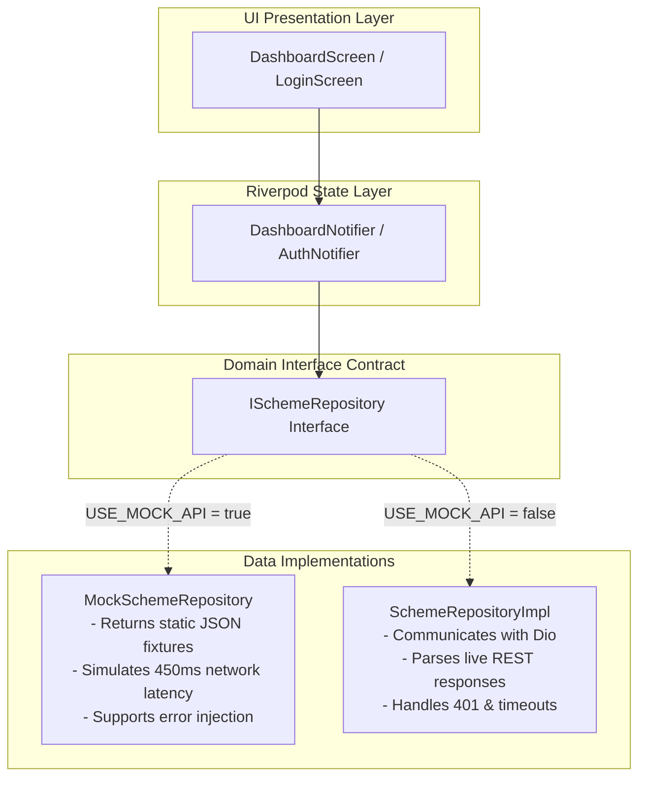

# Mock API Strategy & Offline Sandbox Plan

## 1. Overview & Strategy
Because the backend is developed concurrently by a separate engineer, the frontend team must **never be blocked** waiting for live servers, database deployments, or external gateway credentials.

This strategy establishes a **Mock-First Architecture** where:
1. Every domain feature relies strictly on an abstract repository interface (`IAuthRepository`, `ISchemeRepository`, `IPaymentRepository`).
2. Two parallel implementations exist: `MockRepositoryImpl` and `HttpRepositoryImpl`.
3. Toggling between mock fixtures and the live server is achieved via a single compile-time or runtime environment flag without altering a single line of UI presentation code.

---

## 2. Mock Dependency Injection Architecture



---

## 3. Implementation of the Mock Swapper

```dart
// lib/core/di/repository_providers.dart
import 'package:flutter_riverpod/flutter_riverpod.dart';
import '../../features/kitty/domain/repositories/i_scheme_repository.dart';
import '../../features/kitty/data/repositories/scheme_repository_impl.dart';
import '../../features/kitty/data/repositories/mock_scheme_repository.dart';
import '../config/app_environment.dart';

final schemeRepositoryProvider = Provider<ISchemeRepository>((ref) {
  if (AppEnvironment.useMockApi) {
    return MockSchemeRepository(); // Zero network dependencies
  }
  return SchemeRepositoryImpl(client: ref.read(httpClientProvider));
});
```

---

## 4. Mock Scenarios & State Simulators

To thoroughly test all UI states prior to backend readiness, the mock repositories simulate 5 distinct behaviors:

### 4.1 Scenario A: Normal Success State with Network Latency
```dart
class MockSchemeRepository implements ISchemeRepository {
  @override
  Future<DashboardSummaryEntity> getMyDashboard() async {
    // Artificial 500ms delay to verify shimmer skeleton transitions
    await Future.delayed(const Duration(milliseconds: 500));
    
    final jsonStr = await rootBundle.loadString('test/mocks/fixtures/dashboard_active_suvarna.json');
    final dto = DashboardSummaryDto.fromJson(jsonDecode(jsonStr));
    return DashboardMapper.toEntity(dto);
  }
}
```

### 4.2 Scenario B: Empty State (New User with No Scheme)
```dart
@override
Future<DashboardSummaryEntity> getMyDashboard() async {
  await Future.delayed(const Duration(milliseconds: 400));
  // Returns entity where hasActiveScheme = false
  return const DashboardSummaryEntity.empty();
}
```
* **UI Verification:** Ensures `EmptyStateCard` appears with the "Explore Kitty Plans" button instead of crashing.

### 4.3 Scenario C: Error State & Retry Handling
```dart
@override
Future<DashboardSummaryEntity> getMyDashboard({bool simulateError = false}) async {
  await Future.delayed(const Duration(milliseconds: 600));
  if (simulateError) {
    throw ServerFailure(message: 'Simulated 500 Internal Server Error');
  }
  // ...
}
```
* **UI Verification:** Verifies that the red error banner and "Retry" button appear and re-executes the fetch correctly.

### 4.4 Scenario D: Mock Authentication & Sandbox OTP
* In `MockAuthRepository`:
  - `sendOtp(phone)`: Immediately succeeds after 300ms, logs `"Sandbox OTP generated: 123456"`.
  - `verifyOtp(phone, otp)`:
    - If `otp == '123456'`: Returns valid user entity and JWT token.
    - If `otp != '123456'`: Throws `AuthFailure(message: 'Incorrect OTP entered. Use 123456 for testing.')`.

### 4.5 Scenario E: Mock Payment Flow
* In `MockPaymentRepository`:
  - `initiatePayment(...)`: Returns mock `orderId: 'mock_order_9944'`.
  - `getPaymentStatus('mock_order_9944')`: Simulates 2-second gateway processing delay, then returns `status: 'SUCCESS'` with sample Cloudinary receipt URL.

---

## 5. Mock Fixture Library Directory (`test/mocks/fixtures/`)

| Fixture File | Description & Payload Content |
| :--- | :--- |
| `auth_verify_success.json` | Valid JWT token + Tier 1 user profile (Rihan, #SW-042). |
| `auth_new_user.json` | Valid JWT token + `isNewUser: true` + `kycStatus: 'PENDING'`. |
| `dashboard_active_suvarna.json` | 12-Month Suvarna Varsha plan, 8/12 paid, ₹40,000 paid so far, 5.482g gold, Month 9 due. |
| `dashboard_empty.json` | `{ "hasActiveScheme": false, "dashboard": null }`. |
| `passbook_12_months.json` | Full 12-month installment array with 8 PAID, 1 CURRENT, 2 UPCOMING, 1 BONUS. |
| `schemes_active_catalog.json` | 5 distinct savings plans (Suvarna Varsha, Dhanteras Labh, Bridal Royal, Akshaya Bullion). |
| `live_gold_rate.json` | 24K: ₹7,485.50, 22K: ₹6,860.00, +0.62% change. |

---

## 6. How to Switch to Live Backend

When the backend developer deploys the Node.js / Express server to staging or production:

1. Open terminal in project root.
2. Run Flutter with `USE_MOCK_API=false` pointing to the live API URL:
   ```bash
   flutter run --dart-define=USE_MOCK_API=false --dart-define=API_BASE_URL=https://staging-api.swastikjewels.com/api/v1
   ```
3. **Zero UI code changes required:** The app automatically instantiates `HttpAuthRepository`, `SchemeRepositoryImpl`, and `PaymentRepositoryImpl` with live Dio networking.
