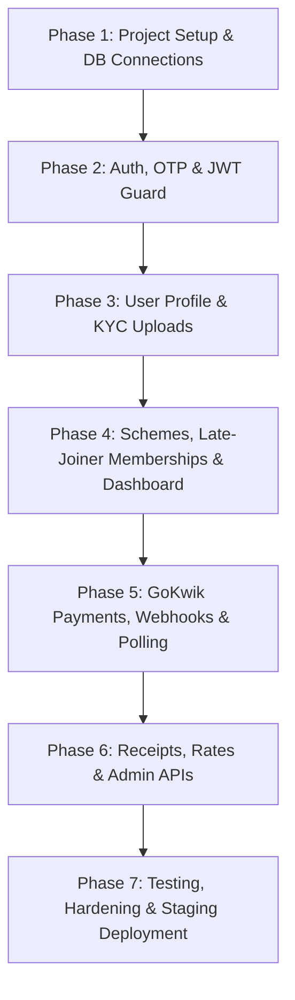

# Backend Developer Implementation Guide & Engineering Checklist

> **Kitty App (Swastik Jewellers)**  
> *Target Stack: Node.js, Express, MongoDB (Replica Set), GoKwik, Cloudinary, Twilio/MSG91*

---

> [!IMPORTANT]
> **RELATIONSHIP TO MASTER CONTRACT:**  
> This document explains **WHAT and HOW** the backend developer needs to build.  
> [BACKEND_CONTRACT_FREEZE.md](file:///d:/ui%20design/kitty_docs/api/BACKEND_CONTRACT_FREEZE.md) defines **EXACTLY what the frontend and backend have agreed on**.  
> If there is any conflict between code ideas and the contract freeze document, **the contract freeze document takes precedence** and must be formally amended before implementation continues.

---

## 1. Backend Objective

The objective of the backend engineering effort is to build, test, and deploy a robust, secure, and performant RESTful API service supporting the Kitty App mobile client.

The backend must:
1. Adhere strictly to the data schemas, HTTP response envelopes, and error codes frozen in `BACKEND_CONTRACT_FREEZE.md`.
2. Encapsulate all critical financial calculations, dynamic EMI adjustments, and ledger mutations server-side.
3. Integrate third-party vendors (GoKwik payment gateway, Cloudinary asset storage, Twilio/MSG91 SMS/WhatsApp notifications).
4. Provide a stable Staging environment for seamless frontend integration without client-side architecture refactoring.

---

## 2. Backend Technology Stack

Based strictly on the original architecture and source documentation (`design_backend_plan.md`, `design_db_schema.md`, `master_integration_plan.md`):

| Layer | Technology | Purpose |
| :--- | :--- | :--- |
| **Runtime** | **Node.js (LTS v20+)** | Asynchronous event-driven JavaScript server environment |
| **Web Framework** | **Express.js (v4.x)** | REST API routing, middleware chaining, JSON serialization |
| **Database** | **MongoDB (v6.0+) with Replica Sets** | Document datastore with ACID multi-document transactions |
| **ODM / Modeling**| **Mongoose (v8.x)** | Strict schema validation, hooks, indexing, transaction sessions |
| **Cache / TTL** | **Redis (v7.x)** | OTP storage, short-lived token blacklisting, rate limiting |
| **Payment Gateway**| **GoKwik Checkout SDK & Webhooks** | UPI, NetBanking, Card checkout, HMAC webhook verification |
| **Media / Receipts**| **Cloudinary (`multer-storage-cloudinary`)** | Secure KYC image upload and receipt PDF archival |
| **PDF Generation** | **PDFKit** | Server-side printable installment receipt PDF creation |
| **Messaging** | **Twilio or MSG91** | OTP SMS dispatch and WhatsApp transaction receipt delivery |
| **Security / Crypto**| **Helmet, Cors, Express-Rate-Limit, Crypto** | Request sanitization, HTTP security headers, HMAC verification |

---

## 3. Backend Responsibilities Checklist

### 3.1 Authentication & Authorization
* [ ] Implement mobile phone number validation (`+91` E.164 standard).
* [ ] Implement 6-digit cryptographic OTP generator.
* [ ] Configure Redis key storage with 300-second TTL for OTP verification.
* [ ] Integrate SMS provider (Twilio or MSG91) for OTP dispatch.
* [ ] Implement `POST /api/v1/auth/send-otp` with rate limiting (max 3 requests/15 min).
* [ ] Implement `POST /api/v1/auth/verify-otp` with auto-registration of new users (`role: 'CUSTOMER'`).
* [ ] Generate and sign JWT Bearer tokens containing `id`, `role`, and claims.
* [ ] Implement JWT authentication guard middleware (`authGuard.js`).
* [ ] Implement role-based access control middleware (`roleGuard.js`) for `ADMIN` routes.
* [ ] Implement `POST /api/v1/auth/logout` with token invalidation.

### 3.2 User & KYC Management
* [ ] Implement user profile queries and updates.
* [ ] Configure Multer storage engine streaming to Cloudinary folder `swastik_kyc/`.
* [ ] Implement `POST /api/v1/users/kyc` multipart handler.
* [ ] Validate Aadhaar (12 digits) and PAN (10-character alphanumeric pattern) formats.
* [ ] Enforce max file upload size limit (10MB) and MIME type validation (`jpeg`, `png`, `pdf`).
* [ ] Persist KYC record with status `PENDING` and generate human-readable reference IDs (`KYC-XXXXXX`).
* [ ] Implement admin KYC review API (`PATCH /api/v1/admin/kyc/:id`) to approve or reject.

### 3.3 Kitty Schemes & Dynamic Memberships
* [ ] Implement `GET /api/v1/schemes/active` returning open schemes (`status: 'OPEN'`).
* [ ] Implement `POST /api/v1/schemes` admin endpoint to configure target amount, duration, and capacity.
* [ ] Implement `POST /api/v1/memberships/join` scheme enrollment.
* [ ] Build dynamic EMI late-joiner calculation:
  $$\text{customMonthlyEmi} = \frac{\text{targetAmount}}{\text{durationMonths} - \text{joinedAtMonth} + 1}$$
* [ ] Enforce scheme capacity limit (`maxCapacity` vs. `currentMembers`) atomically.
* [ ] Assign sequential chit token numbers (e.g. 1 to 100) safely under concurrency.

### 3.4 Dashboard & 12-Month Passbook Synthesis
* [ ] Implement `GET /api/v1/memberships/my-dashboard` aggregator.
* [ ] Synthesize active scheme progress: `totalPaidAmount`, `monthsPaid`, `remainingAmount`.
* [ ] Calculate accumulated 24K gold weight (sum of gold credited across paid installments).
* [ ] Calculate real-time portfolio valuation:
  $$\text{currentValuation} = \text{Math.round}(\text{accumulatedGoldGrams} \times \text{rate24k})$$
* [ ] Compute `valuationGainPct` comparing total paid against current market value.
* [ ] Generate full 12-node passbook array mapping each month to `PAID`, `CURRENT`, `UPCOMING`, or `BONUS`.
* [ ] Attach Cloudinary receipt PDF URLs to all `PAID` installments.

### 3.5 Payments & GoKwik Gateway
* [ ] Implement `POST /api/v1/payments/initiate` creating an order on GoKwik.
* [ ] Insert initial `Payment` record with `status: 'PENDING'`.
* [ ] Implement `POST /api/v1/payments/webhook` with HMAC-SHA256 signature verification.
* [ ] Execute Mongoose multi-document ACID transaction on webhook:
  - Update `Payment.status` to `SUCCESS`.
  - Increment `Membership.totalPaidAmount`.
* [ ] Implement idempotent webhook processing (ignore already processed transactions).
* [ ] Implement `GET /api/v1/payments/status/:orderId` polling endpoint.
* [ ] Implement `POST /api/v1/admin/payments/record-cash` for over-the-counter payments.

### 3.6 Receipts & Notifications
* [ ] Implement background worker/service creating PDF installment receipts via PDFKit.
* [ ] Stream generated PDF to Cloudinary under folder `swastik_receipts/`.
* [ ] Trigger WhatsApp notification with Cloudinary download URL via Twilio/MSG91.
* [ ] Implement monthly lucky draw winner selection (`POST /api/v1/admin/draw/record-winner`).
* [ ] Broadcast WhatsApp announcement to all enrolled members upon draw completion.

### 3.7 Gold Rates Feed
* [ ] Implement `GET /api/v1/rates/gold` endpoint.
* [ ] Return 24K and 22K per-gram prices with timestamp and daily change percentage.

---

## 4. Backend Project Structure

A clean, modular Express architecture conforming to separation of concerns:

```text
backend/
├── src/
│   ├── config/                     # Environment variables, DB connection, 3rd party SDKs
│   │   ├── env.js                  # Dotenv validation (Joi/Zod)
│   │   ├── db.js                   # Mongoose connection & Replica Set config
│   │   ├── redis.js                # Redis client for OTP TTL & caching
│   │   ├── cloudinary.js           # Cloudinary SDK credentials & storage configs
│   │   └── gokwik.js               # GoKwik merchant keys & API endpoints
│   │
│   ├── routes/                     # Express route definitions (URL mapping)
│   │   ├── index.js                # Master route mounter (/api/v1)
│   │   ├── auth.routes.js          # /auth (send-otp, verify-otp, logout)
│   │   ├── user.routes.js          # /users (kyc)
│   │   ├── scheme.routes.js        # /schemes (active, create)
│   │   ├── membership.routes.js    # /memberships (join, my-dashboard)
│   │   ├── payment.routes.js       # /payments (initiate, status, webhook)
│   │   ├── rate.routes.js          # /rates (gold)
│   │   └── admin.routes.js         # /admin (cash payments, draw winners)
│   │
│   ├── controllers/                # Request parsing, HTTP status dispatch, DTO envelope
│   │   ├── auth.controller.js
│   │   ├── user.controller.js
│   │   ├── scheme.controller.js
│   │   ├── membership.controller.js
│   │   ├── payment.controller.js
│   │   ├── rate.controller.js
│   │   └── admin.controller.js
│   │
│   ├── services/                   # Business logic, calculations, ACID transactions
│   │   ├── auth.service.js         # OTP hashing, token generation
│   │   ├── emi.service.js          # Late-joiner EMI formulas & capacity validation
│   │   ├── dashboard.service.js    # Passbook assembly & portfolio valuation
│   │   ├── payment.service.js      # GoKwik API calls, reconciliation, ledger updates
│   │   ├── receipt.service.js      # PDFKit receipt rendering & Cloudinary upload
│   │   └── notification.service.js # Twilio/MSG91 SMS & WhatsApp dispatch
│   │
│   ├── models/                     # Mongoose Schema & Model definitions
│   │   ├── User.model.js           # User profile, role, and KYC subdocument
│   │   ├── Scheme.model.js         # Scheme configuration and capacity
│   │   ├── Membership.model.js     # User-Scheme enrollment, chit token, custom EMI
│   │   └── Payment.model.js        # Immutable ledger records
│   │
│   ├── middleware/                 # Interceptors and guards
│   │   ├── authGuard.js            # JWT Bearer verification
│   │   ├── roleGuard.js            # Role permission checks (ADMIN / CUSTOMER)
│   │   ├── rateLimiter.js          # Express rate limiting for OTP/login
│   │   ├── validate.js             # Schema validation middleware
│   │   ├── upload.js               # Multer Cloudinary storage middleware
│   │   └── errorHandler.js         # Global uncaught error catcher (Standard Error Envelope)
│   │
│   ├── validators/                 # Request validation schemas (Joi or Zod)
│   │   ├── auth.validator.js
│   │   ├── kyc.validator.js
│   │   └── payment.validator.js
│   │
│   ├── integrations/               # 3rd-party vendor HTTP wrappers
│   │   ├── gokwik.client.js        # GoKwik REST client & signature generator
│   │   ├── sms.client.js           # Twilio / MSG91 client
│   │   └── goldRate.client.js      # Market feed integration
│   │
│   ├── utils/                      # Shared helper functions
│   │   ├── responseEnvelope.js     # Standard { success, message, data, meta } builders
│   │   ├── logger.js               # Structured logger (Winston or Pino)
│   │   └── constants.js            # Status strings and enums
│   │
│   └── app.js                      # Express app setup, CORS, Helmet, router registration
│
├── tests/                          # Automated tests
│   ├── unit/                       # EMI math, token generation unit tests
│   └── integration/                # Supertest API endpoint test suite
│
├── server.js                       # Server entrypoint (cluster / process listener)
├── .env.example                    # Template environment variables
├── package.json
└── README.md
```

---

## 5. Database Implementation & Schemas

The database **must be deployed with MongoDB Replica Sets enabled** (`rs.initiate()`) to support multi-document transactions (`session.startTransaction()`).

### 5.1 `User` Collection (`models/User.model.js`)
* **Purpose:** Identity registry for customers and administrative staff.
* **Mongoose Schema:**
  ```javascript
  const UserSchema = new mongoose.Schema({
    name: { type: String, required: true, trim: true },
    phone: { type: String, required: true, unique: true, index: true },
    role: { 
      type: String, 
      enum: ['CUSTOMER', 'ADMIN', 'SUPER_ADMIN'], 
      default: 'CUSTOMER' 
    },
    tier: { type: String, default: 'Standard Member' },
    kyc: {
      documentType: { type: String, enum: ['AADHAAR', 'PAN'], default: null },
      documentNumberMasked: { type: String, default: null },
      documentUrl: { type: String, default: null },
      status: { 
        type: String, 
        enum: ['NOT_SUBMITTED', 'PENDING', 'VERIFIED', 'REJECTED'], 
        default: 'NOT_SUBMITTED' 
      },
      referenceId: { type: String, default: null },
      isVerified: { type: Boolean, default: false },
      verifiedAt: { type: Date, default: null },
      rejectionReason: { type: String, default: null }
    },
    createdAt: { type: Date, default: Date.now }
  });
  ```
* **Indexes:** `{ phone: 1 }` (Unique).

---

### 5.2 `Scheme` Collection (`models/Scheme.model.js`)
* **Purpose:** Defines gold kitty schemes, target amounts, duration, and capacity.
* **Mongoose Schema:**
  ```javascript
  const SchemeSchema = new mongoose.Schema({
    name: { type: String, required: true, trim: true },
    targetAmount: { type: Number, required: true }, // e.g. 60000
    durationMonths: { type: Number, required: true, default: 12 },
    monthlyInstallment: { type: Number, required: true }, // e.g. 5000
    maxCapacity: { type: Number, default: 100 },
    currentMembers: { type: Number, default: 0 },
    status: { 
      type: String, 
      enum: ['OPEN', 'ONGOING', 'COMPLETED'], 
      default: 'OPEN' 
    },
    benefits: [{ type: String }],
    bannerImageUrl: { type: String },
    startDate: { type: Date },
    createdAt: { type: Date, default: Date.now }
  });
  ```
* **Indexes:** `{ status: 1 }`.

---

### 5.3 `Membership` Collection (`models/Membership.model.js`)
* **Purpose:** Binds a user to an enrolled scheme, capturing their specific token number and dynamic EMI.
* **Mongoose Schema:**
  ```javascript
  const MembershipSchema = new mongoose.Schema({
    userId: { type: mongoose.Schema.Types.ObjectId, ref: 'User', required: true, index: true },
    schemeId: { type: mongoose.Schema.Types.ObjectId, ref: 'Scheme', required: true, index: true },
    tokenNumber: { type: Number, required: true }, // Assigned chit number (1-100)
    customMonthlyEmi: { type: Number, required: true }, // Base 5000, or higher if joining late
    targetAmount: { type: Number, required: true }, // e.g. 60000
    totalPaidAmount: { type: Number, default: 0 },
    status: { 
      type: String, 
      enum: ['ACTIVE', 'WINNER', 'COMPLETED', 'DEFAULTED'], 
      default: 'ACTIVE' 
    },
    winMonth: { type: Number, default: null },
    joinedAtMonth: { type: Number, required: true, default: 1 },
    createdAt: { type: Date, default: Date.now }
  });
  ```
* **Indexes:** Compound unique index `{ schemeId: 1, tokenNumber: 1 }`, `{ userId: 1, schemeId: 1 }`.

---

### 5.4 `Payment` Collection (`models/Payment.model.js`)
* **Purpose:** Append-only transactional ledger storing installment checkout events.
* **Mongoose Schema:**
  ```javascript
  const PaymentSchema = new mongoose.Schema({
    membershipId: { type: mongoose.Schema.Types.ObjectId, ref: 'Membership', required: true, index: true },
    userId: { type: mongoose.Schema.Types.ObjectId, ref: 'User', required: true, index: true },
    amount: { type: Number, required: true },
    monthFor: { type: Number, required: true }, // Installment month (1 to 12)
    paymentMethod: { type: String, enum: ['ONLINE', 'CASH'], required: true },
    orderId: { type: String, unique: true, sparse: true, index: true }, // GoKwik order ID
    transactionId: { type: String, index: true }, // Gateway payment ID or counter receipt ID
    goldGrams: { type: Number, default: 0 }, // Gold weight credited
    goldRateAtPayment: { type: Number }, // Snapshot rate per gram
    receiptUrl: { type: String, default: null }, // Cloudinary PDF link
    status: { 
      type: String, 
      enum: ['PENDING', 'SUCCESS', 'FAILED'], 
      default: 'PENDING',
      index: true
    },
    paidAt: { type: Date, default: null },
    createdAt: { type: Date, default: Date.now }
  });
  ```
* **Indexes:** `{ orderId: 1 }` (Unique sparse), `{ membershipId: 1, monthFor: 1 }`.

---

## 6. API Implementation Order

Execute implementation across seven sequential phases to respect architecture dependencies:



### Phase 1: Foundation & Core Infrastructure
1. Initialize repository, install dependencies, configure ESLint/Prettier.
2. Configure MongoDB Replica Set connection (`src/config/db.js`) and Redis client (`src/config/redis.js`).
3. Setup Express `app.js` with `cors`, `helmet`, `express.json()`, and `express.urlencoded()`.
4. Implement standard response envelope utility (`responseEnvelope.js`) and global error handler middleware (`errorHandler.js`).

### Phase 2: Authentication Module
1. Implement OTP dispatch service with Twilio/MSG91 and Redis storage (`POST /api/v1/auth/send-otp`).
2. Implement OTP verification, auto-registration of new users, and JWT signing (`POST /api/v1/auth/verify-otp`).
3. Create `authGuard` middleware validating incoming `Bearer <token>` headers.
4. Implement logout route (`POST /api/v1/auth/logout`).

### Phase 3: KYC & Media Uploads
1. Configure Cloudinary storage engine via `multer-storage-cloudinary`.
2. Implement `POST /api/v1/users/kyc` accepting Aadhaar/PAN image uploads.
3. Validate MIME types, 10MB file limit, and masked identification numbers.
4. Implement admin verification endpoints.

### Phase 4: Scheme Discovery, Enrollment & Dashboard
1. Implement `GET /api/v1/schemes/active` and admin scheme creation `POST /api/v1/schemes`.
2. Implement `POST /api/v1/memberships/join` with dynamic late-joiner EMI formula and capacity checking.
3. Implement `GET /api/v1/memberships/my-dashboard` aggregating active scheme metrics, 12-month passbook array, and gold valuation.

### Phase 5: Payment Processing & Reconciliation
1. Implement GoKwik checkout order initiation (`POST /api/v1/payments/initiate`).
2. Implement signature-verified GoKwik webhook handler (`POST /api/v1/payments/webhook`) with multi-document ACID transactions.
3. Implement mobile payment polling endpoint (`GET /api/v1/payments/status/:orderId`).

### Phase 6: Peripheral & Admin Services
1. Build PDFKit receipt generation and Cloudinary upload worker.
2. Trigger Twilio/MSG91 WhatsApp receipt notification upon transaction success.
3. Implement live gold rate benchmark endpoint (`GET /api/v1/rates/gold`).
4. Implement admin counter cash payment recording (`POST /api/v1/admin/payments/record-cash`).
5. Implement lucky draw winner recording (`POST /api/v1/admin/draw/record-winner`).

### Phase 7: Testing, Security & Staging Deployment
1. Write unit tests for EMI math, capacity limits, and webhook signature verification.
2. Perform end-to-end integration tests using Supertest.
3. Deploy to Staging environment with HTTPS, CORS configuration, and Swagger/Postman collection.

---

## 7. Endpoint Implementation Template

For **every** API endpoint, ensure all checklist items are fulfilled:

```text
Endpoint: [HTTP_METHOD] /api/v1/...
- [ ] Route registered in src/routes/
- [ ] Authentication middleware applied (if protected)
- [ ] Role authorization applied (if admin route)
- [ ] Input validation schema executed (Joi/Zod)
- [ ] Controller extracts parameters and delegates to Service
- [ ] Service executes business logic and database queries
- [ ] Multi-document transaction session used (if mutating financial records)
- [ ] Output formatted using standard success envelope: { success, message, data, meta }
- [ ] Error responses formatted using standard error envelope: { success: false, message, error }
- [ ] Correct HTTP status code returned (200, 201, 400, 401, 403, 404, 409, 422, 429, 500)
- [ ] Unit / integration test written
- [ ] Documented in Postman / Swagger collection
```

---

## 8. Business Logic & Calculation Ownership

> [!CAUTION]
> **SERVER AUTHORITATIVE ONLY:**  
> The client app is an untrusted presentation layer. The backend **must** independently compute and enforce all financial figures:

1. **Late-Joiner Dynamic EMI:**
   - If scheme duration is 12 months, target amount is ₹60,000, and user joins in Month 3:
     $$\text{Remaining Months} = 12 - 3 + 1 = 10$$
     $$\text{customMonthlyEmi} = \frac{60000}{10} = ₹6,000$$
2. **Gold Credited Per Installment:**
   $$\text{goldGrams} = \frac{\text{amountPaid}}{\text{rate24kSnapshot}}$$
   - Store both `goldGrams` and `goldRateAtPayment` on the `Payment` document.
3. **Current Portfolio Valuation:**
   $$\text{currentValuation} = \text{Math.round}(\text{totalAccumulatedGoldGrams} \times \text{liveRate24k})$$
4. **Valuation Gain Percentage:**
   $$\text{valuationGainPct} = \frac{\text{currentValuation} - \text{totalPaidAmount}}{\text{totalPaidAmount}} \times 100$$
5. **Installment Status Resolution:**
   - Month 1 to `monthsPaid` $\rightarrow$ `PAID`
   - Active unpaid month $\rightarrow$ `CURRENT`
   - Months after active month up to 11 $\rightarrow$ `UPCOMING`
   - Month 12 $\rightarrow$ `BONUS` (100% Jeweler bonus deposit upon maturity)
   - Missed months before late enrollment $\rightarrow$ `PRE_JOIN` (Muted row with lock icon)

---

## 9. Security Checklist

* [ ] **OTP Protection:** Use cryptographically secure pseudo-random number generator (`crypto.randomInt(100000, 999999)`).
* [ ] **Rate Limiting:** Enforce `express-rate-limit` on `/auth/send-otp` (max 3 calls / 15 minutes / IP / phone).
* [ ] **JWT Security:** Sign with `HS256` or `RS256` using a 64+ character secret; set strict `expiresIn`.
* [ ] **Input Sanitization:** Use `express-mongo-sanitize` to strip `$` and `.` operators preventing NoSQL injection.
* [ ] **HTTP Headers:** Mount `helmet()` to configure CSP, HSTS, X-Content-Type-Options, and Frameguard.
* [ ] **CORS Configuration:** Restrict allowed origins to mobile app user-agents and development localhost.
* [ ] **File Upload Limits:** Enforce Multer `limits: { fileSize: 10 * 1024 * 1024 }` (10MB) and strict MIME filter.
* [ ] **No Secrets in Source:** Never commit `.env`. Use environment variable injection in CI/CD.
* [ ] **Safe Error Messages:** Catch all errors in global handler; log stack traces with Winston/Pino; return clean error strings to clients.

---

## 10. Payment Security & GoKwik Rules

* [ ] **Never Trust Client Callback Alone:** Do not mark payments `PAID` based on client app requests.
* [ ] **Verify Webhook Signature:**
  ```javascript
  const crypto = require('crypto');
  function verifyGoKwikSignature(payload, signature, secret) {
    const expected = crypto
      .createHmac('sha256', secret)
      .update(JSON.stringify(payload))
      .digest('hex');
    return crypto.timingSafeEqual(Buffer.from(expected), Buffer.from(signature));
  }
  ```
* [ ] **Idempotency Check:**
  ```javascript
  const existingPayment = await Payment.findOne({ orderId: payload.order_id });
  if (existingPayment && existingPayment.status === 'SUCCESS') {
    return res.status(200).json({ success: true, message: 'Already reconciled' });
  }
  ```
* [ ] **ACID Transaction Execution:**
  ```javascript
  const session = await mongoose.startSession();
  session.startTransaction();
  try {
    await Payment.findOneAndUpdate(
      { orderId: payload.order_id },
      { status: 'SUCCESS', transactionId: payload.payment_id, paidAt: new Date() },
      { session }
    );
    await Membership.findByIdAndUpdate(
      payment.membershipId,
      { $inc: { totalPaidAmount: payment.amount } },
      { session }
    );
    await session.commitTransaction();
  } catch (error) {
    await session.abortTransaction();
    throw error;
  } finally {
    session.endSession();
  }
  ```

---

## 11. Environment Configuration (`.env.example`)

```bash
# Server Configuration
NODE_ENV=development
PORT=5000
API_VERSION=v1
CORS_ORIGIN=*

# MongoDB Connection (Replica Set required for ACID transactions)
# Local Replica Set: mongodb://localhost:27017/kitty_app?replicaSet=rs0
# Atlas: mongodb+srv://<user>:<pwd>@cluster.mongodb.net/kitty_app?retryWrites=true&w=majority
MONGODB_URI=mongodb://localhost:27017/kitty_app?replicaSet=rs0

# Redis Cache & TTL
REDIS_HOST=127.0.0.1
REDIS_PORT=6379
REDIS_PASSWORD=

# JWT Secrets & Expiry
JWT_SECRET=your_super_secret_cryptographic_key_64_characters_min
JWT_EXPIRES_IN=30d

# GoKwik Payment Gateway Credentials (BACKEND CONFIRMATION REQUIRED)
GOKWIK_APP_ID=gokwik_test_app_id
GOKWIK_APP_SECRET=gokwik_test_app_secret
GOKWIK_WEBHOOK_SECRET=gokwik_test_webhook_secret
GOKWIK_BASE_URL=https://sandbox.gokwik.co

# Cloudinary Asset Storage
CLOUDINARY_CLOUD_NAME=swastik_jewel
CLOUDINARY_API_KEY=your_cloudinary_api_key
CLOUDINARY_API_SECRET=your_cloudinary_api_secret

# SMS & WhatsApp Provider (Twilio / MSG91)
SMS_PROVIDER=MSG91
MSG91_AUTH_KEY=your_msg91_auth_key
MSG91_OTP_TEMPLATE_ID=your_dlt_approved_template_id
MSG91_SENDER_ID=SWASTK

# Gold Rate Provider
GOLD_RATE_SOURCE=ADMIN_MANAGED
# GOLD_RATE_API_KEY=your_gold_api_key
```

---

## 12. Frontend Integration Testing Checklist

Before inviting the frontend developer to connect to Staging, execute and verify this testing checklist:

* [ ] `POST /api/v1/auth/send-otp` returns 200 with `expiresInSeconds: 300`.
* [ ] `POST /api/v1/auth/verify-otp` with valid OTP returns 200 with JWT and user profile.
* [ ] `POST /api/v1/auth/verify-otp` with invalid OTP returns 400 with `error.code: "INVALID_OTP"`.
* [ ] Requests without `Authorization: Bearer` header to protected routes return 401.
* [ ] `POST /api/v1/users/kyc` uploads image to Cloudinary and returns 200 with reference ID.
* [ ] `GET /api/v1/schemes/active` returns array of schemes with benefits and target amounts.
* [ ] `POST /api/v1/memberships/join` correctly computes dynamic EMI for late joiners.
* [ ] `GET /api/v1/memberships/my-dashboard` returns full 12-month passbook array and portfolio valuation.
* [ ] `POST /api/v1/payments/initiate` returns 200 with GoKwik `orderId`.
* [ ] `GET /api/v1/payments/status/:orderId` returns payment status accurately.
* [ ] Webhook processing verifies signature and updates database atomically.
* [ ] Receipts are generated and accessible via public Cloudinary URL.
* [ ] Standard response and error JSON envelopes match contract exact schema.

---

## 13. Mock → Real API Switch Protocol

The Flutter client has been engineered using the **Repository Pattern** with configurable data sources.
Once Staging is ready:

1. Provide the frontend developer with:
   - Staging Base URL: `https://staging-api.swastikjewellers.com/api/v1`
   - Test user phone number: `+919876543210`
   - Mock OTP code configured on Staging: `123456`
2. The frontend switches its runtime environment flag:
   ```dart
   // lib/core/config/app_config.dart
   static const bool useMockApi = false;
   static const String baseUrl = 'https://staging-api.swastikjewellers.com/api/v1';
   ```
3. Because the mock repository and real remote data source both adhere to the frozen contract, the application will function seamlessly without UI or state architecture changes.

---

## 14. Backend Developer Confirmation Status

> [!NOTE]
> **ARCHITECTURAL DECISIONS CONFIRMED:**  
> The backend engineering decisions flagged during planning have been reviewed and confirmed as follows:

* [x] **Money Representation (CONFIRMED):** Option A — Whole Integer Rupees (e.g. `5000` represents ₹5,000; `60000` represents ₹60,000). No paise conversion needed.
* [x] **JWT Session Policy (CONFIRMED):** Option A — Single cryptographically signed Bearer JWT with 30-day validity.
* [x] **GoKwik Sandbox Credentials (CONFIRMED):** Initial development proceeds with dummy sandbox keys (`gokwik_test_app_id`, `gokwik_test_app_secret`). Production/live sandbox credentials will be shared soon.
* [x] **Gold Rate Feed (CONFIRMED):** Option B — Admin-managed daily gold rate collection updated every morning at store opening by management.
* [x] **Late-Joiner Passbook Display (CONFIRMED):** Missed months prior to late-joining are represented with status enum `"PRE_JOIN"`.
* [x] **File Upload Limits (CONFIRMED):** NGINX and Express `client_max_body_size` configured to 10MB for KYC documents.
* [ ] **API Base URL Provisioning (PENDING DEPLOYMENT):** Provide final DNS hostnames for Staging and Production servers once deployed.

---

## 15. Definition of Done (Backend)

The backend service is considered complete and production-ready only when:

* [ ] All endpoints specified in `BACKEND_CONTRACT_FREEZE.md` are implemented.
* [ ] All responses and errors adhere 100% to the frozen JSON envelopes.
* [ ] Multi-document ACID transactions are active and verified on MongoDB Replica Sets.
* [ ] GoKwik webhook signature verification is active and tested against test callbacks.
* [ ] PDF receipt generation and Cloudinary archival execute asynchronously without blocking HTTP threads.
* [ ] SMS and WhatsApp delivery integrations are verified with valid templates.
* [ ] Unit and integration test suites achieve $>80\%$ code coverage on financial calculation services.
* [ ] Rate limiting and security middleware are verified against load testing tools.
* [ ] Postman collection or Swagger OpenAPI specification is published.
* [ ] Staging environment is deployed and successfully connects with the Flutter application.

---

## 16. Final Backend Handoff Checklist

```text
BACKEND READY FOR FRONTEND INTEGRATION SIGN-OFF

[ ] Contract Freeze document reviewed and confirmed
[ ] All open confirmation items resolved
[ ] Node.js / Express service running on Staging
[ ] MongoDB Replica Set deployed with automated backups
[ ] Staging Base URL delivered to frontend team
[ ] Test credentials and static bypass OTP delivered
[ ] GoKwik sandbox webhooks receiving events
[ ] Cloudinary credentials configured and tested
[ ] Joint integration testing session scheduled
```

---

## 17. Separation of Concerns (Do Not Duplicate Frontend)

The backend developer should focus strictly on server-side capabilities and **must not**:
* Re-implement Flutter client-side state logic or validation rules in a way that creates coupling.
* Return UI-specific styling, raw HTML strings, or layout instructions in API responses.
* Rely on client-submitted financial calculations; all ledger state must originate from server math.
* Hardcode UI messages; provide clean, localized domain error codes that the mobile app can map to user-facing strings.
