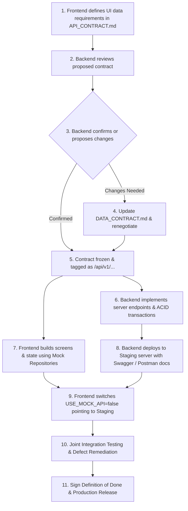

# Backend Developer Handoff Document

> [!IMPORTANT]
> **FINAL BACKEND HANDOFF SUITE (DEFINITIVE):**  
> This specification has been formalized into two definitive, implementation-ready handoff documents:
> 1. **Master API Contract:** [BACKEND_CONTRACT_FREEZE.md](file:///d:/ui%20design/kitty_docs/api/BACKEND_CONTRACT_FREEZE.md) — Single source of truth for the agreed API contract.
> 2. **Engineering Checklist:** [BACKEND_DEVELOPER_IMPLEMENTATION_GUIDE.md](file:///d:/ui%20design/kitty_docs/api/BACKEND_DEVELOPER_IMPLEMENTATION_GUIDE.md) — Detailed to-do list, architecture, Mongoose schemas, and testing guide.

## 1. Executive Summary & Purpose
This document serves as the **master engineering specification** for the backend developer building the Node.js / Express API and MongoDB database for the Swastik Jewel Kitty App.

It explicitly documents what the frontend application expects, categorizing requirements into:
* **`[CONFIRMED]`**: Requirements explicitly defined in the initial planning files (`design_backend_plan.md`, `design_db_schema.md`).
* **`[FRONTEND REQUIREMENT]`**: Mandatory structures and response fields required to render the designed UI prototypes without runtime failure.
* **`[BACKEND TBD]`**: Engineering decisions, third-party credentials, or schema enhancements that the backend developer must define and configure.

---

## 2. Global Authentication & Header Expectations

* **`[CONFIRMED]` Authentication Scheme:** Bearer Token JWT transmitted via standard HTTP header:
  ```http
  Authorization: Bearer <signed_jwt_token>
  ```
* **`[CONFIRMED]` OTP Security:** OTP must be 6 digits, stored in Redis/memory with a 5-minute expiry window.
* **`[FRONTEND REQUIREMENT]` Standardized Envelope:** Every API response must adhere to a uniform structure:
  ```json
  {
    "success": true,
    "message": "Human readable status description",
    "data": { ... }
  }
  ```
* **`[FRONTEND REQUIREMENT]` HTTP 401 Interception:** When a JWT expires or is revoked, the backend MUST respond with HTTP status code `401 Unauthorized`. The frontend will automatically clear local storage and redirect to the login screen.
* **`[BACKEND TBD]` Token Expiration Strategy:** Recommended 30-day refresh token or 7-day access token. Backend developer to define whether refresh tokens will be implemented.

---

## 3. Screen-by-Screen Data & Field Contract

### 3.1 Authentication Screens (`login.html`)
* **`[CONFIRMED]` Fields Received on Verify OTP (`POST /api/auth/verify-otp`):**
  - `token`: String (JWT)
  - `user`: Object (`id`, `name`, `phone`, `role`, `kyc`)
  - `isNewUser`: Boolean (`true` if new registration, triggering KYC routing)
* **`[FRONTEND REQUIREMENT]` User Tier Display:**
  - `user.tier`: String (e.g. `"Tier 1 Verified Member"` or `"Royal Gold Patron"`) used directly in the success badge card.

---

### 3.2 KYC Verification Screen (`kyc.html`)
* **`[CONFIRMED]` Endpoint:** `POST /api/users/kyc` (Multipart Form-Data with JWT)
* **`[CONFIRMED]` Form Fields:**
  - `documentType`: Enum (`'AADHAAR'`, `'PAN'`)
  - `file`: Binary image/PDF file
* **`[FRONTEND REQUIREMENT]` Additional Expected Request Fields:**
  - `documentNumber`: String (12-digit numeric Aadhaar or 10-char alphanumeric PAN).
  - `consentAgreed`: Boolean (`true`).
* **`[FRONTEND REQUIREMENT]` Response Fields:**
  - `referenceId`: String (e.g. `"KYC-849201"` rendered on success card).
  - `status`: String (`"PENDING"`, `"VERIFIED"`).
* **`[BACKEND TBD]` Cloudinary Bucket & Transform:** Backend to configure `multer-storage-cloudinary` to compress images under 2MB and store them in the `swastik_kyc/` folder.

---

### 3.3 My Scheme / Dashboard Screen (`dashboard.html`)
* **`[CONFIRMED]` Endpoint:** `GET /api/memberships/my-dashboard` (JWT required)
* **`[CONFIRMED]` Fields Required:**
  - `schemeName`: String
  - `totalPaidAmount`: Number (Sum of verified payments)
  - `targetAmount`: Number (Total commitment)
  - `remainingMonths`: Number
  - `customMonthlyEmi`: Number
* **`[FRONTEND REQUIREMENT]` Crucial UI Fields Missing from Original Minimal Plan:**
  - `chitToken`: String (e.g. `"#SW-042"`) required for top badge display.
  - `totalMonths`: Number (e.g. `12`) required for progress ratio.
  - `monthsPaid`: Number (e.g. `8`) required for circular gauge fraction (`8 / 12`).
  - `accumulatedGoldGrams`: Number (e.g. `5.482`) required for the "ACCUMULATED 24K GOLD" stat card.
  - `currentValuation`: Number (e.g. `41036`) required for portfolio value card.
  - `valuationGainPct`: Number (e.g. `2.59`) required for current valuation percentage gain (`+2.59%`).
  - `nextInstallment`: Object:
    - `month`: Number (e.g. `9`)
    - `amount`: Number (e.g. `5000`)
    - `dueDate`: Date/String (e.g. `"2026-09-15"`)
    - `daysRemaining`: Number (e.g. `5`) for the "5 Days Left" warning pill.

---

### 3.4 12-Month Passbook & Statements (`passbook.html`)
* **`[CONFIRMED]` Ledger Collection:** Read from MongoDB `Payment` collection.
* **`[FRONTEND REQUIREMENT]` Passbook Row Item Schema:**
  The frontend requires a list of exactly 12 installment nodes:
  ```json
  [
    {
      "month": 1,
      "label": "Month 1",
      "amount": 5000,
      "status": "PAID",
      "paidAt": "2026-01-15T10:30:00.000Z",
      "paymentMethod": "ONLINE",
      "transactionId": "TXN-SW-10821",
      "goldGrams": 0.702,
      "receiptUrl": "https://res.cloudinary.com/swastik/image/upload/receipts/rec_10821.pdf"
    },
    {
      "month": 9,
      "label": "Month 9",
      "amount": 5000,
      "status": "CURRENT",
      "dueDate": "2026-09-15T00:00:00.000Z"
    },
    {
      "month": 12,
      "label": "Month 12",
      "amount": 5000,
      "status": "BONUS",
      "bonusNote": "100% Jeweler Bonus Deposit on completion"
    }
  ]
  ```
* **`[FRONTEND REQUIREMENT]` Status Enum Required by UI:**
  - `PAID`: Completed payment. Triggers green badge and "View Receipt" button.
  - `CURRENT`: Due payment for active month. Triggers amber highlight and "Pay Now" button.
  - `UPCOMING`: Future scheduled installment. Triggers muted row.
  - `BONUS`: Final month free jeweler deposit. Triggers gift star badge.
  - `DEFAULTED`: Missed installment (`BACKEND CONTRACT TBD`).

---

### 3.5 Payment Gateway Integration (`/api/payments`)
* **`[CONFIRMED]` Provider:** GoKwik
* **`[CONFIRMED]` Order Initiation:** `POST /api/payments/initiate` accepts `membershipId`, returns `orderId`.
* **`[CONFIRMED]` Webhook Logic:** 
  - GoKwik POSTs to `/api/payments/webhook`.
  - Signature verification using `crypto`.
  - Multi-document ACID session: Update `Payment` to `SUCCESS`, increment `Membership.totalPaidAmount`.
  - Trigger PDF generation (`pdfkit`), upload stream to Cloudinary, send WhatsApp link via Twilio/MSG91.
* **`[FRONTEND REQUIREMENT]` Polling Status Endpoint:**
  Because the mobile app user returns from the GoKwik webview before the backend webhook may have finished committing the transaction, the frontend requires an endpoint to check order completion:
  - `GET /api/payments/status/:orderId`
  - Returns `{ status: 'PENDING' | 'SUCCESS' | 'FAILED', transactionId, receiptUrl }`.
* **`[BACKEND TBD]` Webhook Secret & Credentials:** Backend developer to provision GoKwik Sandbox merchant keys and configure webhook secret.

---

### 3.6 Live Gold Rate Benchmark API (`/api/rates/gold`)
* **`[FRONTEND REQUIREMENT]` Benchmark Rate Endpoint:**
  - The frontend displays real-time gold rates in the sticky header and calculates current portfolio values.
  - Endpoint: `GET /api/rates/gold`
  - Response expected:
    ```json
    {
      "rate24k": 7485.50,
      "rate22k": 6860.00,
      "rateChangePct": 0.62,
      "benchmark": "IBJA Official",
      "updatedAt": "2026-09-15T13:14:41.000Z"
    }
    ```
* **`[BACKEND TBD]` Rate Data Provider:** Backend developer to integrate with an Indian Bullion and Jewellers Association (IBJA) rate feed or maintain an admin-managed daily rate collection.

---

## 4. Standardized Error Formats
When an error occurs, the backend must return an appropriate HTTP status code (`400`, `401`, `403`, `404`, `429`, `500`) and a JSON body with the following structure:
```json
{
  "success": false,
  "errorCode": "SCHEME_CAPACITY_REACHED",
  "message": "This scheme has reached its maximum member capacity.",
  "details": {
    "maxCapacity": 100,
    "currentMembers": 100
  }
}
```

---

## 5. Summary Checklist for Backend Developer
- [ ] Implement MongoDB schemas with Replica Sets enabled for transactions.
- [ ] Implement SMS OTP delivery via Twilio or MSG91.
- [ ] Set up Cloudinary credentials for KYC images and receipt PDFs.
- [ ] Build late-joiner dynamic EMI math in `POST /api/memberships/join`.
- [ ] Implement GoKwik order initiation and signature-verified webhook.
- [ ] Return all UI-required fields in `GET /api/memberships/my-dashboard`.
- [ ] Deploy with CORS enabled for frontend mobile and development domains.

---

## 6. Formal Frontend ↔ Backend Handshake Workflow

To prevent integration misalignments, both developers must adhere to the 11-step handshake sequence:



> [!CAUTION]
> **Zero Silent Changes:** Once a contract is frozen, neither developer may rename fields, modify types, or change status codes without logging an update in `kitty_docs/api/API_CONTRACT.md`.

---

## 7. API Versioning & Backward Compatibility Protocol

1. **Prefix Standard:** All endpoints must be routed under `/api/v1/...`.
2. **Additive Changes Allowed in `/v1`:**
   - Adding new optional fields to response objects.
   - Adding new query parameters with sensible defaults.
3. **Breaking Changes Require `/v2`:**
   - Removing or renaming any existing response field.
   - Changing data types (e.g. from `Integer` Rupee to float).
   - Altering the authentication Bearer header structure.
4. **Client Defensive Resiliency:**
   - The frontend ignores unknown JSON fields during deserialization.
   - The frontend falls back to `unknown` on unseen enum values.

