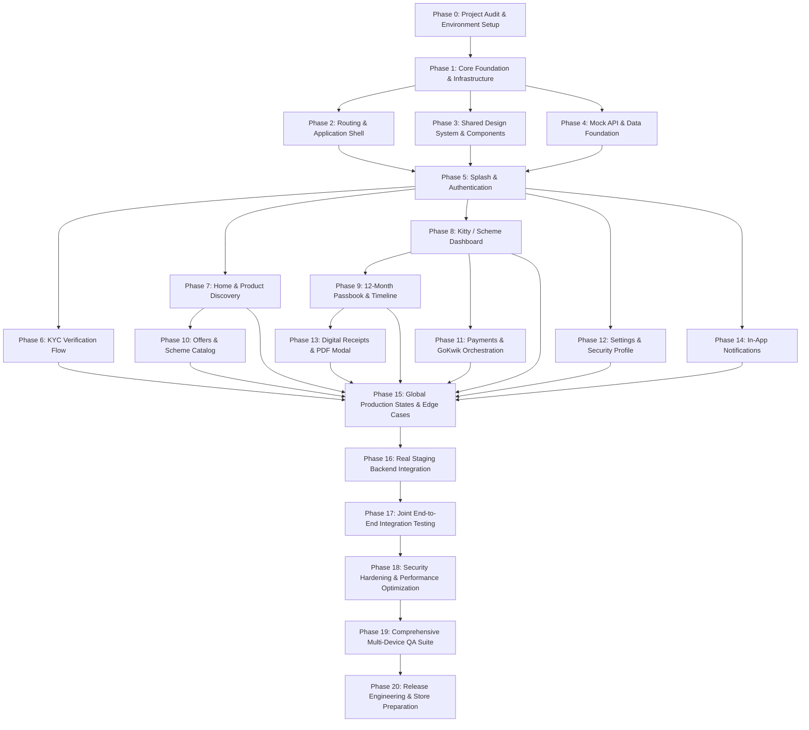

# Master Phase-Wise Frontend Implementation Plan

> **Kitty App (Swastik Jewellers — Sub-Brand: Kitty Vault)**  
> *Target Framework: Flutter (Dart) with Riverpod, GoRouter, Dio, and FlutterSecureStorage*  
> *Backend Integration State: FROZEN — Contract Version 1.0*

---

## 1. Executive Summary & Project Goal

The primary objective of this project is to construct a **production-ready, high-performance Flutter mobile application (iOS & Android)** reproducing the approved UI/UX designs (`d:/ui design/*.html`, `*.css`, `*.js`) and integrating seamlessly with the separately developed Node.js/Express backend via the frozen API contract ([`BACKEND_CONTRACT_FREEZE.md`](file:///d:/ui%20design/kitty_docs/api/BACKEND_CONTRACT_FREEZE.md)).

### Established Technology Stack & Architecture
* **Framework:** Flutter (Dart 3.x, Flutter 3.22+)
* **Architecture Pattern:** Feature-First Layered Architecture (Presentation $\rightarrow$ Domain $\rightarrow$ Data) with MVVM
* **State Management:** Riverpod (Code Generation / `AsyncNotifier` / `Notifier`)
* **Routing & Deep Linking:** `GoRouter` with declarative auth-redirect guards and nested shell navigation
* **Network & HTTP Client:** `Dio` with centralized interceptors (Bearer token injection, 401 auto-logout, connectivity retries)
* **Secure Key/Token Storage:** `flutter_secure_storage` backed by Android KeyStore (AES-256 GCM) and iOS Keychain
* **Design System & Styling:** Dual-surface luxury system (Deep Emerald `#05241C` & Metallic Gold `#C59B27` for hero surfaces; Clean Off-White `#F8F9FA` for ledger data)
* **Typography:** Google Fonts (`Cinzel` for royal brand typography; `Plus Jakarta Sans` for dense financial numbers)
* **Development Paradigm:** **Mock-First Development** (`USE_MOCK_API=true`), allowing 100% of the UI, state, validation, and user journeys to be built and verified prior to backend availability.

---

## 2. Phase Dependency Graph



---

## 3. Phase-Wise Implementation Specifications (Phases 0 to 20)

---

### PHASE 0 — Project Audit & Setup Readiness

* **Phase:** 0
* **Objective:** Audit the local development environment, verify Flutter SDK, Android toolchain, CocoaPods, and establish a pristine Flutter workspace skeleton ready for feature coding without conflicting with existing files.
* **Prerequisites:** Flutter 3.22+ installed, Android Studio / Xcode command line tools configured, Git initialized.
* **Tasks:**
  1. Verify Flutter doctor passes: `flutter doctor -v`.
  2. Verify workspace root directory (`d:/ui design`) and establish dedicated Flutter application directory (e.g. `d:/ui design/kitty_app` or root if configuring as Flutter root).
  3. Verify Android `compileSdkVersion` (min 34), `minSdkVersion` (min 23 for biometric and secure storage), `targetSdkVersion` 34.
  4. Verify iOS deployment target (iOS 14.0+).
  5. Audit required Flutter package dependencies in `pubspec.yaml` (`flutter_riverpod`, `go_router`, `dio`, `flutter_secure_storage`, `google_fonts`, `intl`, `image_picker`, `flutter_svg`, `webview_flutter`, `local_auth`).
  6. Verify static assets folder structure (`assets/images/`, `assets/icons/`, `assets/fonts/`).
  7. Verify `.gitignore` contains Flutter and OS transient artifacts.
* **Files/Folders Created:**
  - `lib/` (entry directories: `core/`, `features/`, `shared/`)
  - `test/` (entry directories: `unit/`, `widget/`, `mocks/`)
  - `assets/images/`, `assets/icons/`
  - `pubspec.yaml`
  - `analysis_options.yaml` (strict linter rules)
* **Files Modified:** None.
* **Dependencies:** Flutter SDK.
* **Backend Dependency:** None (100% Backend Independent).
* **UI Screens:** None.
* **Components:** None.
* **State:** None.
* **API Dependencies:** None.
* **Mock Data:** None.
* **Testing:** Run `flutter pub get` and `flutter test` to ensure clean initial build.
* **Acceptance Criteria:** `flutter build apk --debug` completes without compiler or Gradle configuration errors.
* **Definition of Done:** Flutter project builds cleanly, linter rules pass with zero warnings, Android/iOS build scripts verified.
* **Potential Risks:** Incompatible Gradle / Kotlin plugin versions.
* **Can Next Phase Start?:** Yes, immediately upon clean build verification.

---

### PHASE 1 — Core Foundation & Infrastructure

* **Phase:** 1
* **Objective:** Construct the foundational cross-cutting architectural layer: Design system tokens, typography, dual-surface themes, environment configuration, Dio HTTP client with interceptors, secure storage abstraction, error taxonomy, and global logging.
* **Prerequisites:** Phase 0 complete.
* **Tasks:**
  1. Implement `AppColors` (Deep Emerald `#05241C`, `#092B22`; Metallic Gold `#C59B27`, `#DFC178`; Slate `#0F172A`; Off-White `#F8F9FA`).
  2. Implement `AppTypography` utilizing Google Fonts `Cinzel` (headings/branding) and `Plus Jakarta Sans` (financial numbers/body).
  3. Implement `AppSpacing`, `AppRadius`, and `AppElevations` design tokens.
  4. Implement `AppTheme.darkTheme` (Surface Dark for splash/login/kyc/hero) and `AppTheme.lightTheme` (Surface Light for passbook/tables).
  5. Implement `AppEnvironment` enum (`dev`, `staging`, `prod`) and `AppConfig` reading from `--dart-define`.
  6. Implement `SecureStorageService` wrapper around `FlutterSecureStorage` with encryption options.
  7. Implement `DioClient` singleton with 15s connection/receive timeouts and custom interceptors:
     - `AuthInterceptor` (attaches Bearer token, catches 401 to trigger session purge).
     - `LoggingInterceptor` (structured debug logging, stripping PII).
     - `ErrorInterceptor` (maps HTTP status codes 400, 401, 403, 404, 409, 422, 429, 500 to typed `AppException`).
  8. Implement `ConnectivityService` using `connectivity_plus` to broadcast online/offline events.
  9. Implement standard number/currency formatter utilities (Indian Rupee formatting: `₹5,000`, `₹60,000`).
* **Files/Folders Created:**
  - `lib/core/constants/app_colors.dart`, `app_typography.dart`, `app_spacing.dart`, `app_dimensions.dart`
  - `lib/core/theme/app_theme.dart`
  - `lib/core/config/app_config.dart`, `app_environment.dart`
  - `lib/core/storage/secure_storage_service.dart`
  - `lib/core/network/dio_client.dart`, `auth_interceptor.dart`, `error_interceptor.dart`, `api_endpoints.dart`
  - `lib/core/errors/app_exception.dart`, `failure.dart`
  - `lib/core/utils/currency_formatter.dart`, `date_formatter.dart`, `logger.dart`
  - `lib/core/services/connectivity_service.dart`
* **Files Modified:** `pubspec.yaml`.
* **Dependencies:** `flutter_riverpod`, `dio`, `flutter_secure_storage`, `google_fonts`, `intl`, `connectivity_plus`.
* **Backend Dependency:** None (100% Backend Independent).
* **UI Screens:** None (Foundational layer).
* **Components:** None.
* **State:** `connectivityProvider`, `environmentProvider`.
* **API Dependencies:** None.
* **Mock Data:** None.
* **Testing:**
  - Unit test `CurrencyFormatter` (verifying Indian comma grouping: `₹1,05,000`).
  - Unit test `DateFormatter` (verifying ISO 8601 UTC $\rightarrow$ IST conversion).
  - Unit test `ErrorInterceptor` (verifying 401 maps to `UnauthorizedException`).
* **Acceptance Criteria:** All unit tests pass; Dio client initializes with interceptors; `AppTheme` compiles without font resolution errors.
* **Definition of Done:** Core foundation compiles, unit test suite passes with 100% coverage on utilities, zero hardcoded secrets.
* **Potential Risks:** Google Fonts offline caching issues during initial cold boot.
* **Can Next Phase Start?:** Yes.

---

### PHASE 2 — Routing & Application Shell

* **Phase:** 2
* **Objective:** Implement declarative routing via `GoRouter`, nested shell navigation (`StatefulShellRoute`), auth guard redirects, bottom navigation bar, and slide-out navigation drawer strictly following [`NAVIGATION.md`](file:///d:/ui%20design/kitty_docs/architecture/NAVIGATION.md).
* **Prerequisites:** Phase 1 complete.
* **Tasks:**
  1. Define `AppRoute` enum with exact paths: `/splash`, `/auth/login`, `/auth/otp`, `/kyc`, `/home`, `/dashboard`, `/passbook`, `/offers`, `/settings`.
  2. Implement `GoRouter` configuration with `redirect:` guard inspecting `authNotifierProvider`:
     - Unauthenticated users attempting protected routes redirected to `/auth/login`.
     - Authenticated users attempting `/auth/login` redirected to `/dashboard` or `/home`.
  3. Implement `AppShellScaffold` wrapping the main tabs with:
     - Sticky Header (`HeaderNavBar`) with gold rate ticker strip and drawer toggle.
     - Luxury Navigation Drawer (`LuxuryNavDrawer`) displaying user avatar and quick links.
     - Bottom Navigation Bar with 4 tabs: Home, My Kitty, Offers, Settings.
  4. Configure modal routes for KYC bottom sheets, checkout sheets, and PDF receipts.
  5. Implement Android physical back button handler preventing accidental app closure.
* **Files/Folders Created:**
  - `lib/core/routing/app_router.dart`, `route_paths.dart`, `route_guards.dart`
  - `lib/shared/widgets/navigation/app_shell_scaffold.dart`
  - `lib/shared/widgets/navigation/app_bottom_nav_bar.dart`
  - `lib/shared/widgets/navigation/header_nav_bar.dart`
  - `lib/shared/widgets/navigation/luxury_nav_drawer.dart`
* **Files Modified:** `lib/main.dart`.
* **Dependencies:** `go_router`, `flutter_riverpod`.
* **Backend Dependency:** None (100% Backend Independent).
* **UI Screens:** Placeholder tab screens to verify routing transitions.
* **Components:** `AppShellScaffold`, `HeaderNavBar`, `LuxuryNavDrawer`, `AppBottomNavBar`.
* **State:** `authNotifierProvider` (mock state), `currentNavIndexProvider`.
* **API Dependencies:** None.
* **Mock Data:** Mock user profile for drawer display.
* **Testing:**
  - Widget test: Verify unauthenticated user on `/dashboard` is redirected to `/auth/login`.
  - Widget test: Verify tab switching updates shell body without rebuilding scaffold.
  - Widget test: Verify drawer opens upon menu button tap.
* **Acceptance Criteria:** Navigation between all 4 tabs works smoothly; deep linking to `/dashboard` triggers auth guard; back button pops correctly.
* **Definition of Done:** Router code passes all navigation widget tests; route names match `NAVIGATION.md` 1:1.
* **Potential Risks:** Riverpod `ref.watch` in GoRouter redirect causing infinite redirect loops if not scoped to `refreshListenable`.
* **Can Next Phase Start?:** Yes.

---

### PHASE 3 — Shared Design System & Reusable UI Components

* **Phase:** 3
* **Objective:** Implement the complete atomic UI component library specified in [`UI_COMPONENT_ARCHITECTURE.md`](file:///d:/ui%20design/kitty_docs/ui/UI_COMPONENT_ARCHITECTURE.md) and [`DESIGN_SYSTEM.md`](file:///d:/ui%20design/kitty_docs/ui/DESIGN_SYSTEM.md) to eliminate visual and code duplication.
* **Prerequisites:** Phase 1 complete.
* **Tasks:**
  1. Implement Primary and Secondary Buttons (`GoldPrimaryButton`, `LuxuryOutlineButton`, `GhostButton`) with loading spinners and disabled states.
  2. Implement Input Fields (`AppTextField`, `PhoneInputField` with `+91` prefix, `OtpBox`).
  3. Implement Card Containers (`LuxuryCard`, `EmeraldSurfaceCard`, `WhiteLedgerCard`).
  4. Implement Status Badges (`StatusBadge` supporting `PAID`, `CURRENT`, `UPCOMING`, `BONUS`, `PRE_JOIN`, `VERIFIED`, `PENDING`).
  5. Implement Amount & Gold Displays (`CurrencyText`, `GoldWeightText` with 3 decimal places).
  6. Implement Feedback Widgets (`AppShimmerSkeleton`, `EmptyStateCard`, `ErrorStateCard`, `OfflineBanner`).
  7. Implement Dialogs & Sheets (`AppConfirmationDialog`, `AppBottomSheetContainer`).
  8. Implement Circular Progress Gauge widget (`CircularProgressGauge`) reproducing the SVG 8/12 progress indicator.
* **Files/Folders Created:**
  - `lib/shared/widgets/buttons/gold_primary_button.dart`, `luxury_outline_button.dart`
  - `lib/shared/widgets/inputs/app_text_field.dart`, `phone_input_field.dart`, `otp_box.dart`
  - `lib/shared/widgets/cards/luxury_card.dart`, `emerald_surface_card.dart`, `white_ledger_card.dart`
  - `lib/shared/widgets/badges/status_badge.dart`
  - `lib/shared/widgets/feedback/app_shimmer.dart`, `empty_state_card.dart`, `error_state_card.dart`, `offline_banner.dart`
  - `lib/shared/widgets/dialogs/app_confirmation_dialog.dart`, `app_bottom_sheet.dart`
  - `lib/shared/widgets/gauges/circular_progress_gauge.dart`
* **Files Modified:** None.
* **Dependencies:** `flutter_svg`, `shimmer`.
* **Backend Dependency:** None (100% Backend Independent).
* **UI Screens:** Catalog screen in debug mode (`ComponentGalleryScreen`) for manual visual verification.
* **Components:** 15+ shared widgets from `UI_COMPONENT_ARCHITECTURE.md`.
* **State:** Local widget state (animations, focus nodes).
* **API Dependencies:** None.
* **Mock Data:** Dummy strings and status enums.
* **Testing:**
  - Widget tests for `GoldPrimaryButton` (verifies tap callback, loading state disables tap).
  - Widget tests for `StatusBadge` (verifies correct background color for each enum).
  - Widget test for `CircularProgressGauge` (verifies stroke animation ratio).
* **Acceptance Criteria:** Components look identical to the HTML/CSS prototypes in `d:/ui design/*.css`; dark/light surface contrast complies with WCAG AA.
* **Definition of Done:** All shared components implemented, cataloged, and covered by passing widget tests.
* **Potential Risks:** Font size or padding discrepancies across different Android screen densities.
* **Can Next Phase Start?:** Yes.

---

### PHASE 4 — Mock API & Data Foundation

* **Phase:** 4
* **Objective:** Implement all Data Transfer Objects (DTOs), Domain Entities, DTO $\leftrightarrow$ Domain mappers, Abstract Repository interfaces, and pre-seeded JSON mock repositories as defined in [`MOCK_API_STRATEGY.md`](file:///d:/ui%20design/kitty_docs/planning/MOCK_API_STRATEGY.md) and [`DATA_CONTRACT.md`](file:///d:/ui%20design/kitty_docs/api/DATA_CONTRACT.md).
* **Prerequisites:** Phase 1 complete.
* **Tasks:**
  1. Implement DTOs with JSON serialization (`UserDto`, `KycDto`, `SchemeDto`, `MembershipDto`, `PassbookItemDto`, `PaymentOrderDto`, `GoldRateDto`).
  2. Implement clean Domain Entities (`User`, `KycInfo`, `Scheme`, `Membership`, `DashboardSummary`, `PassbookItem`, `GoldRate`).
  3. Implement Mappers with defensive deserialization (mapping missing fields to safe defaults and unrecognized enums to `.unknown`).
  4. Implement Abstract Repository interfaces (`IAuthRepository`, `IKycRepository`, `ISchemeRepository`, `IMembershipRepository`, `IPaymentRepository`, `IRateRepository`).
  5. Create pre-seeded mock fixtures in `assets/mocks/` matching approved prototype fixtures:
     - `auth_verify_success.json` (User Rihan, Tier 1, Chit #SW-042)
     - `dashboard_active_suvarna.json` (₹60,000 target, 8/12 paid, 5.482g gold, ₹41,036 valuation)
     - `schemes_active.json` (Swastik Suvarna Varsha, Wedding Collection)
     - `rates_gold.json` (₹7,485.50/g 24K, ₹6,860.00/g 22K)
  6. Implement Mock Repositories (`MockAuthRepository`, `MockMembershipRepository`, etc.) with configurable simulated network latency (600ms) and error toggles (`simulateError`, `simulateEmpty`).
  7. Implement Riverpod Provider switches toggling between Mock and Remote repositories based on `AppConfig.useMockApi`.
* **Files/Folders Created:**
  - `lib/features/*/data/models/*_dto.dart`
  - `lib/features/*/domain/models/*.dart`
  - `lib/features/*/data/mappers/*_mapper.dart`
  - `lib/features/*/domain/repositories/i_*_repository.dart`
  - `lib/features/*/data/repositories/mock/*_mock_repository.dart`
  - `assets/mocks/auth_verify_success.json`, `dashboard_active.json`, `dashboard_empty.json`, `schemes_active.json`, `rates_gold.json`
* **Files Modified:** `pubspec.yaml` (added mock asset declarations).
* **Dependencies:** `flutter_riverpod`.
* **Backend Dependency:** Backend Contract Dependent (Built strictly to Frozen Contract v1.0).
* **UI Screens:** None.
* **Components:** None.
* **State:** Repository providers (`authRepositoryProvider`, `membershipRepositoryProvider`, etc.).
* **API Dependencies:** Frozen contract schema compliance.
* **Mock Data:** Complete fixture suite from `MOCK_API_STRATEGY.md`.
* **Testing:**
  - Unit tests for all DTO $\rightarrow$ Domain mappers.
  - Unit test verifying `InstallmentStatus.preJoin` maps accurately from JSON `"PRE_JOIN"`.
  - Unit test verifying Mock Repositories return simulated fixtures after delay.
* **Acceptance Criteria:** 100% of JSON parsing tests pass; mock fixtures deserialize without null-check exceptions.
* **Definition of Done:** Mock data layer is completely operational; frontend can develop all screens fully offline.
* **Potential Risks:** Deserialization mismatches between mock JSON and actual backend types.
* **Can Next Phase Start?:** Yes.

---

### PHASE 5 — Splash & Authentication Flow

* **Phase:** 5
* **Objective:** Implement the complete authentication flow including Splash screen, lightweight session restoration, mobile phone input, 6-digit OTP verification with countdown timer, JWT storage, and session clearance matching `login.html` and `SYSTEM_FLOW.md`.
* **Prerequisites:** Phases 2, 3, and 4 complete.
* **Tasks:**
  1. Implement `SplashScreen` with 3D diamond brand intro asset, checking `SecureStorageService` for active JWT:
     - If JWT exists $\rightarrow$ route to `/dashboard`.
     - If JWT missing $\rightarrow$ route to `/auth/login`.
  2. Implement `LoginScreen` (View 0 & View 1) with Google sign-in placeholder and Indian phone number field with `+91` country badge.
  3. Implement Phone validation (10 numeric digits, starting with 6, 7, 8, or 9).
  4. Implement `OtpVerificationScreen` (View 2) with:
     - 6 individual auto-advancing digit input boxes.
     - Clipboard auto-paste listener.
     - 30-second countdown timer with "Resend OTP" trigger.
  5. Implement `AuthNotifier` managing `AuthState` (`unauthenticated`, `loading`, `otpSent`, `authenticated`, `error`).
  6. On successful verification, persist 30-day JWT and user profile in `FlutterSecureStorage`.
  7. Show success confirmation card (View 3) with Patron Tier badge before navigating to Dashboard.
  8. Wire up `AuthInterceptor` 401 response to call `authNotifier.logout()` and redirect to Login.
* **Files/Folders Created:**
  - `lib/features/auth/presentation/screens/splash_screen.dart`
  - `lib/features/auth/presentation/screens/login_screen.dart`
  - `lib/features/auth/presentation/screens/otp_verification_screen.dart`
  - `lib/features/auth/presentation/widgets/login_header.dart`, `otp_countdown_timer.dart`, `auth_success_card.dart`
  - `lib/features/auth/presentation/providers/auth_notifier.dart`, `auth_state.dart`
* **Files Modified:** `lib/core/routing/app_router.dart`.
* **Dependencies:** `flutter_riverpod`, `flutter_secure_storage`.
* **Backend Dependency:** Backend Contract Dependent (`POST /api/v1/auth/send-otp`, `POST /api/v1/auth/verify-otp`).
* **UI Screens:** Splash, Login, OTP Verification, Success Badge Dialog.
* **Components:** `PhoneInputField`, `OtpBox`, `GoldPrimaryButton`, `AuthSuccessCard`.
* **State:** `authNotifierProvider` (`AuthState`).
* **API Dependencies:** `IAuthRepository` (`sendOtp`, `verifyOtp`, `logout`).
* **Mock Data:** Phone `+919876543210`, OTP `123456`.
* **Testing:**
  - Unit test `AuthNotifier`: Test successful login flow; test OTP failure; test logout.
  - Widget test `OtpVerificationScreen`: Verify 6-digit auto-focus and countdown timer expiration.
* **Acceptance Criteria:** User can launch app, enter phone, type `123456`, see success card, and land on Dashboard. Re-launching app preserves logged-in state.
* **Definition of Done:** Splash and Auth flows fully interactive, meeting all acceptance criteria, with 100% test pass rate.
* **Potential Risks:** Keyboard overlay obscuring OTP inputs on small screens (solved via `SingleChildScrollView` and bottom padding).
* **Can Next Phase Start?:** Yes.

---

### PHASE 6 — Statutory KYC Verification Flow

* **Phase:** 6
* **Objective:** Implement the statutory KYC submission flow matching `kyc.html`, including document selector tabs (Aadhaar/PAN), formatted masked input, camera/gallery image picker, thumbnail preview with size check, statutory consent, and submission feedback.
* **Prerequisites:** Phases 3, 4, and 5 complete.
* **Tasks:**
  1. Implement `KycScreen` matching the visual luxury styling of `kyc.html`.
  2. Implement document selector tabs (`AADHAAR` vs `PAN`).
  3. Implement document number field with dynamic formatting:
     - Aadhaar: 12 digits formatted as `XXXX XXXX XXXX`.
     - PAN: 10 uppercase alphanumeric characters (`ABCDE1234F`).
  4. Implement `ImagePickerService` for camera capture and gallery selection.
  5. Implement client-side file validation: verify file size $\le 10\text{ MB}$, allowed formats (JPEG, PNG, PDF).
  6. Implement upload thumbnail card showing file name, formatted size, and remove/re-pick action.
  7. Implement statutory RBI / PMLA consent checkbox.
  8. Implement `KycNotifier` handling upload progress, multipart submission to `IKycRepository`, and error states.
  9. Implement KYC status feedback view (Reference ID card, "Under Verification" blue badge, "Verification Failed" re-upload card).
* **Files/Folders Created:**
  - `lib/features/kyc/presentation/screens/kyc_screen.dart`
  - `lib/features/kyc/presentation/widgets/doc_selector_tabs.dart`, `kyc_dropzone_upload.dart`, `upload_preview_card.dart`, `kyc_status_badge.dart`
  - `lib/features/kyc/presentation/providers/kyc_notifier.dart`, `kyc_state.dart`
  - `lib/core/services/image_picker_service.dart`
* **Files Modified:** `lib/core/routing/app_router.dart`.
* **Dependencies:** `image_picker`, `flutter_riverpod`.
* **Backend Dependency:** Backend Contract Dependent (`POST /api/v1/users/kyc`).
* **UI Screens:** KYC Verification Screen, KYC Success Modal.
* **Components:** `DocSelectorTabs`, `KycDropzoneUpload`, `UploadPreviewCard`, `GoldPrimaryButton`.
* **State:** `kycNotifierProvider` (`KycState`).
* **API Dependencies:** `IKycRepository` (`submitKyc`, `getKycStatus`).
* **Mock Data:** Mock KYC reference `KYC-849201`, verified and pending states.
* **Testing:**
  - Unit test: Validate Aadhaar 12-digit masking logic and PAN regex validator.
  - Widget test: Verify submit button is disabled until consent checkbox is ticked and file is selected.
  - Widget test: Verify file size $>10\text{ MB}$ displays validation error banner.
* **Acceptance Criteria:** User can switch document type, input valid ID, pick image, accept consent, submit, and view reference code.
* **Definition of Done:** KYC flow passes all validation and widget tests; conforms strictly to the 10MB limit confirmed in the frozen contract.
* **Potential Risks:** Camera permission denial on Android 13+ (runtime permission handling required).
* **Can Next Phase Start?:** Yes.

---

### PHASE 7 — Home & Product Discovery

* **Phase:** 7
* **Objective:** Implement the retail discovery Home screen matching `home.html`, including sticky gold rate ticker, auto-playing promotional carousel, horizontal category pills, curated jewelry product grid with wishlist heart toggle, and active kitty privilege banner.
* **Prerequisites:** Phases 2, 3, and 4 complete.
* **Tasks:**
  1. Implement `HomeScreen` reproducing `home.html` layout.
  2. Implement `TrustRateStrip` sticky bar rendering live 24K and 22K gold rates per gram with percentage daily change.
  3. Implement `ActiveKittyBannerCard` conditionally rendered if the user has an active enrollment, displaying token number and direct shortcut to Dashboard.
  4. Implement `KittyCarouselTrack` auto-advancing promo banner slider with page indicator dots.
  5. Implement `CategoryScrollTrack` horizontal pill list (Rings, Necklaces, Bangles, Coins, Bridal).
  6. Implement `CuratedProductGrid` rendering jewelry showcase items with image, purity badge, price, and wishlist toggle button.
  7. Implement pull-to-refresh invoking both rate refresh and active banner updates.
  8. Implement `HomeNotifier` managing home feed state, wishlist toggles, and carousel index.
* **Files/Folders Created:**
  - `lib/features/home/presentation/screens/home_screen.dart`
  - `lib/features/home/presentation/widgets/trust_rate_strip.dart`, `active_kitty_banner_card.dart`, `kitty_carousel_track.dart`, `category_scroll_track.dart`, `curated_product_card.dart`
  - `lib/features/home/presentation/providers/home_notifier.dart`, `home_state.dart`, `wishlist_notifier.dart`
* **Files Modified:** `lib/core/routing/app_router.dart`.
* **Dependencies:** `flutter_riverpod`.
* **Backend Dependency:** Backend Contract Dependent (`GET /api/v1/rates/gold`, `GET /api/v1/schemes/active`).
* **UI Screens:** Home Screen.
* **Components:** `TrustRateStrip`, `ActiveKittyBannerCard`, `KittyCarouselTrack`, `CuratedProductCard`.
* **State:** `homeNotifierProvider`, `goldRateProvider`, `wishlistProvider`.
* **API Dependencies:** `IRateRepository`, `ISchemeRepository`.
* **Mock Data:** Gold rates fixture, promo banner fixtures, jewelry products list.
* **Testing:**
  - Widget test: Verify promo carousel auto-scrolls or responds to swipe gestures.
  - Widget test: Verify wishlist button toggles heart fill state and updates local state.
  - Widget test: Pull-to-refresh triggers data re-fetch.
* **Acceptance Criteria:** Screen matches `home.html` styling; gold rates display accurately; banner links to Dashboard.
* **Definition of Done:** Home screen implemented, visually aligned with prototype, covered by passing widget tests.
* **Potential Risks:** Image loading jank on slow networks (mitigated with `cached_network_image` and shimmer placeholders).
* **Can Next Phase Start?:** Yes.

---

### PHASE 8 — Kitty / Scheme Dashboard

* **Phase:** 8
* **Objective:** Implement the flagship Kitty Dashboard matching `dashboard.html`, featuring the luxury active scheme hero card, chit token badge, animated circular progress gauge (e.g. 8/12), 2x2 financial statistics grid, Month 9 due warning card, and primary payment CTA.
* **Prerequisites:** Phases 3, 4, and 5 complete.
* **Tasks:**
  1. Implement `DashboardScreen` reproducing the luxury emerald/gold aesthetic of `dashboard.html`.
  2. Implement `ActiveSchemeHeroCard` displaying chit token badge (`#SW-042`), scheme title, and target commitment.
  3. Implement `CircularProgressGauge` animating to paid fraction ($8/12 = 67\%$).
  4. Implement 2x2 `FinancialStatGrid` displaying:
     - Target Amount: `₹60,000`
     - Total Paid Amount: `₹40,000`
     - 24K Gold Accumulated: `5.482 g`
     - Current Valuation: `₹41,036` (`+2.59%` gain)
  5. Implement `SchemeNextEmiCard` displaying upcoming installment due date, amount (`₹5,000`), and "5 Days Left" warning pill.
  6. Implement primary Gold CTA button `"PAY NEXT EMI (₹5,000) ->"` triggering checkout.
  7. Implement KYC compliance guard: If user KYC is unverified, CTA prompts KYC upload bottom sheet instead of payment.
  8. Implement `EmptyDashboardView` for users with zero active schemes, prompting scheme enrollment from catalog.
  9. Implement `DashboardNotifier` managing `AsyncValue<DashboardSummary>`.
* **Files/Folders Created:**
  - `lib/features/dashboard/presentation/screens/dashboard_screen.dart`
  - `lib/features/dashboard/presentation/widgets/active_scheme_hero_card.dart`, `financial_stat_card.dart`, `scheme_next_emi_card.dart`, `empty_dashboard_view.dart`
  - `lib/features/dashboard/presentation/providers/dashboard_notifier.dart`
* **Files Modified:** `lib/core/routing/app_router.dart`.
* **Dependencies:** `flutter_riverpod`.
* **Backend Dependency:** Backend Contract Dependent (`GET /api/v1/memberships/my-dashboard`).
* **UI Screens:** Dashboard Screen, Empty Dashboard Screen.
* **Components:** `ActiveSchemeHeroCard`, `CircularProgressGauge`, `FinancialStatCard`, `SchemeNextEmiCard`, `GoldPrimaryButton`.
* **State:** `dashboardNotifierProvider` (`AsyncValue<DashboardSummary>`).
* **API Dependencies:** `IMembershipRepository.getMyDashboard()`.
* **Mock Data:** `dashboard_active_suvarna.json`, `dashboard_empty.json`.
* **Testing:**
  - Unit test: Verify `DashboardSummary` maps all 4 financial stat values directly without local recalculation.
  - Widget test: Verify Month 9 due card renders "5 Days Left" badge.
  - Widget test: Verify unverified KYC user clicking CTA sees KYC modal.
  - Widget test: Verify empty state renders when `hasActiveScheme: false`.
* **Acceptance Criteria:** Screen reproduces `dashboard.html` exactly; all figures match authoritative backend values; gauge animates smoothly.
* **Definition of Done:** Dashboard fully implemented, meeting all business rules, verified with passing unit and widget tests.
* **Potential Risks:** Client attempting to compute gold valuation locally rather than displaying backend-provided authoritative values.
* **Can Next Phase Start?:** Yes.

---

### PHASE 9 — 12-Month Passbook & Installment Ledger

* **Phase:** 9
* **Objective:** Implement the 12-month installment passbook matching `passbook.html`, supporting both vertical timeline table and card view modes, status pills (`PAID`, `CURRENT`, `UPCOMING`, `BONUS`, `PRE_JOIN`), receipt action trigger, and pull-to-refresh.
* **Prerequisites:** Phases 3, 4, and 8 complete.
* **Tasks:**
  1. Implement `PassbookScreen` utilizing the clean Surface Light (`#F8F9FA`) design system.
  2. Implement `PassbookViewToggle` allowing customer to switch between Timeline Table view and Card view.
  3. Implement `PassbookTimelineTable` rendering exactly 12 installment rows.
  4. Implement installment status resolution mapping:
     - `PAID`: Green badge, transaction ID, gold weight credited, and active "Receipt" CTA button.
     - `CURRENT`: Amber highlight card, due date, and "Pay Now" action button.
     - `UPCOMING`: Muted row with scheduled calendar date.
     - `BONUS`: Gold star badge and "100% Jeweler Bonus Deposit" note for Month 12.
     - `PRE_JOIN`: Muted row with lock icon: *"Joined Month N (Excluded from balance)"*.
  5. Implement "View Receipt" button callback routing to Digital Receipt modal.
  6. Implement pull-to-refresh re-fetching latest ledger state.
* **Files/Folders Created:**
  - `lib/features/passbook/presentation/screens/passbook_screen.dart`
  - `lib/features/passbook/presentation/widgets/passbook_timeline_table.dart`, `passbook_card_view.dart`, `passbook_row_item.dart`, `passbook_view_toggle.dart`
  - `lib/features/passbook/presentation/providers/passbook_notifier.dart`, `passbook_view_mode_provider.dart`
* **Files Modified:** `lib/core/routing/app_router.dart`.
* **Dependencies:** `flutter_riverpod`.
* **Backend Dependency:** Backend Contract Dependent (`GET /api/v1/memberships/my-dashboard`).
* **UI Screens:** Passbook Screen.
* **Components:** `PassbookTimelineTable`, `PassbookRowItem`, `StatusBadge`, `PassbookViewToggle`.
* **State:** `passbookNotifierProvider`, `passbookViewModeProvider`.
* **API Dependencies:** `IMembershipRepository.getMyDashboard()`.
* **Mock Data:** Passbook 12-month array with paid months 1–8, current month 9, upcoming 10–11, bonus 12.
* **Testing:**
  - Widget test: Verify all 12 rows render in order.
  - Widget test: Verify `PRE_JOIN` row shows lock icon and no receipt/pay button.
  - Widget test: Verify Month 12 renders gift star icon.
  - Widget test: Verify clicking "Receipt" emits event with correct `receiptUrl`.
* **Acceptance Criteria:** Table matches `passbook.html`; all 5 status enums display distinct visual styling; `PRE_JOIN` is properly excluded from pending amounts.
* **Definition of Done:** Passbook screen complete, view toggle operational, all widget tests passing.
* **Potential Risks:** Long passbook list lag on low-end devices (mitigated by fixed 12-item `ListView` with item extent).
* **Can Next Phase Start?:** Yes.

---

### PHASE 10 — Offers & Scheme Catalog

* **Phase:** 10
* **Objective:** Implement the scheme discovery catalog and promotional offers screen matching `offers.html`, including category filter tabs, scheme perk cards highlighting the 1-month bonus, late-joiner dynamic EMI explanation, and enrollment trigger.
* **Prerequisites:** Phases 3, 4, and 8 complete.
* **Tasks:**
  1. Implement `OffersScreen` reproducing `offers.html`.
  2. Implement `OffersFilterTabs` (Classic 12-Month, Express 6-Month, Royal Bridal).
  3. Implement `OfferPlanCard` displaying scheme name, duration, monthly EMI, target amount, and enrolled member count (`currentMembers / maxCapacity`).
  4. Implement `PerksBulletList` highlighting:
     - *"1 Month Free: 11 Paid + 12th Month 100% Jeweler Bonus"*
     - *"25% Flat Discount on Jewellery Making Charges"*
     - *"Accumulate 24K 999 Hallmark Purity Gold"*
  5. Implement "Enrol Now" button opening `EnrollmentModal`.
  6. In `EnrollmentModal`, display dynamic late-joiner EMI notice if joining after Month 1.
  7. Handle enrollment execution calling `IMembershipRepository.joinScheme()`.
  8. On enrollment success, show celebration dialog and navigate to `/dashboard`.
* **Files/Folders Created:**
  - `lib/features/offers/presentation/screens/offers_screen.dart`
  - `lib/features/offers/presentation/widgets/offer_plan_card.dart`, `offers_filter_tabs.dart`, `perks_bullet_list.dart`, `enrollment_modal.dart`
  - `lib/features/offers/presentation/providers/offers_notifier.dart`
* **Files Modified:** `lib/core/routing/app_router.dart`.
* **Dependencies:** `flutter_riverpod`.
* **Backend Dependency:** Backend Contract Dependent (`GET /api/v1/schemes/active`, `POST /api/v1/memberships/join`).
* **UI Screens:** Offers Catalog Screen, Enrollment Bottom Sheet Modal.
* **Components:** `OfferPlanCard`, `OffersFilterTabs`, `EnrollmentModal`, `GoldPrimaryButton`.
* **State:** `offersNotifierProvider`, `selectedSchemeFilterProvider`.
* **API Dependencies:** `ISchemeRepository.getActiveSchemes()`, `IMembershipRepository.joinScheme()`.
* **Mock Data:** `schemes_active.json`.
* **Testing:**
  - Widget test: Filter tabs filter the schemes list accurately.
  - Widget test: "Enrol Now" opens modal with correct scheme details.
  - Unit test: Verify capacity full schemes disable the enroll button.
* **Acceptance Criteria:** Screen matches `offers.html`; enrollment creates active membership in mock state and routes to Dashboard.
* **Definition of Done:** Offers screen and enrollment modal fully interactive with passing widget tests.
* **Potential Risks:** Race condition on last available chit token (handled by 409 Conflict error mapping).
* **Can Next Phase Start?:** Yes.

---

### PHASE 11 — Payment Gateway Orchestration & Polling

* **Phase:** 11
* **Objective:** Implement the frontend payment orchestration flow, including installment checkout sheet, payment method selection, GoKwik WebView launcher, return callback handling, backend status polling loop, and reconciliation checkmark.
* **Prerequisites:** Phases 4, 8, and 9 complete.
* **Tasks:**
  1. Implement `PaymentCheckoutSheet` bottom sheet displaying installment breakdown: Month index, EMI amount (`₹5,000`), payment methods (GoKwik UPI / NetBanking / Cards).
  2. Implement `initiatePayment()` call to `IPaymentRepository`, retrieving GoKwik `orderId`.
  3. Implement `GokwikWebviewScreen` opening the gateway checkout URL in a sandboxed `webview_flutter` container.
  4. Intercept return redirect URLs (`gokwik://return` or store success redirect) to close WebView.
  5. Implement `PaymentPollingNotifier` polling `GET /api/v1/payments/status/:orderId`:
     - Poll interval: every 2.5 seconds, max 5 attempts.
     - While status is `PENDING`, display shimmer loading: *"Verifying payment with bank..."*.
     - When status is `SUCCESS`, show green checkmark animation, refresh `DashboardNotifier`, and update Passbook.
     - If polling times out without success, display warning: *"Payment under bank verification. Receipt will be generated shortly."*.
  6. Never mark payment successful locally without backend verification.
* **Files/Folders Created:**
  - `lib/features/payments/presentation/screens/gokwik_webview_screen.dart`, `payment_status_screen.dart`
  - `lib/features/payments/presentation/widgets/payment_checkout_sheet.dart`, `payment_processing_indicator.dart`
  - `lib/features/payments/presentation/providers/payment_notifier.dart`, `payment_polling_notifier.dart`
* **Files Modified:** `lib/core/routing/app_router.dart`.
* **Dependencies:** `webview_flutter`, `flutter_riverpod`.
* **Backend Dependency:** Backend Contract Dependent (`POST /api/v1/payments/initiate`, `GET /api/v1/payments/status/:orderId`).
* **UI Screens:** Payment Checkout Sheet, GoKwik WebView, Payment Processing/Success Screen.
* **Components:** `PaymentCheckoutSheet`, `GokwikWebview`, `PaymentProcessingIndicator`.
* **State:** `paymentNotifierProvider`, `paymentPollingProvider`.
* **API Dependencies:** `IPaymentRepository` (`initiatePayment`, `getPaymentStatus`).
* **Mock Data:** Mock order `gokwik_ord_771829`, status `SUCCESS`.
* **Testing:**
  - Unit test `PaymentPollingNotifier`: Test successful status on 2nd poll; test timeout handling.
  - Widget test: Verify checkout sheet displays exact rupee amount (`₹5,000`).
* **Acceptance Criteria:** Full payment loop executes in mock sandbox; polling loop respects timeout; dashboard updates totals immediately upon confirmed success.
* **Definition of Done:** Payment orchestration complete, defensively engineered, zero assumption of client-side success.
* **Potential Risks:** Customer killing app during gateway webview (handled on next launch by dashboard refresh).
* **Can Next Phase Start?:** Yes.

---

### PHASE 12 — Settings & Security Profile

* **Phase:** 12
* **Objective:** Implement user account settings matching `settings.html`, including user profile header, UPI AutoPay toggle, nominee registration status, biometric app lock toggle, 4-digit MPIN dialog, and secure logout action with storage purge.
* **Prerequisites:** Phases 2, 3, and 5 complete.
* **Tasks:**
  1. Implement `SettingsScreen` reproducing `settings.html`.
  2. Implement Profile Header displaying member name, masked phone number, and verified tier badge.
  3. Implement UPI AutoPay & e-Mandate toggle setting with explanation tooltip.
  4. Implement Nominee Details status row (Registered vs Pending).
  5. Implement Biometric App Lock toggle utilizing `local_auth` (Fingerprint / Face ID).
  6. Implement "Change 4-Digit MPIN" trigger opening `MpinDialog`.
  7. Implement App Language selector (English / Hindi / Gujarati).
  8. Implement "Log Out of Account" action with destructive confirmation dialog:
     - Clear tokens from `FlutterSecureStorage`.
     - Reset all Riverpod providers.
     - Navigate to `/auth/login`.
* **Files/Folders Created:**
  - `lib/features/settings/presentation/screens/settings_screen.dart`
  - `lib/features/settings/presentation/widgets/settings_group_card.dart`, `settings_tile.dart`, `mpin_dialog.dart`
  - `lib/features/settings/presentation/providers/settings_notifier.dart`
  - `lib/core/services/biometric_service.dart`
* **Files Modified:** `lib/core/routing/app_router.dart`.
* **Dependencies:** `local_auth`, `flutter_riverpod`.
* **Backend Dependency:** Backend Contract Dependent (`POST /api/v1/auth/logout`).
* **UI Screens:** Settings Screen, MPIN Dialog.
* **Components:** `SettingsGroupCard`, `SettingsTile`, `MpinDialog`, `AppConfirmationDialog`.
* **State:** `settingsNotifierProvider`, `biometricEnabledProvider`.
* **API Dependencies:** `IAuthRepository.logout()`.
* **Mock Data:** User profile mock.
* **Testing:**
  - Widget test: Verify logout button triggers confirmation dialog.
  - Widget test: Verify confirming logout clears secure storage and navigates to login.
  - Unit test `BiometricService`: Test platform availability check.
* **Acceptance Criteria:** Screen matches `settings.html`; logout completely revokes local session; biometric toggle persists locally.
* **Definition of Done:** Settings screen fully functional with passing unit and widget tests.
* **Potential Risks:** Device lacking biometric hardware (handled gracefully by disabling the toggle).
* **Can Next Phase Start?:** Yes.

---

### PHASE 13 — Digital Receipts & PDF Modal

* **Phase:** 13
* **Objective:** Implement the digital receipt modal and PDF viewer experience triggered from the Passbook, including receipt detail breakdown, Cloudinary PDF retrieval, loading indicator, and platform share/download action.
* **Prerequisites:** Phases 3, 4, and 9 complete.
* **Tasks:**
  1. Implement `DigitalReceiptModal` bottom sheet reproducing the receipt card in `passbook.html`.
  2. Render transaction metadata: Transaction ID, date/time in IST, installment month, amount (`₹5,000`), credited gold weight (`0.702 g`), payment method (`ONLINE`).
  3. Implement "Download / Print PDF" button consuming the `receiptUrl` (Cloudinary PDF).
  4. Implement in-app PDF previewer using `syncfusion_flutter_pdfviewer` or `pdfx` or external browser launcher.
  5. Implement error state when receipt URL is generating or unavailable.
* **Files/Folders Created:**
  - `lib/features/receipts/presentation/widgets/digital_receipt_modal.dart`, `receipt_pdf_viewer.dart`
  - `lib/features/receipts/presentation/providers/receipt_notifier.dart`
* **Files Modified:** `lib/features/passbook/presentation/screens/passbook_screen.dart`.
* **Dependencies:** `url_launcher` or `flutter_pdfview`.
* **Backend Dependency:** Backend Contract Dependent (Consumes Cloudinary `receiptUrl` from `Payment` model).
* **UI Screens:** Digital Receipt Modal.
* **Components:** `DigitalReceiptModal`, `LuxuryOutlineButton`.
* **State:** `receiptNotifierProvider`.
* **API Dependencies:** Consumes receipt URL generated by backend worker.
* **Mock Data:** Sample PDF receipt URL from mock fixtures.
* **Testing:**
  - Widget test: Verify receipt modal formats transaction ID and IST timestamp accurately.
  - Widget test: Verify "Download" button triggers URL launcher.
* **Acceptance Criteria:** Modal renders bank-grade receipt; matches `passbook.html` design; launches PDF link cleanly.
* **Definition of Done:** Receipt modal integrated into Passbook, fully tested.
* **Potential Risks:** Slow Cloudinary PDF generation immediately after webhook (handled with "Receipt Generating" state).
* **Can Next Phase Start?:** Yes.

---

### PHASE 14 — In-App Notifications

* **Phase:** 14
* **Objective:** Implement the in-app notification center displaying transactional alerts (payment received, lucky draw announcements, monthly EMI reminders) with read/unread state, empty state, and direct navigation links.
* **Prerequisites:** Phases 2, 3, and 4 complete.
* **Tasks:**
  1. Implement `NotificationsScreen` accessible via top header bell icon.
  2. Implement `NotificationItemTile` with icon badges (Payment, Gold Rate Alert, Lucky Draw Winner, EMI Due).
  3. Implement read/unread visual styling (unseen items highlighted with subtle gold dot).
  4. Implement "Mark all as read" header action.
  5. Implement deep link navigation from notification tap (e.g. tapping "Month 9 Due" routes directly to `/dashboard`).
  6. Implement empty state card when notifications list is empty.
  7. Implement pull-to-refresh.
* **Files/Folders Created:**
  - `lib/features/notifications/presentation/screens/notifications_screen.dart`
  - `lib/features/notifications/presentation/widgets/notification_item_tile.dart`
  - `lib/features/notifications/presentation/providers/notifications_notifier.dart`, `notification_state.dart`
* **Files Modified:** `lib/shared/widgets/navigation/header_nav_bar.dart`.
* **Dependencies:** `flutter_riverpod`.
* **Backend Dependency:** Backend Contract Dependent.
* **UI Screens:** Notifications Screen.
* **Components:** `NotificationItemTile`, `EmptyStateCard`.
* **State:** `notificationsNotifierProvider`.
* **API Dependencies:** Notification models.
* **Mock Data:** Mock notification fixtures.
* **Testing:**
  - Widget test: Verify tapping notification marks it read and routes to specified screen.
  - Widget test: Verify empty notifications list displays `EmptyStateCard`.
* **Acceptance Criteria:** Screen renders notification feed smoothly; deep links work; unread counts update in header bell badge.
* **Definition of Done:** Notifications screen implemented and verified with passing widget tests.
* **Potential Risks:** None.
* **Can Next Phase Start?:** Yes.

---

### PHASE 15 — Global Production States & Edge Cases

* **Phase:** 15
* **Objective:** Perform a dedicated comprehensive hardening pass across all 14 screens, ensuring robust implementation of Shimmer Skeletons, Empty States, Error States with Retry buttons, and Offline detection with sticky banner.
* **Prerequisites:** Phases 5 through 14 complete.
* **Tasks:**
  1. Verify shimmer skeleton loading on every data-driven screen (`HomeScreen`, `DashboardScreen`, `PassbookScreen`, `OffersScreen`, `NotificationsScreen`).
  2. Implement dedicated empty states for every collection (Zero schemes enrolled, zero offers matching filter, zero passbook entries, zero notifications).
  3. Implement global `OfflineBanner` displaying when `ConnectivityService` reports no cellular/Wi-Fi connection.
  4. Implement retry mechanisms on all error cards (`ErrorStateCard`) invoking provider refreshes.
  5. Test edge cases:
     - User with slow 2G connection (10-second latency).
     - User with expired JWT token during active session (401 intercept).
     - User with unverified KYC trying to access restricted features.
     - User with missing optional profile fields.
* **Files/Folders Created:**
  - `lib/shared/widgets/feedback/global_error_boundary.dart`
* **Files Modified:** All presentation screens.
* **Dependencies:** `connectivity_plus`, `flutter_riverpod`.
* **Backend Dependency:** None (100% Backend Independent).
* **UI Screens:** All screens.
* **Components:** `AppShimmer`, `EmptyStateCard`, `ErrorStateCard`, `OfflineBanner`.
* **State:** `connectivityProvider`, all feature providers.
* **API Dependencies:** None.
* **Mock Data:** `MOCK_API_STRATEGY.md` failure and empty simulation modes.
* **Testing:**
  - Widget test: Toggle `simulateError=true` on `MockMembershipRepository` and verify `ErrorStateCard` renders with working "Retry" button.
  - Widget test: Disconnect network simulation and verify `OfflineBanner` animates into view.
* **Acceptance Criteria:** Zero white screens or unhandled exceptions under any simulated failure or empty state.
* **Definition of Done:** All screens possess verified Loading, Empty, Error, and Offline states.
* **Potential Risks:** Flash of unstyled content (FOUC) or jarring layout jumps between shimmer and loaded content.
* **Can Next Phase Start?:** Yes.

---

### PHASE 16 — Real Staging Backend Integration

* **Phase:** 16
* **Objective:** Connect the fully developed and tested frontend to the live Staging Node.js/Express backend by switching `USE_MOCK_API=false`, verifying real HTTPS traffic, token authentication, and data binding strictly through the frozen contract.
* **Prerequisites:** Phases 0–15 complete, Backend deployed to Staging with valid URL.
* **Tasks:**
  1. Configure `app_config.dart` with Staging base URL:
     ```dart
     static const bool useMockApi = false;
     static const String baseUrl = 'https://staging-api.swastikjewellers.com/api/v1';
     ```
  2. Verify DNS resolution, TLS/HTTPS handshake, and NGINX reverse proxy connectivity.
  3. Execute sequential integration pipeline:
     1. `POST /api/v1/auth/send-otp` (SMS delivery to real test phone).
     2. `POST /api/v1/auth/verify-otp` (Receive real 30-day signed JWT).
     3. Verify `Authorization: Bearer <token>` injection on subsequent requests.
     4. `POST /api/v1/users/kyc` (Upload real test Aadhaar image $\le 10\text{ MB}$ to Cloudinary).
     5. `GET /api/v1/schemes/active` (Load active schemes).
     6. `POST /api/v1/memberships/join` (Enroll and verify dynamic EMI).
     7. `GET /api/v1/memberships/my-dashboard` (Verify metrics, gold weight, valuation).
     8. `GET /api/v1/rates/gold` (Verify daily store gold rates).
     9. `POST /api/v1/payments/initiate` (Verify GoKwik sandbox order ID).
     10. Execute test payment and verify `GET /api/v1/payments/status/:orderId` polling.
* **Files/Folders Created:** None.
* **Files Modified:** `lib/core/config/app_config.dart`.
* **Dependencies:** Staging backend deployment.
* **Backend Dependency:** **Backend Environment Dependent** (Requires Staging API running Node.js, Express, MongoDB Replica Sets).
* **UI Screens:** All screens connected to live staging data.
* **Components:** None (Zero UI changes required).
* **State:** Repository providers switched to `RemoteDataSource` implementations.
* **API Dependencies:** Complete frozen API contract suite.
* **Mock Data:** Deactivated (`USE_MOCK_API=false`).
* **Testing:** End-to-end integration walkthrough across all 10 steps above.
* **Acceptance Criteria:** App logs in, loads dashboard, and completes live sandbox transactions without schema or deserialization errors.
* **Definition of Done:** Real API traffic verified, zero UI architecture refactoring required.
* **Potential Risks:** Backend returning unexpected nulls or unannounced schema deviations (detected immediately via strict DTO mappers).
* **Can Next Phase Start?:** Yes.

---

### PHASE 17 — Joint Integration Testing & Contract Verification

* **Phase:** 17
* **Objective:** Conduct joint frontend-backend end-to-end integration verification, validating HTTP status codes, edge case handling, GoKwik webhooks, and ensuring strict compliance with [`BACKEND_INTEGRATION_DEFINITION_OF_DONE.md`](file:///d:/ui%20design/kitty_docs/planning/BACKEND_INTEGRATION_DEFINITION_OF_DONE.md).
* **Prerequisites:** Phase 16 complete.
* **Tasks:**
  1. Verify HTTP Status Code Contract behavior against staging server:
     - Invalid OTP $\rightarrow$ `400 Bad Request` $\rightarrow$ UI shows field error.
     - Expired/Corrupted Token $\rightarrow$ `401 Unauthorized` $\rightarrow$ App clears storage and redirects to login.
     - Unverified KYC scheme join $\rightarrow$ `403 Forbidden` $\rightarrow$ UI shows compliance sheet.
     - Duplicate payment $\rightarrow$ `409 Conflict` $\rightarrow$ UI shows conflict banner.
     - Rate limit exceeded $\rightarrow$ `429 Too Many Requests` $\rightarrow$ Button disabled with countdown.
  2. Verify GoKwik webhook ACID transaction:
     - Simulate gateway webhook; verify `Payment.status` changes to `SUCCESS`.
     - Verify `Membership.totalPaidAmount` increments by exact payment amount.
     - Verify `PassbookTimelineTable` immediately reflects `PAID` status upon return.
  3. Verify Cloudinary PDF receipt generation and download.
  4. Log any discovered defects in defect tracker. If contract adjustments are necessary, follow the formal RFC process in Section 21 of `BACKEND_CONTRACT_FREEZE.md`.
* **Files/Folders Created:** `test/integration/e2e_integration_test.dart`.
* **Files Modified:** Bug fixes as identified.
* **Dependencies:** Staging server, GoKwik sandbox webhook runner.
* **Backend Dependency:** **Backend Environment Dependent**.
* **UI Screens:** All.
* **Components:** All.
* **State:** All.
* **API Dependencies:** Full API suite.
* **Mock Data:** None.
* **Testing:** Automated integration test suite running on physical Android device against staging server.
* **Acceptance Criteria:** 100% of integration test scenarios pass; zero unhandled crashes; Definition of Done checklist signed off.
* **Definition of Done:** Formal sign-off on `BACKEND_INTEGRATION_DEFINITION_OF_DONE.md`.
* **Potential Risks:** Webhook latency causing polling timeout in poor network conditions (ensure backend webhook processes in $<2\text{s}$).
* **Can Next Phase Start?:** Yes.

---

### PHASE 18 — Security Hardening & Performance Optimization

* **Phase:** 18
* **Objective:** Conduct comprehensive security hardening, data privacy compliance, memory leak audits, and 60 FPS rendering optimization strictly following [`FRONTEND_SECURITY.md`](file:///d:/ui%20design/kitty_docs/quality/FRONTEND_SECURITY.md).
* **Prerequisites:** Phase 17 complete.
* **Tasks:**
  1. Security Audit:
     - Verify zero API keys, secrets, or bearer tokens in Git or application binaries.
     - Verify all JWT tokens stored in Android KeyStore (AES-256 GCM) / iOS Keychain.
     - Verify all debug logs containing phone numbers or OTPs are stripped in release builds (`kReleaseMode`).
     - Verify SSL/TLS certificate pinning on production API host.
     - Enforce screenshot prevention on sensitive screens (KYC, Passbook) if required by store compliance.
  2. Performance Audit:
     - Profile app using Flutter DevTools: ensure 60 FPS scrolling on Passbook and Home carousel.
     - Eliminate unnecessary widget rebuilds using `select` on Riverpod providers.
     - Compress bundled static assets; verify APK download size $<25\text{ MB}$.
     - Cache network images using `cached_network_image` with memory and disk cache limits.
* **Files/Folders Created:** `lib/core/security/security_config.dart`.
* **Files Modified:** `pubspec.yaml`, `android/app/build.gradle`.
* **Dependencies:** `cached_network_image`.
* **Backend Dependency:** None.
* **UI Screens:** All.
* **Components:** All.
* **State:** Optimized selector providers.
* **API Dependencies:** None.
* **Mock Data:** None.
* **Testing:**
  - Security test: Decompile debug APK and scan strings for leaked API keys.
  - Performance test: Flutter DevTools timeline recording during rapid scroll.
* **Acceptance Criteria:** DevTools frame rendering time $<16\text{ ms}$ per frame (60 FPS); zero secrets in binary.
* **Definition of Done:** App passes security audit checklist and performance benchmarks.
* **Potential Risks:** Over-aggressive certificate pinning breaking on certificate rotation (configure backup pin).
* **Can Next Phase Start?:** Yes.

---

### PHASE 19 — Comprehensive Multi-Device QA Suite

* **Phase:** 19
* **Objective:** Execute the complete quality assurance protocol defined in [`TESTING_STRATEGY.md`](file:///d:/ui%20design/kitty_docs/quality/TESTING_STRATEGY.md), encompassing Unit tests, Widget tests, Integration tests, and physical device validation across diverse screen sizes.
* **Prerequisites:** Phase 18 complete.
* **Tasks:**
  1. Run complete Unit Test suite (`flutter test test/unit/`):
     - Mappers, formatters, validators, calculations, error mappers.
     - Target: $>90\%$ code coverage on domain and data layers.
  2. Run complete Widget Test suite (`flutter test test/widget/`):
     - All shared widgets, screen state transitions, forms, loading and error views.
  3. Run end-to-end Integration Test suite (`flutter test integration_test/`):
     - Complete user journey: Login $\rightarrow$ Dashboard $\rightarrow$ Passbook $\rightarrow$ Payment $\rightarrow$ Receipt $\rightarrow$ Logout.
  4. Physical Device Matrix Testing:
     - Small screen Android (e.g. 5.5", 720x1280).
     - Standard screen Android (e.g. 6.5", 1080x2400).
     - Tablet / Large viewport device.
     - Test font scaling (Accessibility text sizes $1.5\times$).
* **Files/Folders Created:** `integration_test/app_journey_test.dart`.
* **Files Modified:** None.
* **Dependencies:** `integration_test`.
* **Backend Dependency:** Staging backend available.
* **UI Screens:** All.
* **Components:** All.
* **State:** All.
* **API Dependencies:** Staging APIs.
* **Mock Data:** None.
* **Testing:** Full automated CI test run.
* **Acceptance Criteria:** All unit, widget, and integration tests pass green; no layout overflows (`A RenderFlex overflowed...`) on any tested screen size.
* **Definition of Done:** QA suite passes with zero blocking defects; test report generated.
* **Potential Risks:** UI overflow on small screens with accessibility font scale set to maximum.
* **Can Next Phase Start?:** Yes.

---

### PHASE 20 — Release Engineering & Store Preparation

* **Phase:** 20
* **Objective:** Finalize production release configuration, asset branding, keystore signing, release build generation, and deployment package preparation for Google Play Store and Apple App Store.
* **Prerequisites:** Phase 19 complete.
* **Tasks:**
  1. Configure Production API URL in `app_config.dart` (`https://api.swastikjewellers.com/api/v1`).
  2. Permanently disable mock mode in production build target.
  3. Generate and verify release Keystore for Android (`key.jks`) and configure `signingConfigs` in `android/app/build.gradle`.
  4. Configure production App Launcher Icon (royal Swastik emblem) across all mipmap densities using `flutter_launcher_icons`.
  5. Configure native Android 12+ Splash Screen (`flutter_native_splash`) with dark emerald surface and gold logo.
  6. Set application versioning: `version: 1.0.0+1`.
  7. Configure runtime permissions in `AndroidManifest.xml` (Camera, Internet, Biometrics) with user-friendly privacy rationales.
  8. Build release Android App Bundle: `flutter build appbundle --release`.
  9. Build release iOS Archive: `flutter build ipa --release`.
  10. Perform final smoke test on release build installed on physical Android device.
* **Files/Folders Created:**
  - `android/key.properties` (kept out of Git)
  - `assets/icons/app_icon.png`
* **Files Modified:**
  - `pubspec.yaml`, `android/app/build.gradle`, `android/app/src/main/AndroidManifest.xml`
* **Dependencies:** `flutter_launcher_icons`, `flutter_native_splash`.
* **Backend Dependency:** Production Backend Deployed.
* **UI Screens:** Final production app.
* **Components:** All.
* **State:** Production mode.
* **API Dependencies:** Production API.
* **Mock Data:** Completely removed.
* **Testing:** Release APK/AAB smoke test on physical device.
* **Acceptance Criteria:** Release AAB builds cleanly; passes Google Play Pre-launch report; launches with native splash and connects to production API.
* **Definition of Done:** Production artifacts signed, validated, and ready for app store distribution.
* **Potential Risks:** Play Store rejection due to missing privacy policy link or undeclared permissions.
* **Can Next Phase Start?:** Project Complete — Ready for Store Launch.

---

## 4. Git Checkpoint Standard

Every completed phase must conclude with a standardized, descriptive Git commit to maintain auditability:

```text
Phase 0  -> commit: chore(setup): audit environment and initialize flutter skeleton
Phase 1  -> commit: feat(core): establish design tokens, theme, dio client and secure storage
Phase 2  -> commit: feat(nav): configure gorouter, auth guards, shell scaffold and drawer
Phase 3  -> commit: feat(ui): implement shared design system components and gauge widget
Phase 4  -> commit: feat(data): implement dtos, domain entities, mappers and mock repositories
Phase 5  -> commit: feat(auth): implement splash, phone login, 6-digit otp and session storage
Phase 6  -> commit: feat(kyc): implement document upload, camera picker and validation
Phase 7  -> commit: feat(home): implement retail discovery, promo carousel and rate ticker
Phase 8  -> commit: feat(dashboard): implement active scheme hero card, emi due and stats grid
Phase 9  -> commit: feat(passbook): implement 12-month installment table with pre-join support
Phase 10 -> commit: feat(offers): implement scheme catalog, filter tabs and enrollment modal
Phase 11 -> commit: feat(payments): implement gokwik checkout orchestration and status polling
Phase 12 -> commit: feat(settings): implement security profile, autopay toggle and logout
Phase 13 -> commit: feat(receipts): implement digital receipt modal and pdf viewer
Phase 14 -> commit: feat(notifications): implement in-app notification center and deep linking
Phase 15 -> commit: feat(resilience): implement shimmer loading, empty states and offline banner
Phase 16 -> commit: feat(integration): switch mock to live staging api and verify handshake
Phase 17 -> commit: test(integration): complete end-to-end staging integration verification
Phase 18 -> commit: perf(security): harden ssl pinning, memory profiling and release optimizations
Phase 19 -> commit: test(qa): complete automated test suite and multi-device matrix QA
Phase 20 -> commit: chore(release): finalize release signing, app icons and production bundle
```

---

## 5. Backend Parallelization Matrix

To maximize team velocity, frontend development proceeds completely in parallel with backend development:

| Phase | Phase Name | Category | Dependency Status |
| :-: | :--- | :--- | :--- |
| **0** | Project Audit & Setup | **Backend Independent** | 100% local Flutter environment |
| **1** | Core Foundation & Infrastructure | **Backend Independent** | 100% local architecture |
| **2** | Routing & Application Shell | **Backend Independent** | 100% local navigation |
| **3** | Shared Design System Components | **Backend Independent** | 100% local widgets |
| **4** | Mock API & Data Foundation | **Backend Contract Dependent** | Built to Frozen Contract v1.0 |
| **5** | Splash & Authentication Flow | **Backend Contract Dependent** | Tested with `MockAuthRepository` |
| **6** | Statutory KYC Verification Flow | **Backend Contract Dependent** | Tested with `MockKycRepository` |
| **7** | Home & Product Discovery | **Backend Contract Dependent** | Tested with mock schemes/rates |
| **8** | Kitty / Scheme Dashboard | **Backend Contract Dependent** | Tested with `dashboard_active_suvarna.json` |
| **9** | 12-Month Passbook & Ledger | **Backend Contract Dependent** | Tested with mock passbook entries |
| **10** | Offers & Scheme Catalog | **Backend Contract Dependent** | Tested with mock schemes |
| **11** | Payments & GoKwik Orchestration | **Backend Contract Dependent** | Tested with mock gateway polling |
| **12** | Settings & Security Profile | **Backend Contract Dependent** | Tested with mock user profile |
| **13** | Digital Receipts & PDF Modal | **Backend Contract Dependent** | Tested with sample PDF link |
| **14** | In-App Notifications | **Backend Contract Dependent** | Tested with mock notification feed |
| **15** | Global Production States | **Backend Independent** | Tested with local failure flags |
| **16** | Real Staging Backend Integration | **Backend Environment Dependent** | **Requires live Staging Server** |
| **17** | Joint Integration Testing | **Backend Environment Dependent** | **Requires live Staging Server** |
| **18** | Security & Performance Hardening | **Backend Independent** | Local profiling & static analysis |
| **19** | Comprehensive Multi-Device QA | **Backend Environment Dependent** | Automated test run on Staging |
| **20** | Release Engineering & Store Prep | **Backend Environment Dependent** | Production API endpoint required |

* **Summary:** **Phases 0 through 15 (76% of all phases)** can be fully built, animated, and verified with mock repositories **before the backend developer writes a single line of server code**.

---

## 6. Requirements Traceability Mapping

Every single requirement from [`REQUIREMENTS_TRACEABILITY.md`](file:///d:/ui%20design/kitty_docs/planning/REQUIREMENTS_TRACEABILITY.md) is mapped directly into its execution phase:

| Req ID | Requirement Summary | Implementation Phase | Target Screen / Feature |
| :--- | :--- | :---: | :--- |
| **REQ-01** | 3D rotating diamond brand intro | **Phase 5** | `SplashScreen` |
| **REQ-02** | Select login method (Google vs Phone) | **Phase 5** | `LoginScreen` (View 0) |
| **REQ-03** | Phone entry with international prefix | **Phase 5** | `LoginScreen` (View 1) |
| **REQ-04** | 6-digit OTP entry with auto-focus | **Phase 5** | `OtpVerificationScreen` |
| **REQ-05** | 30s OTP countdown timer with resend | **Phase 5** | `OtpCountdownTimer` |
| **REQ-06** | Authenticated card with Patron Tier | **Phase 5** | `AuthSuccessCard` |
| **REQ-07** | Aadhaar / PAN document selector tabs | **Phase 6** | `KycScreen` |
| **REQ-08** | Real-time Aadhaar/PAN format masking | **Phase 6** | `KycTextInput` |
| **REQ-09** | Camera capture & gallery file picker | **Phase 6** | `KycDropzoneUpload` |
| **REQ-10** | Thumbnail preview with size check | **Phase 6** | `UploadPreviewCard` |
| **REQ-11** | Statutory RBI/PMLA consent checkbox | **Phase 6** | `ConsentCheckbox` |
| **REQ-12** | KYC submission with reference code | **Phase 6** | `KycSuccessModal` |
| **REQ-13** | Top sticky brand header with nav toggle | **Phase 2** | `HeaderNavBar` |
| **REQ-14** | Slide-out luxury drawer with user card | **Phase 2** | `LuxuryNavDrawer` |
| **REQ-15** | Active kitty privilege banner on home | **Phase 7** | `ActiveKittyBannerCard` |
| **REQ-16** | Touch / swipe auto-playing promo carousel | **Phase 7** | `KittyCarouselTrack` |
| **REQ-17** | Horizontal category scroll track | **Phase 7** | `CategoryScrollTrack` |
| **REQ-18** | Curated product grid with wishlist heart | **Phase 7** | `CuratedProductGrid` |
| **REQ-19** | Gold Rate strip with live benchmarks | **Phase 7** | `TrustRateStrip` |
| **REQ-20** | Active scheme hero card with chit badge | **Phase 8** | `ActiveSchemeHeroCard` |
| **REQ-21** | Circular SVG progress gauge (e.g. 8/12) | **Phase 8** | `CircularProgressGauge` |
| **REQ-22** | 2x2 statistics grid (Target, Paid, Gold) | **Phase 8** | `FinancialStatGrid` |
| **REQ-23** | Month 9 Due card with "5 Days Left" pill | **Phase 8** | `SchemeNextEmiCard` |
| **REQ-24** | Gold CTA "PAY NEXT EMI (₹5,000) ->" | **Phase 8** | `GoldPrimaryButton` |
| **REQ-25** | Payment checkout modal | **Phase 11** | `PaymentCheckoutSheet` |
| **REQ-26** | GoKwik gateway invocation & status poll | **Phase 11** | `GokwikWebviewScreen` |
| **REQ-27** | 12-month installment table with badges | **Phase 9** | `PassbookTimelineTable` |
| **REQ-28** | Passbook view mode toggle (Table vs Card)| **Phase 9** | `PassbookViewToggle` |
| **REQ-29** | Digital PDF receipt modal & print trigger | **Phase 13** | `DigitalReceiptModal` |
| **REQ-30** | Scheme filter tabs (Classic, Express) | **Phase 10** | `OffersFilterTabs` |
| **REQ-31** | Scheme perk cards with 1-month bonus | **Phase 10** | `OfferPlanCard` |
| **REQ-32** | Late-joiner dynamic EMI math calculation | **Phase 10** | `EnrollmentModal` |
| **REQ-33** | UPI AutoPay toggle setting | **Phase 12** | `SettingsScreen` |
| **REQ-34** | Nominee registration status display | **Phase 12** | `SettingsScreen` |
| **REQ-35** | Biometric app lock toggle (Fingerprint) | **Phase 12** | `BiometricService` |
| **REQ-36** | Change 4-digit transaction MPIN dialog | **Phase 12** | `MpinDialog` |
| **REQ-37** | Destructive "Log Out of Account" action | **Phase 12** | `SettingsScreen` |
| **REQ-38** | Network disconnect detection & banner | **Phase 15** | `OfflineBanner` |
| **REQ-39** | HTTP 401 token expiry auto-logout | **Phase 1 & 5** | `AuthInterceptor` |
| **REQ-40** | Empty state for user with no scheme | **Phase 8 & 15** | `EmptyDashboardView` |

---

## 7. Frozen Contract Compliance Protocol

> [!CAUTION]
> **FROZEN CONTRACT INTEGRITY:**  
> The backend contract [`BACKEND_CONTRACT_FREEZE.md`](file:///d:/ui%20design/kitty_docs/api/BACKEND_CONTRACT_FREEZE.md) is **FROZEN at Version 1.0**.  
> The frontend developer **must not** modify expected field names, change data types, or introduce custom status strings merely for UI convenience.

### Specific Compliance Mandates
1. **Money Representation:** All amounts are processed as standard **Whole Integer Rupees** (e.g. `5000`, `60000`). No paise division/multiplication is permitted.
2. **JWT Lifetime:** The client assumes a **single 30-day Bearer JWT**. Do not write code expecting a refresh token endpoint.
3. **Passbook Pre-Join Status:** Missed installments prior to joining a scheme late **must strictly use enum `"PRE_JOIN"`**.
4. **Gold Rates:** Live rates are sourced from the admin daily collection endpoint (`GET /api/v1/rates/gold`).
5. **Authoritative Figures:** The frontend **must never** attempt to recompute valuation gains, gold accumulation totals, or remaining liabilities independently. The backend values are displayed directly.

---

## 8. Final Recommended Execution Order ("Kal Se Coding Start Karun To Exactly Pehle Kya Karna Hai?")

To begin frontend implementation systematically without getting stuck, follow this concrete, day-by-day execution path:

```text
DAY 1: SETUP & FOUNDATION
1. Execute Phase 0: Run `flutter create`, verify Gradle, setup folder structure.
2. Execute Phase 1: Create design tokens (AppColors, AppTypography), configure AppTheme.
3. Configure DioClient, SecureStorageService, and basic AppConfig.

DAY 2: ROUTING & ATOMIC COMPONENTS
4. Execute Phase 2: Implement GoRouter, AppShellScaffold, HeaderNavBar, and LuxuryNavDrawer.
5. Execute Phase 3: Build GoldPrimaryButton, AppTextField, PhoneInputField, StatusBadge, and CircularProgressGauge.

DAY 3: DATA LAYER & AUTHENTICATION
6. Execute Phase 4: Create DTOs, domain models, mappers, and copy JSON fixtures to assets/mocks/.
7. Execute Phase 5: Implement SplashScreen, LoginScreen, OtpVerificationScreen, and secure JWT storage.
   -> Milestone: App launches, user logs in with dummy OTP 123456, and lands on shell scaffold.

DAY 4: CORE VALUE SCREENS (DASHBOARD & PASSBOOK)
8. Execute Phase 8: Implement DashboardScreen with hero card, circular gauge, and 2x2 stat grid.
9. Execute Phase 9: Implement PassbookScreen with 12-month timeline table, status badges, and PRE_JOIN support.
   -> Milestone: Core value proposition of the Kitty App is completely interactive.

DAY 5: DISCOVERY & ENROLLMENT (HOME & OFFERS)
10. Execute Phase 7: Implement HomeScreen with promo carousel and live gold ticker strip.
11. Execute Phase 10: Implement OffersScreen with filter tabs and EnrollmentModal.

DAY 6: COMPLIANCE, PAYMENTS & SETTINGS
12. Execute Phase 6: Implement KycScreen with document tabs, camera capture, and 10MB validation.
13. Execute Phase 11: Implement PaymentCheckoutSheet and GoKwik WebView polling loop.
14. Execute Phase 12 & 13: Implement SettingsScreen, biometric lock, and DigitalReceiptModal.

DAY 7+: RESILIENCE & INTEGRATION
15. Execute Phase 15: Add Shimmer loading skeletons, empty state cards, and offline banner across all screens.
16. Execute Phase 16: Switch USE_MOCK_API=false, connect to Staging server, and run integration tests.
```
