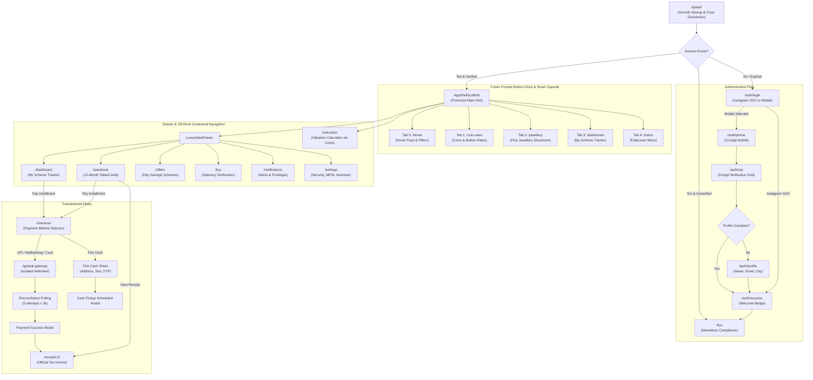

# Product Flow & Navigation Architecture — Kitty App

**Project**: Swastik Jewellers Kitty App (Sub-Brand: Kitty Vault)  
**Primary Codebase**: D:\kitty_app\  
**Document Status**: SUPERSEDED  
**SUPERSEDED BY**: KITTY_USER_FLOWS_V2.md & INFORMATION_ARCHITECTURE_V2.md  
**Last Audit Date**: 2026-09-29  

> [!NOTE]
> **STATUS: SUPERSEDED (PRESERVED FOR HISTORICAL CONTEXT)**  
> This V1 product flow has been superseded by [KITTY_USER_FLOWS_V2.md](file:///D:/kitty_frontend/kitty_docs/02_UX_UI/KITTY_USER_FLOWS_V2.md) and [INFORMATION_ARCHITECTURE_V2.md](file:///D:/kitty_frontend/kitty_docs/02_UX_UI/INFORMATION_ARCHITECTURE_V2.md). Do not delete.

---

## 1. Master Navigation Architecture

The Kitty App employs a multi-tiered navigation structure using **GoRouter 14.x**:

---

## 2. Detailed End-to-End User Flows

### 2.1 Authentication & Onboarding Flow
1. **Splash Entry (`/splash`)**:
   - Renders with non-blank emerald canvas root (`AppColors.emeraldDeep`) ensuring seamless first-frame painting.
   - Smooth 3D diamond rotation with natural breathing scale (0.95 to 1.15) softly dissolving into the central Swastik crest.
   - Concurrently checks `SecureStorageService` for active JWT session token and user profile.
   - Navigates smoothly to `/home` if authenticated, or `/auth/login` if session is absent/expired.
2. **Login Selection (`/auth/login`)**:
   - Patron selects between **Continue with Instagram** (Instagram SSO branded button) or **Continue with Mobile**.
3. **Mobile Phone Entry (`/auth/phone`)**:
   - Patron enters their 10-digit Indian mobile number with country code picker.
   - Triggers `POST /api/v1/auth/send-otp`. Upon success, navigates to `/auth/otp`.
4. **OTP Verification (`/auth/otp`)**:
   - Patron enters the 6-digit verification code with auto-advance across cells.
   - Features 30-second resend countdown timer and auto-shake feedback on incorrect submission.
5. **First-Time Profile Registration (`/auth/profile`)**:
   - If profile is incomplete, patron enters **Full Legal Name**, **Email Address**, and **City**.
6. **Authentication Welcome Splash (`/auth/success`)**:
   - Displays patron name, membership tier chip ("Tier 1 Verified Member"), and gold "Enter Vault" CTA.

---

### 2.2 Home Brand Feed Flow (`/home`)
1. **Sticky Top Header (`HeaderNavBar`)**:
   - Left-aligned live 24K gold rate pill with pulsing indicator.
   - Center authentic Swastik brand SVG crest.
   - Right-aligned notification bell with badge counter and hamburger drawer trigger.
2. **Promotional Offers Carousel (`HomeOffersCarousel`)**:
   - Positioned at the top of the feed immediately below the header with an elevated vertical height of **265px** for prominent visual appeal without screen overflow.
   - Auto-scrolls every 5 seconds showcasing curated scheme tiers with direct links to plans.
3. **Live Gold / Silver Rate Carousel (`HomeGoldSilverRateCarousel`)**:
   - Elevated royal emerald card automatically rotating between live rates: **Gold 24K (999)** and **999 Fine Silver**.
   - Real-time live data with chevron navigation controls and direct navigation to Coins.
4. **Explore Our Jewellery Section (`HomeJewelleryCollections`)**:
   - Circular curated category showcase (Rings, Earrings, Bangles, Necklaces, etc.) with gold accent border rings.
5. **Gold Scheme + Coins Quick Action Section (`HomeSchemeCoinsQuickActions`)**:
   - Two-action emerald card with floating circular icons featuring `Icons.workspace_premium_outlined` (Gold Scheme) and `Icons.monetization_on_outlined` (Coins).
6. **Gold Price Trend Graph (`HomeGoldPriceTrend`)**:
   - Interactive multi-line chart with 1W, 1M, 6M, 1Y, 5Y timeframe selectors and live percentage indicators.
7. **Clean Luxury Footer (`HomeFooter`)**:
   - Showroom credentials, About Us, Contact Us, Policies, and copyright notice.

---

### 2.3 Bullion & Coin Rates Flow (`/coin-rates`)
1. **Gold Coins vs. Silver Coins Tab Switcher**:
   - High-contrast toggle between **Gold Coins** and **Silver Coins**.
2. **Top Action Bar with Calculator**:
   - Prominent Calculator button opening `/calculator`.
3. **Unified Table Layout**:
   - `GM | PURITY | PRICE` table with dedicated "Book Now" buttons on every row.
4. **Custom Weight & Purity Selection**:
   - Numeric gram input with placeholder `"Enter custom grams"`.
   - **Karat Selector (24K / 22K)**: Dynamically rendered ONLY when Gold Coins is active; hidden for Silver Coins.

---

### 2.4 Jewellery Catalog Flow (`/jewellery`)
1. **Authentic Photography Showcase**:
   - Real, authentic showroom product photographs with smooth fade-in loading and graceful icon fallbacks.
2. **Metal & Category Selectors**:
   - Dual dropdowns for **Gold Jewellery** and **Diamond Jewellery** across 6 categories: Rings, Pendants, Necklace, Earrings, Bangles, and Bracelets.

---

### 2.5 Gold Valuation Calculator Flow (`/calculator`)
1. **Coins Action Bar & Route Access**:
   - Accessible via the Calculator action button on the Coins page (`/coin-rates`) and direct route `/calculator`.
2. **Dual Reactive Input Modes**:
   - **Shop by Gram**: User enters weight (e.g. 5.5g) $\rightarrow$ computes applicable gold rate $\rightarrow$ outputs Total Valuation Amount.
   - **Shop by Money**: User enters budget (e.g. ₹50,000) $\rightarrow$ computes applicable gold rate $\rightarrow$ outputs Estimated Weight in grams.
3. **Purity / Karat Selector**:
   - Toggle between 24K (Pure Gold), 22K (Standard Jewellery 916), and 18K (Diamond Studded).
4. **Defensive States**:
   - Fully supports empty states, decimal values, zero input, large values, instant reset, and soft keyboard dismissal.

---

### 2.6 Kitty Scheme Dashboard Flow (`/dashboard`)
1. **3-Pillar Metric Summary**:
   - High-contrast summary cards: Total Deposited, Bonus Gold Accrued, Next Due Date.
2. **Active Scheme Card**:
   - Circular animated progress gauge and installment timeline.
3. **Pay Installment CTA**:
   - Launches `/checkout` payment sheet.

---

### 2.7 Passbook & Digital Receipt Flow (`/passbook`)
1. **Dual-Mode Layout Switcher**:
   - **Table View**: Classic financial ledger with columns for Month, Due Date, Paid Date, Amount, Method, and Action.
   - **Card View**: Touch-optimized vertical stack of monthly payment tiles.
2. **Pay Installment Flow**:
   - Tapping "Pay Installment" on due installments opens `/checkout` with interactive payment channel selection.
3. **Digital Tax Receipt**:
   - Clicking "Receipt" on paid installments opens `/receipt/:id` tax invoice.

---

### 2.8 Payment Checkout & Doorstep "Pick Cash" Flow (`/checkout`)
1. **Interactive Payment Method Selection**:
   - Supports **UPI**, **Net Banking**, **Debit/Credit Card**, and **Pick Cash**.
   - Tapping any method updates active radio border, gold glow, and selection state.
2. **Online Gateway Flow**:
   - UPI, Net Banking, or Card opens GoKwik gateway webview followed by reconciliation polling.
3. **Doorstep "Pick Cash" Pipeline**:
   - Selecting "Pick Cash" opens `PickCashSheet`.
   - Pre-populates patron name, phone, email, and active scheme installment amount.
   - Captures pickup address, city, 6-digit postal pincode, and preferred time slot (Morning, Afternoon, Evening).
   - Validates PMLA compliance limits (₹1,99,999 cash collection maximum).
   - Generates unique reference code (`PCK-XXXXXX`) and 6-digit physical handover verification OTP.

